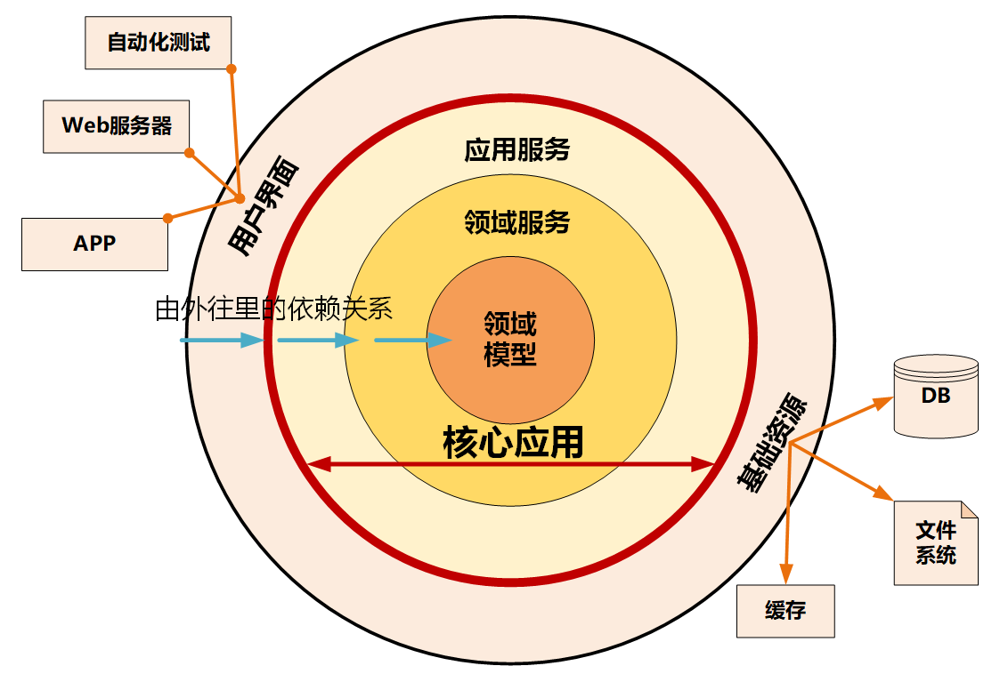
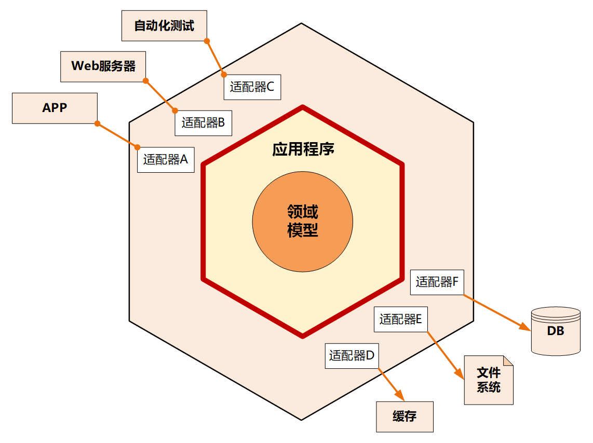
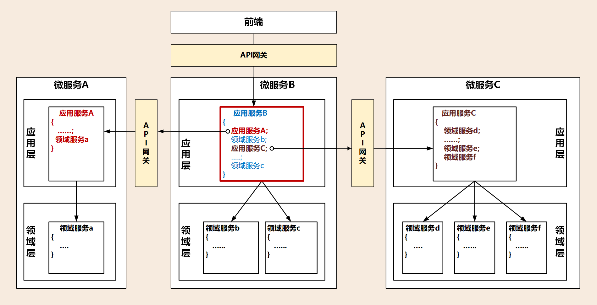
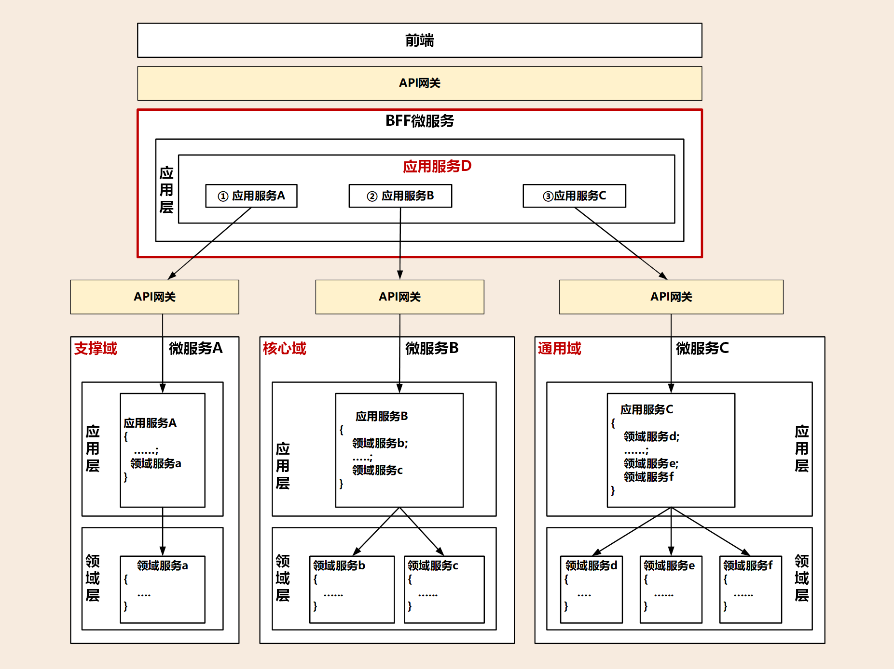

---
date: "2019-06-23"
---  
      
# 08 | 微服务架构模型：几种常见模型的对比和分析
你好，我是欧创新。

在上一讲中我重点介绍了DDD分层架构，同时我也提到了微服务架构模型其实还有好多种，不知道你注意到了没？这些架构模型在我们的实际应用中都具有很高的借鉴价值。

那么今天我们就把DDD分层架构（详情介绍如有遗忘可回看 [\[第07讲\]](https://time.geekbang.org/column/article/156849) ）、整洁架构、六边形架构这三种架构模型放到一起，对比分析，看看如何利用好它们，帮助我们设计出高内聚低耦合的中台以及微服务架构。

## 整洁架构

整洁架构又名“洋葱架构”。为什么叫它洋葱架构？看看下面这张图你就明白了。整洁架构的层就像洋葱片一样，它体现了分层的设计思想。

在整洁架构里，同心圆代表应用软件的不同部分，从里到外依次是领域模型、领域服务、应用服务和最外围的容易变化的内容，比如用户界面和基础设施。

整洁架构最主要的原则是依赖原则，它定义了各层的依赖关系，越往里依赖越低，代码级别越高，越是核心能力。外圆代码依赖只能指向内圆，内圆不需要知道外圆的任何情况。

在洋葱架构中，各层的职能是这样划分的：

* 领域模型实现领域内核心业务逻辑，它封装了企业级的业务规则。领域模型的主体是实体，一个实体可以是一个带方法的对象，也可以是一个数据结构和方法集合。
* 领域服务实现涉及多个实体的复杂业务逻辑。
* 应用服务实现与用户操作相关的服务组合与编排，它包含了应用特有的业务流程规则，封装和实现了系统所有用例。
* 最外层主要提供适配的能力，适配能力分为主动适配和被动适配。主动适配主要实现外部用户、网页、批处理和自动化测试等对内层业务逻辑访问适配。被动适配主要是实现核心业务逻辑对基础资源访问的适配，比如数据库、缓存、文件系统和消息中间件等。
* 红圈内的领域模型、领域服务和应用服务一起组成软件核心业务能力。

<!-- [[[read_end]]] -->

## 六边形架构

六边形架构又名“端口适配器架构”。追溯微服务架构的渊源，一般都会涉及到六边形架构。

六边形架构的核心理念是：应用是通过端口与外部进行交互的。我想这也是微服务架构下API网关盛行的主要原因吧。

也就是说，在下图的六边形架构中，红圈内的核心业务逻辑（应用程序和领域模型）与外部资源（包括APP、Web应用以及数据库资源等）完全隔离，仅通过适配器进行交互。它解决了业务逻辑与用户界面的代码交错问题，很好地实现了前后端分离。六边形架构各层的依赖关系与整洁架构一样，都是由外向内依赖。

六边形架构将系统分为内六边形和外六边形两层，这两层的职能划分如下：

* 红圈内的六边形实现应用的核心业务逻辑；
* 外六边形完成外部应用、驱动和基础资源等的交互和访问，对前端应用以API主动适配的方式提供服务，对基础资源以依赖倒置被动适配的方式实现资源访问。

六边形架构的一个端口可能对应多个外部系统，不同的外部系统也可能会使用不同的适配器，由适配器负责协议转换。这就使得应用程序能够以一致的方式被用户、程序、自动化测试和批处理脚本使用。

## 三种微服务架构模型的对比和分析

虽然DDD分层架构、整洁架构、六边形架构的架构模型表现形式不一样，但你不要被它们的表象所迷惑，这三种架构模型的设计思想正是微服务架构高内聚低耦合原则的完美体现，而它们身上闪耀的正是以领域模型为中心的设计思想。

我们看下上面这张图，结合图示对这三种架构模型做一个分析。

请你重点关注图中的红色线框，它们是非常重要的分界线，这三种架构里面都有，它的作用就是将核心业务逻辑与外部应用、基础资源进行隔离。

红色框内部主要实现核心业务逻辑，但核心业务逻辑也是有差异的，有的业务逻辑属于领域模型的能力，有的则属于面向用户的用例和流程编排能力。按照这种功能的差异，我们在这三种架构中划分了应用层和领域层，来承担不同的业务逻辑。

领域层实现面向领域模型，实现领域模型的核心业务逻辑，属于原子模型，它需要保持领域模型和业务逻辑的稳定，对外提供稳定的细粒度的领域服务，所以它处于架构的核心位置。

应用层实现面向用户操作相关的用例和流程，对外提供粗粒度的API服务。它就像一个齿轮一样进行前台应用和领域层的适配，接收前台需求，随时做出响应和调整，尽量避免将前台需求传导到领域层。应用层作为配速齿轮则位于前台应用和领域层之间。

可以说，这三种架构都考虑了前端需求的变与领域模型的不变。需求变幻无穷，但变化总是有矩可循的，用户体验、操作习惯、市场环境以及管理流程的变化，往往会导致界面逻辑和流程的多变。但总体来说，不管前端如何变化，在企业没有大的变革的情况下，核心领域逻辑基本不会大变，所以领域模型相对稳定，而用例和流程则会随着外部应用需求而随时调整。把握好这个规律，我们就知道该如何设计应用层和领域层了。

架构模型通过分层的方式来控制需求变化从外到里对系统的影响，从外向里受需求影响逐步减小。面向用户的前端可以快速响应外部需求进行调整和发布，灵活多变，应用层通过服务组合和编排来实现业务流程的快速适配上线，减少传导到领域层的需求，使领域层保持长期稳定。

这样设计的好处很明显了，就是可以保证领域层的核心业务逻辑不会因为外部需求和流程的变动而调整，对于建立前台灵活、中台稳固的架构很有帮助。

看到这里，你是不是已经猜出中台和微服务设计的关键了呢？我给出的答案是：领域模型和微服务的合理分层设计。那么你的答案呢？

## 从三种架构模型看中台和微服务设计

结合这三种微服务架构模型的共性，下面我来谈谈中台和微服务设计的一些心得体会。

中台本质上是领域的子域，它可能是核心域，也可能是通用域或支撑域。通常大家认为阿里的中台对应DDD的通用域，将通用的公共能力沉淀为中台，对外提供通用共享服务。

中台作为子域还可以继续分解为子子域，在子域分解到合适大小，通过事件风暴划分限界上下文以后，就可以定义微服务了，微服务用来实现中台的能力。表面上看，DDD、中台、微服务这三者之间似乎没什么关联，实际上它们的关系是非常紧密的，组合在一起可以作为一个理论体系用于你的中台和微服务设计。

### 1\. 中台建设要聚焦领域模型

中台需要站在全企业的高度考虑能力的共享和复用。

中台设计时，我们需要建立中台内所有限界上下文的领域模型，DDD建模过程中会考虑架构演进和功能的重新组合。领域模型建立的过程会对业务和应用进行清晰的逻辑和物理边界（微服务）划分。领域模型的结果会影响到后续的系统模型、架构模型和代码模型，最终影响到微服务的拆分和项目落地。

因此，在中台设计中我们首先要聚焦领域模型，将它放在核心位置。

### 2\. 微服务要有合理的架构分层

微服务设计要有分层的设计思想，让各层各司其职，建立松耦合的层间关系。

不要把与领域无关的逻辑放在领域层实现，保证领域层的纯洁和领域逻辑的稳定，避免污染领域模型。也不要把领域模型的业务逻辑放在应用层，这样会导致应用层过于庞大，最终领域模型会失焦。如果实在无法避免，我们可以引入防腐层，进行新老系统的适配和转换，过渡期完成后，可以直接将防腐层代码抛弃。

微服务内部的分层方式我们已经清楚了，那微服务之间是否也有层次依赖关系呢？如何实现微服务之间的服务集成？

有的微服务可以与前端应用集成，一起完成特定的业务，这是项目级微服务。而有的则是某个职责单一的中台微服务，企业级的业务流程需要将多个这样的微服务组合起来才能完成，这是企业级中台微服务。两类微服务由于复杂度不一样，集成方式也会有差异。

**项目级微服务**

项目级微服务的内部遵循分层架构模型就可以了。领域模型的核心逻辑在领域层实现，服务的组合和编排在应用层实现，通过API网关为前台应用提供服务，实现前后端分离。但项目级的微服务可能会调用其它微服务，你看在下面这张图中，比如某个项目级微服务B调用认证微服务A，完成登录和权限认证。

通常项目级微服务之间的集成，发生在微服务的应用层，由应用服务调用其它微服务发布在API网关上的应用服务。你看下图中微服务B中红色框内的应用服务B，它除了可以组合和编排自己的领域服务外，还可以组合和编排外部微服务的应用服务。它只要将编排后的服务发布到API网关供前端调用，这样前端就可以直接访问自己的微服务了。

**企业级中台微服务**

企业级的业务流程往往是多个中台微服务一起协作完成的，那跨中台的微服务如何实现集成呢？

企业级中台微服务的集成不能像项目级微服务一样，在某一个微服务内完成跨微服务的服务组合和编排。

我们可以在中台微服务之上增加一层，你看下面这张图，增加的这一层就位于红色框内，它的主要职能就是处理跨中台微服务的服务组合和编排，以及微服务之间的协调，它还可以完成前端不同渠道应用的适配。如果再将它的业务范围扩大一些，我可以将它做成一个面向不同行业和渠道的服务平台。

我们不妨借用BFF（服务于前端的后端，Backend for Frontends）这个词，暂且称它为BFF微服务。BFF微服务与其它微服务存在较大的差异，就是它没有领域模型，因此这个微服务内也不会有领域层。BFF微服务可以承担应用层和用户接口层的主要职能，完成各个中台微服务的服务组合和编排，可以适配不同前端和渠道的要求。

### 3\. 应用和资源的解耦与适配

传统以数据为中心的设计模式，应用会对数据库、缓存、文件系统等基础资源产生严重依赖。

正是由于它们之间的这种强依赖的关系，我们一旦更换基础资源就会对应用产生很大的影响，因此需要为应用和资源解耦。

在微服务架构中，应用层、领域层和基础层解耦是通过仓储模式，采用依赖倒置的设计方法来实现的。在应用设计中，我们会同步考虑和基础资源的代码适配，那么一旦基础设施资源出现变更（比如换数据库），就可以屏蔽资源变更对业务代码的影响，切断业务逻辑对基础资源的依赖，最终降低资源变更对应用的影响。

## 总结

今天我们详细讲解了整洁架构和六边形架构，并对包括DDD分层架构在内的三种微服务架构模进行对比分析，总结出了它们的共同特征，并从共性出发，梳理出了中台建模和微服务架构设计的几个要点，我们后面还会有更加详细的有关设计落地的讲述。

**那从今天的内容中我们不难看出：**DDD分层架构、整洁架构、六边形架构都是以领域模型为核心，实行分层架构，内部核心业务逻辑与外部应用、资源隔离并解耦。请务必记好这个设计思想，今后会有大用处。

## 思考题

在系统设计时，你是如何避免外部需求对核心业务逻辑的影响的？有什么具体方法可以分享给大家吗？

欢迎留言分享，你也可以把今天所学分享给身边的朋友，邀请他一同交流、打卡。