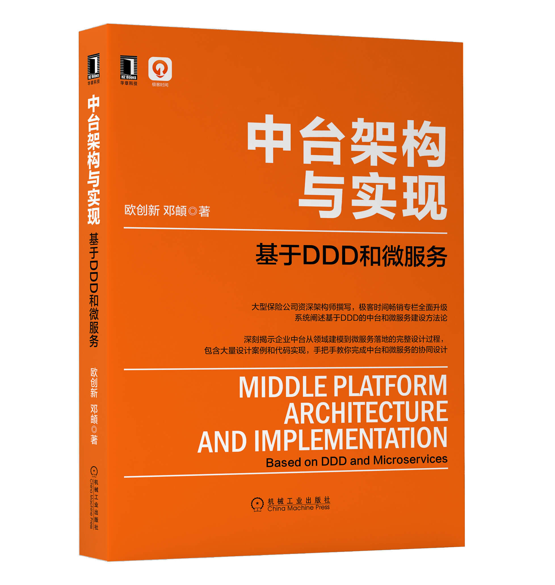

---
date: "2019-06-23"
---  
      
# 抽奖｜《DDD实战课》沉淀成书了，感谢有你！
你好，我是欧创新。好久不见！

专栏结课已经快一年了，累计有 **10000** 余人加入学习，非常感谢大家的支持。每次登录后台查看留言，依然能看到大家的分享，真的非常开心能和你一直保持联系、保持交流！

《DDD实战课》完结后，我并没有停止在DDD方面的深度探索，他一直延伸至我工作的方方面面。做了很多次的实践与思考，和诸多技术大牛进行切磋，加之专栏的铺垫和积累，历时一年，我完成了这本书**《中台架构与实现：基于DDD和微服务》**，特来与你分享好消息。

完整学习过专栏的同学，对DDD的优势应该了如指掌了，有所遗忘的同学也可以再去看看[开篇词](https://time.geekbang.org/column/article/149941)，这里不再赘述。但话说回来，DDD与微服务，乃至中台设计的结合，目前仍是一个非常新的领域。对于如何利用DDD，完成中台和微服务的协同设计，其实还有很多难题等待攻克。

想必你在购买这个专栏的时候，就已经了解到DDD相关的资料在市面上的表现是怎样的一个状态。微服务开发和技术的学习资料非常多，但在中台数字化转型过程中，关于如何进行业务领域边界划分，如何完成中台领域建模实现能力复用，如何完成单体应用拆分和微服务设计，如何实现前中后台的协同设计等等，可参考和借鉴的资料并不是很多。即便有一些，真正理解和实施起来也是困难重重。这也是我写书的源动力。

<!-- [[[read_end]]] -->

目前这本书已经正式出版，极客商城、京东、当当同步开售。由于新上架，**现在极客商城刚好是有限时优惠活动的，感兴趣的话可以通过该链接查看：**<http://gk.link/a/10mEQ>

全书共计22万余字，系统地阐述了基于DDD的中台和微服务建设的方法体系，主要包括中台业务边界划分和领域模型构建，微服务、微前端设计理念与实践，以及如何进行前中后台的协同设计和单元化设计等内容。另外，大家在《DDD实战课》中提出的宝贵问题，我也在本书中做出了解答。再次感谢你与我共创内容！

**今天我带了3本我的签名图书与大家分享，我会在文末的留言区中抽取3位幸运同学赠书，期待看到你的身影。**

下面我来简单介绍下这本书，喜欢纸质书的同学，也可以多做一点了解。先睹为快了！

## 本书大纲

共计24章，分为6部分。

**第一部分：认识中台（第1～4章）**

这部分包括4章，主要介绍中台相关背景知识，认识并理解中台的真正含义，从业务中台、数据中台、技术中台以及与之匹配的组织架构等多个方面分析传统企业中台转型应该具备的能力，带你初步了解DDD是如何指导中台和微服务设计，并厘清它们的协作关系。

**第二部分：DDD基本原理（第5～11章）**

为了让你能够更加深刻地理解DDD，这部分通过一些浅显易懂的案例，帮助你学习并深刻理解DDD的核心基础知识、设计思想、原则和方法等内容，了解它们之间的协作和依赖关系，解决DDD概念理解困难的问题，做好中台实践前的准备工作。

这部分包括7章，主要讲解DDD的关键核心知识体系，包括领域、子域、核心子域、通用子域、支撑子域、限界上下文、实体、值对象、聚合、聚合根、领域事件和DDD分层架构等知识。

**第三部分：中台领域建模与微服务设计（第12～19章）**

这部分包括8章，主要介绍DDD是如何通过战略设计构建中台业务模型，以及如何通过战术设计指导微服务拆分和设计的。在这一部分，我会用多个实际案例，带你用DDD方法完成中台和微服务的全流程设计，深刻理解DDD在中台领域建模与微服务设计中的步骤、方法、设计思想和价值。

* 了解如何用事件风暴方法构建领域模型；
* 了解如何用DDD设计思想构建企业级可复用的中台业务模型；
* 了解如何用DDD设计微服务代码模型，如何将领域模型映射到微服务以建立领域模型与微服务代码模型的映射关系，如何完成微服务架构演进等。

最后用一个案例将DDD所有知识点串联在一起，带你深入了解如何用DDD的设计方法完成领域建模与微服务设计的全流程，并对代码示例进行了详细分析和讲解。

**第四部分：前端设计（第20章和第21章）**

这部分包括2章，主要介绍微前端的设计思想，通过前端微服务化和单元化的设计思想，解决业务中台建设完成后，前端应用解耦和前后端服务集成复杂的难点。书中阐述了如何借鉴微服务的设计思想来解构前端应用，实现前端应用的拆分解耦，并结合实践介绍前端架构的转型策略与技术落地。

另外，这部分还探讨了基于领域模型的单元化设计方法。通过微服务与微前端组合后的单元化设计，既可以降低企业级前台应用集成的复杂度，又可以让企业具有更强的产品快速发布和业务响应能力。这种能力能给我们的团队组建、研发模式、业务能力发布等带来非常大的价值。

**第五部分：中台设计案例（第22章）**

这部分包括1章，通过保险订单化设计案例，采用自顶向下的领域建模策略，带你走一遍中台设计的完整流程。案例中涵盖业务领域分解、中台领域建模、微服务和微前端设计、单元化设计以及如何实现业务和数据融合等内容，希望能够帮助你加深对DDD、中台、微服务和微前端等知识体系、设计思想和技术体系的全面理解，更好地投入DDD、中台和微服务建设实践中。

**第六部分：总结（第23章和第24章）**

这部分是全书的总结，包括2章。书中结合我多年的设计经验和思考，带你了解单体应用向微服务架构的演进策略，如何避免陷入DDD设计的常见误区，微服务设计原则以及分布式架构下的关键设计等内容。

## 本书阅读对象

本书是一本关于中台、微服务和微前端设计与建设的书，采用了DDD设计思想和方法，适合的阅读对象主要分为下面几类：

1.  从事企业数字化转型的企业管理者；
2.  从事企业技术架构和微服务设计的架构师；
3.  从事企业业务架构设计和业务建模的业务人员；
4.  从事微服务设计和开发的高级技术人员；
5.  希望从事中台和微服务架构设计的人员；
6.  对DDD、微服务和中台设计感兴趣的学习者。

最后，我想说，DDD不是新事物，它2003年诞生于集中式架构盛行的年代。**技术常变，思想则永恒！**在充满不确定的时代，凡事预则立，不预则废。心中有边界，脚下有乾坤，分而治之，方能轻松应对业务和技术的快速发展和变化。

祝你在工作中一切顺利。更多关于专栏和图书的问题，都可以在留言区中与我交流。如有任何疑问、技术交流需求或建议，以及纰漏之处，也可直接发送至我的邮箱chuangxinou\@163.com，期待你的来信！

> **推荐语1：知行合一**  
>    
> 右军  
> 支付宝专家 《深入分布式缓存》《程序员的三门课》联合作者  
>    
> 个人对DDD一直比较有兴趣，也包括企业架构设计、在DDD之前的领域分析如分析模式、彩色建模等。如果把软件按照相对的“稳定性”来排序，领域层＞应用层＞界面层。以营销为例，撬动用户的还是老三样：卡、券、积分，本质就是营销资产+资金流，而从产品包装上可以策划满减、满返、2件折扣、限时优惠、限定电商全场消费、限定活动线下商超、限定品类等活动，不一而足。领域层是相对稳定的，应用层（业务逻辑层和具体规则）可以有多种变化，而广义界面层的实质包括产品包装、交互等可以有更多的互动玩法。窃以为，领域分析的价值所在就是寻求“千变万化”中相对的“稳定性、第一性”，然后通过合理的架构分层及抽象隔离的业务复杂度和技术复杂度，隔离业务领域的稳定性和易变性，从架构上精巧、快速地支持业务的变化。技术为业务服务，但绝不是业务到IT的简单翻译。  
>    
> 欧老师精于保险业务，对于DDD也有自己的理解和看法。从经典的DDD战略设计到基于微服务的战术设计/实现的案例，本书给出了全面的参考案例。知行合一，则“限界上下文”“实体”“值对象”“聚合”“事件”“事务一致性”等都不再神秘。本书也有一些可喜的创见，如对于“微前端”和“业务单元化”的提炼。本书以保险订单化销售业务领域为例，采用自顶向下策略，完成保险部分业务领域的中台设计，带领读者了解中台设计全流程，理解DDD、业务中台、微服务、微前端与单元化设计的关系以及它们的核心设计思想。  
>    
> 本书价值不菲，强烈推荐。无论对于DDD的初学者，还是DDD的资深人士，都有相应的启发。写作者的最大安慰莫过于读者觉得有价值，有收获。祝大家阅读愉快！  
>    
> **推荐语2：为不确定而架构**  
>    
> 王威  
> ThoughtWorks中国区技术战略咨询服务负责人  
>    
> 在过去的几年中，因为工作的关系，我同很多科技类企业和组织合作过。这些企业和组织分布在不同的行业和地区，从电信、金融到物流供应链，从国内到全球各地。几乎所有技术行业的同仁在谈到未来的时候，都流露出了很强的改变意愿和紧迫感。例如今年出现的新冠肺炎疫情，以及围绕疫情在全球范围出现的一系列连锁反应，都导致大家逐渐形成了一个共识：世界已经从根本上改变，未来20年将要发生的事情，可能是我们今天根本无法想象的。在这样的背景下，每一个组织都希望能够通过加大科技的投入，赋能自己的客户和业务，从而做好应对未知挑战的准备。  
>    
> 另一方面，软件“侵蚀”世界已经是不争的事实，在国内的很多城市中，恐怕已经很难想象完全脱离软件的生活会是什么样子。即使我们不谈“不可见”的嵌入式软件和网络控制类软件，仅仅脱离了智能手机以及建于其上的各种App，我们熟悉的生活似乎将无法运转下去。新兴的科技公司，在利用软件技术打造新的场景，培养用户的使用习惯，创造新的业务价值的同时，也在倒逼前辈们对传统的业务进行数字化改造，以适应新时代下技术的变化速度。同时，科技公司又将自己的最佳实践标准化、产品化，希望通过与传统企业的合作，加速整个行业变革的进程。20年前的SOA架构、6年前的微服务架构和3年前阿里的“中台”都是这种模式的很好代表。  
>    
> 客户习惯的改变，技术的发展和快速演进，以及在一些行业出现的外力作用，都带来了价值、场景、技术、政策的不确定性。所有不确定性的综合，使得软件的构建过程一定会面对这样的窘境：软件永远跟不上业务变化。为了解决这样的问题，业界的前辈们一直在通过管理、技术、工具平台等多种维度来解决同一个问题：如何使软件的构建具备更高的响应力。敏捷、精益、DevOps、效能平台都是为解决这个问题而出现的解决方案。在这个过程中，“如何在复杂业务场景下设计软件”逐渐成为架构师们关注的焦点。领域驱动设计（以下简称DDD）的提出，恰恰解决了这一问题。但是在2010年之前，因为单体应用仍然占据主流地位，DDD“曲高和寡”。直到“微服务”的出现，才消除了原来单体应用的桎梏，使得DDD成为架构师们都在讨论的软件架构设计标准实践。  
>    
> 近年来，DDD在国内的影响力逐年增大。我仍然记得在2015年前后和企业交流的时候，当时大家对于什么是DDD完全摸不着头脑，很多组织直接把源自“产品线工程”的“领域工程”和DDD作为相同的概念加以实践。2017年我们举办了第一届DDD中国峰会，那时有很多参与的同行对于DDD如何在自己的组织、场景中落地还存有这样或那样的疑虑。而到2019年的第三届峰会时，大家更多是带着问题和经验来和业界的同行们一起交流心得，探索在新场景下如何利用DDD带来更多的价值。  
>    
> 我和欧创新老师正是在这样的背景下认识的。欧老师在过去几年中将DDD的思想、微服务以及中台的理念同自己企业的实际相结合，积累了丰富的实践经验。每一次和欧老师交流，我都能学到很多东西。当欧老师找到我为这本书作序的时候，我既受宠若惊，又诚惶诚恐。在拜读完本书后，我惊讶于在这么短的时间内，欧老师不仅将自己获得的经验提炼总结，还用通俗易懂的语言和丰富的案例，将DDD、微服务、中台的概念和围绕在它们周围的实践讲述得如此详细。本书确实是业界难得的一个针对架构设计和中台转型的技术层面的总结，我个人从中获益匪浅，相信本书的读者朋友会和我有同样的体会。