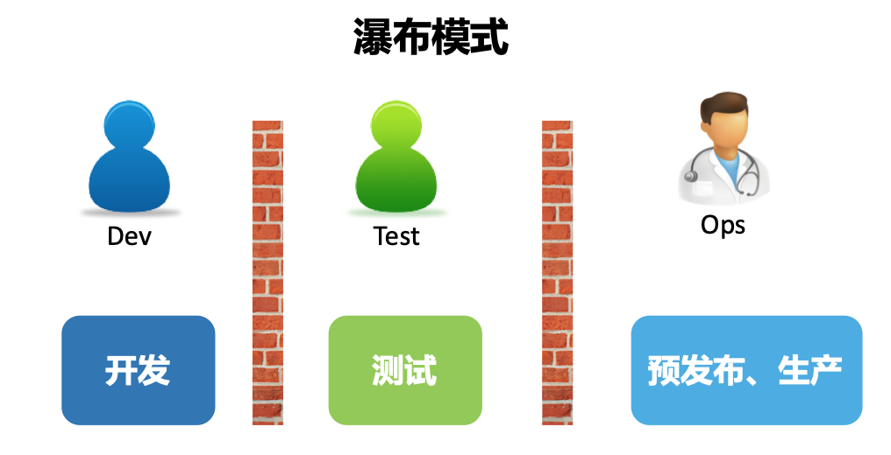
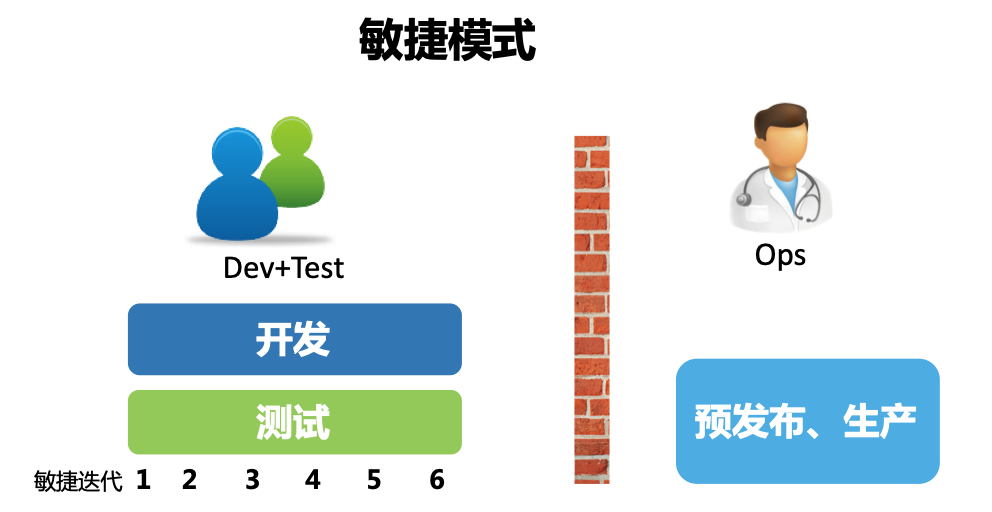
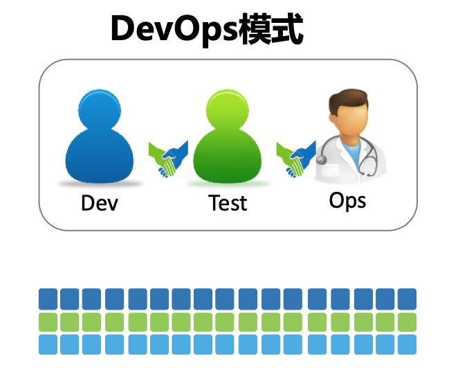

---
date: "2019-06-23"
---  
      
# 01 | DevOps的“定义”：DevOps究竟要解决什么问题？
你好，我是石雪峰。今天我们来聊一聊DevOps的“定义”。

近些年来，DevOps在我们身边出现的频率越来越高了。各种大会上经常出现DevOps专场，行业内的公司纷纷在都招聘DevOps工程师，企业的DevOps转型看起来迫在眉睫，公司内部也要设计和开发DevOps平台……这么看来，DevOps似乎无处不在。

可回过头来想想，关于DevOps，很多问题我们真的想清楚了吗？所谓的DevOps平台，是否等同于自动化运维平台，或持续交付平台呢？DevOps工程师的岗位描述中又需要写哪些技能要求呢？另外，该如何证明企业已经实现了DevOps转型呢？这些问题真是难倒了一众英雄好汉。说到底，听了这么久的DevOps，它的“定义”到底是什么，好像从来没有人能说清楚。

现在，我们先来看看维基百科对DevOps的定义。不过，估计也没谁能看懂这到底是在说什么。

> DevOps（开发Development与运维Operations的组合词）是一种文化、一场运动或实践，强调在自动化软件交付流程及基础设施变更过程中，软件开发人员与其他信息技术（IT）专业人员彼此之间的协作与沟通。它旨在建立一种文化与环境，使构建、测试、软件发布得以快速、频繁以及更加稳定地进行。

<!-- [[[read_end]]] -->

于是乎，每当提及DevOps是什么的时候，最常出现的比喻就是“盲人摸象”。有意思的是，DevOps之父Patrick第一次参加DevOpsDays中国站活动的时候，也使用了这个比喻，看来在这一点上，中西方文化是共通的。毕竟每个人的视角都不相同，看到的DevOps自然也是千差万别。

DevOps大潮汹涌而来，很多人都被裹挟着去探索和实践DevOps，甚至有一种极端的看法认为一切好的实践都属于DevOps，而一切不好的实践都是DevOps的反模式。

当年敏捷开始流行的时候，似乎也是相同的论调，但这种笼统的定义并不能帮助我们理清思路，甚至会带来很多负面的声音，比如DevOps就是开发干掉运维，又或者，DevOps就是要让运维抛弃老本行，开始全面转型做开发。这让很多IT从业人员一度很焦虑。

客观来说，从DevOps运动诞生开始，那些先行者们就从来没有试图给DevOps下一个官方的定义。当然，这样做的好处很明显，由于不限定人群和范围，每个人都能从自己的立场来为DevOps做贡献，从而使DevOps所涵盖的范围越发宽广。

但是，坏处也是显而易见的。随着DevOps的不断发展，刚开始接触DevOps的人往往不得要领，只见树木不见森林，认知的偏差使得DevOps越发地神秘起来。

与其纠结于DevOps的定义，不如让我们一起回归原始，来看看DevOps究竟要解决的是什么问题。

其实，DevOps的秘密就来源于它的名字所代表的两种角色——**开发和运维**。那么这两种角色之间究竟有什么问题呢？我们从软件工程诞生以来所历经的三个重要发展阶段说起。

## 瀑布式开发模式

瀑布式开发模式将软件交付过程划分成几个阶段，从需求到开发、测试和运维，它的理念是软件开发的规模越来越大，必须以一种工程管理的方式来定义每个阶段，以及相应的交付产物和交付标准，以期通过一种重流程，重管控，按照计划一步步推进整个项目的交付过程。

可是，随着市场环境和用户需求变化的不断加速，这种按部就班的方式有一个严重的潜在问题。

软件开发活动需要在项目一开始就确定项目目标、范围以及实现方式，而这个时间点往往是我们对用户和市场环境信息了解最少的时候，这样做出来的决策往往带有很大的不确定性，很容易导致项目范围不断变更，计划不断延期，交付上线时间不断推后，最后的结果是，即便我们投入了大量资源，却难以达到预期的效果。

从业界巨头IBM的统计数字来看，有34\%的新IT项目延期交付，将近一半的应用系统因为缺陷导致线上回滚，这是一件多么令人沮丧的事情。

## 敏捷式开发模式

基于这种问题，敏捷的思潮开始盛行。它的核心理念是，既然我们无法充分了解用户的真实需求是怎样的，那么不如将一个大的目标不断拆解，把它变成一个个可交付的小目标，然后通过不断迭代，以小步快跑的方式持续开发。

与此同时，将测试工作从研发末端的一个独立环节注入整个开发活动中，对开发交付的内容进行持续验证，保证每次可交付的都是一个可用的功能集合，并且由于质量内建在研发环节中，交付功能的质量也是有保障的。

很显然，敏捷是一种更加灵活的研发模式。经常有人会问，敏捷会直接提升团队的开发速度吗？答案是否定的。试想一下，难道说采用了敏捷方法，研发编码的速度就会提高两倍甚至三倍吗？回想一下很多年前在IT行业广为流传的“人月神话”，我们就能发现正确的认知有多么重要。

**敏捷之所以更快，根本原因在于持续迭代和验证节省了大量不必要的浪费和返工**。关于这一点，我会在敏捷和精益的相关内容中做更加详细的介绍。

说到底，敏捷源于开发实践，敏捷的应用使得开发和测试团队抱团取暖。可是问题又来了，开发和测试团队发现，不管研发的速度变得多快，在软件交付的另一端，始终有一群人在冷冰冰地看着他们，一句“现在没到发布窗口”让多少新开发的功能倒在了上线的门槛上。

毕竟，无论开发了多少“天才”的功能，如果没有经过运维环节的部署上线，并最终发布给真实用户，那么这些功能其实并没有什么用。

## DevOps模式

于是，活在墙的另一端的运维团队成了被拉拢的对象。这些在软件交付最末端的团队始终处于一种“背锅”的状态，他们也有改变的意愿，所以DevOps应运而生，也就是说，DevOps最开始想要打破的就是开发和运维之间的对立和隔阂。

在传统模式下，度量开发团队效率的途径就是看开发完成了多少需求。于是，开发为了达成绩效目标，当然也是为了满足业务需求，不断地堆砌新功能，却很少有时间认真思考这些功能的可运维性和可测试性，只要需求状态流转到开发完成就万事大吉了。

而对于运维团队而言，他们的考核指标却是**系统的稳定性、可用性和安全性**。但现代IT系统是如此复杂，以至于每一次的上线发布都是一场战役，整个团队如临大敌，上线失败的焦虑始终如影随形。

很多时候，我们并不知道上线之后会发生什么，只能按照部署手册一步步操作，完成之后就听天由命。所以，每逢大促活动，就会有各种“拜服务器教”的照片广为流传。

另一方面，在无数次被开发不靠谱的功能缺陷蹂躏得体无完肤之后，运维团队意识到，变更才是影响他们绩效目标的最大敌人。于是，预先设立的上线窗口就成了运维团队的自留地，不断抬高的上线门槛也使得开发团队的交付变成了不可能完成的任务，最后，“互相伤害”就成了这个故事注定的结局。

即便到了今天，部署上线在大多数公司依然是一件很神圣的事。我给你讲一件有趣的事情。

去年我在欧洲拜访DevOps之父Patrick的时候，曾经去过他的公司。那天风雪交加，比利时根特显得非常冷清。我们停好车后，刚要推门进入他们公司，恰好碰到Patrick和他的一个同事下楼抽烟。

简单寒暄之后，我们才知道，原来Patrick公司负责的一个系统要在15分钟后上线，他们趁这个间歇出来换换脑子，然后再回去大干一场。所以你看，连DevOps之父在面临上线的时候都如此正式，可见，DevOps的发展之路依然任重而道远啊。

从一开始想要促进开发和运维的协作，团队慢慢发现，**其实在整个软件交付过程中，不仅只有开发和运维，业务也是重要的一环**。

比方说，如果业务制定了一个不靠谱的需求，那么无论开发和运维怎样协作，得到的终究是一个不靠谱的结果，以及对人力的浪费。可是业务并不清楚用户的真实情况，于是运维团队慢慢转向运营团队，他们需要持续不断地把线上的真实数据和用户行为及时地反馈给需求团队，来帮助需求团队客观评估需求的价值，并及时作出有利于产品发展的调整，这样一来，业务也被引入到了DevOps之中，甚至诞生了BizDevOps这样一个专门的词汇。

那么，既然沟通协作放之四海皆准，安全也开始积极地参与进来。安全不再是系统上线发布之后的“定时炸弹”，而是介入到整个软件开发过程中，在每个过程中注入安全反馈机制，来帮助团队在第一时间应对安全风险，那么，对于安全团队来说，**DevSecOps**就成了他们眼中的DevOps。

这样的例子比比皆是，包括职能部门、战略部门等，都纷纷加入其中，使得DevOps由最开始的点，扩展为线，再到面，不断发展壮大。每个人都参与其中，这使得DevOps成了每一个IT从业人员都需要学习和了解的知识和技能体系。

说到最后，我还是希望基于我对DevOps的理解，给出一个我自己的“定义”：

**DevOps是通过平台（Platform）、流程（Process）和人（People）的有机整合，以C（协作）A（自动化）L（精益）M（度量）S（共享）文化为指引，旨在建立一种可以快速交付价值并且具有持续改进能力的现代化IT组织。**

## 总结

今天，我带你一起梳理了DevOps的发展历程，以及软件开发模式的变迁。有人说，DevOps是软件工程发展至今的第三次革命，可见它带给整个行业的影响是很深远的。人云亦云并不能帮助我们更好地理解DevOps，建立正确的认知才是体系化学习的第一步，希望你能通过今天的课程，建立起你自己对于DevOps的独特认知。

## 思考题

最后，给你提一个问题：我给出的定义符合你心目中对DevOps的预期吗？DevOps具有与生俱来的开放性，你能谈一谈你对DevOps的理解和定义吗？

欢迎在留言区写下你的思考和答案，我们一起讨论，共同学习进步。如果你觉得这篇文章对你有所帮助，欢迎你把文章分享给你的朋友。