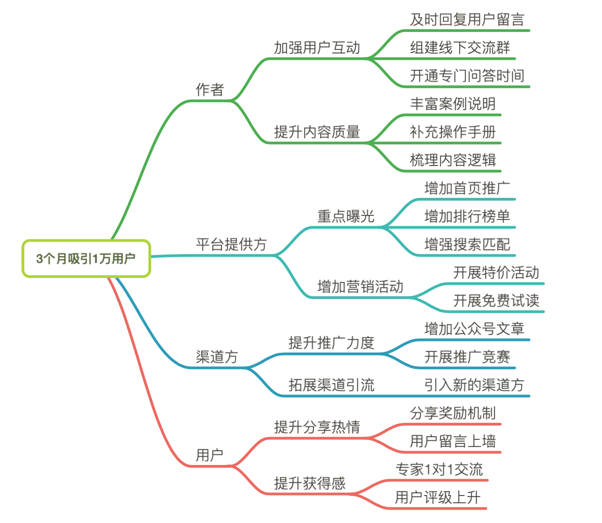
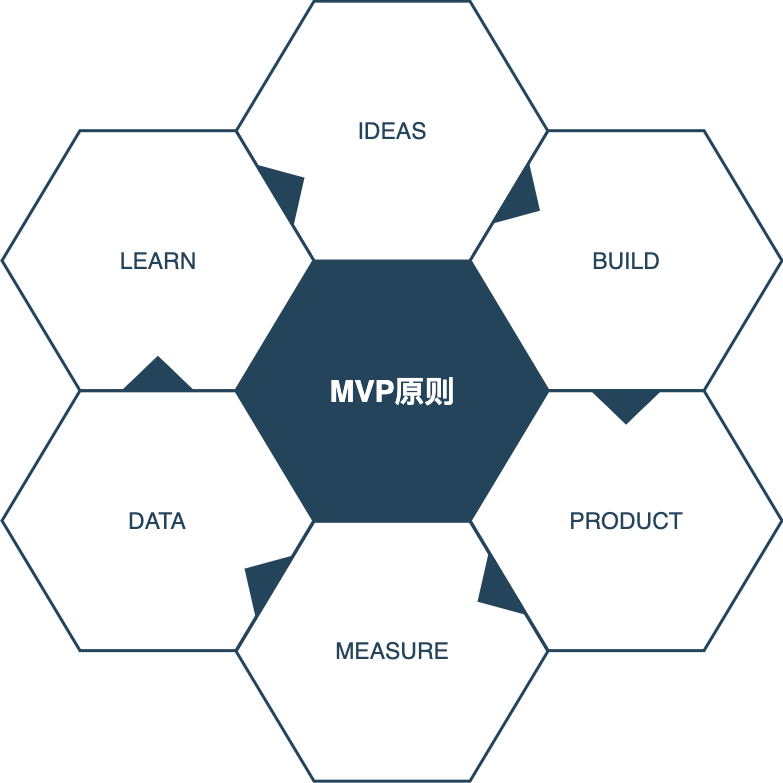

---
date: "2019-06-23"
---  
      
# 07 | 业务敏捷：帮助DevOps快速落地的源动力
你好，我是石雪峰，今天我要跟你分享的主题是业务敏捷，那么，我们先来聊一聊，什么是业务敏捷，为什么需要业务敏捷呢？

先试想这样一个场景：你们公司内部成立了专项小组，计划用三个月时间验证DevOps落地项目的可行性。当要跟大老板汇报这个事情的时候，作为团队的负责人，你开始发愁，怎么才能将DevOps的价值和业务价值关联起来，以表明DevOps对业务价值的拉动和贡献呢？

如果朝着这个方向思考，就很容易钻进死胡同。因为，从来没有一种客观的证据表明，软件交付效率的提升，和公司的股价提升有什么对应关系。换句话说，软件交付效率的提升，并不能直接影响业务的价值。

实际上，软件交付团队一直在努力通过各种途径改善交付效率，但如果你的前提是需求都是靠谱的、有效的，那你恐怕就要失望了。因为，实际情况是，业务都是在不断的试错中摸着石头过河，抱着“宁可错杀一千，也不放过一个”的理念，各种天马行空的需求一起上阵，搞得软件交付团队疲于奔命，宝贵的研发资源都消耗在了业务的汪洋大海中。但是，这些业务究竟带来了多少价值，却很少有人能说得清楚。

在企业中推行DevOps的时间越长，就越会发现，开发、测试和运维团队之间的沟通障碍固然存在，但实际上，业务部门和IT部门之间的鸿沟，有时候会更加严重。试问有多少公司的业务方能够满意IT部门的交付效率，又有多少IT团队不会把矛头指向业务方呢？说白了，就一句话：**如果业务不够敏捷，IT再怎么努力也没用啊！**所以，我觉得很有必要跟你聊一聊有关需求的话题。

<!-- [[[read_end]]] -->

回到最开始的那个问题，如果DevOps不能直接提升公司的业务价值，那么为什么又要推行DevOps呢？实际上，如果你把DevOps的价值拆开业务价值和交付能力两个部分，就很好理解了。

在现在这个多变的时代，没人能够准确地预测需求的价值。所以，交付能力的提升，可以帮助业务以最小的成本进行试错，将新功能快速交付给用户。同时，用户和市场的情况又能够快速地反馈给业务方，从而帮助业务校准方向。而业务的敏捷能力高低，恰恰体现在对功能的设计和需求的把握上，如果不能灵活地调整需求，专注于最有价值的事情，同样会拖累交付能力，导致整体效率的下降。

也就是说，在这样一种快速迭代交付的模式下，业务敏捷和交付能力二者缺一不可。

所以，开发更少的功能，聚焦用户价值，持续快速验证，就成了产品需求管理的核心思想。

## 开发更少的功能

很多时候，团队面临的最大问题，就是需求太多。但实际上，很多需求一开始就没想好，甚至在设计和开发阶段还在不断变更，这就给交付团队带来了极大的困扰。所以，在把握需求质量的前提下，如何尽可能地减小需求交付批次，采用最小的实现方案，保证高优先级的需求可以快速交付，从而提升上线实验和反馈的频率，就成了最关键的问题。

关于需求分析，比较常见的方法就是影响地图。

影响地图是通过简单的“Why-Who-How-What”分析方法，实现业务目标和产品功能之间的映射关系。

* Why代表目标，它可以是一个核心的业务目标，也可以是一个实际的用户需求。
* Who代表影响对象，也就是通过影响谁来实现这个目标。
* How代表影响，也就是怎样影响用户以实现我们的目标。
* What代表需要交付什么样的功能，可以带来期望的影响。

如果你是第一次接触影响地图，可能会听起来有点晕。没关系，我给你举个例子，来帮你理解这套分析方法。

比如，一个专栏希望可以在上线3个月内吸引1万名用户，那么，这个Why，也就是最核心的业务目标。为了达成这个目标，需要影响的角色包含哪些呢？其实就包含了作者、平台提供方、渠道方和最终用户。需要对他们施加哪些影响呢？对作者来说，需要快速地回答用户的问题，提升内容的质量；对平台来说，需要对专栏进行重点曝光，增加营销活动；对渠道方来说，需要提高推广力度和渠道引流；对于用户来说，增加分享有礼、免费试读和个人积分等活动。

那么基于以上这些影响方式，转化为最终的实际需求，就形成了一张完整的影响地图，如下图所示：

你可能会问，需求这么多，优先级要怎么安排呢？别急，现在我就给你介绍一下“卡诺模型”。

> [卡诺模型](https://www.kanomodel.com/)（Kano Model），是日本大师授野纪昭博士提出的一套需求分析方法，它对理解用户需求，对其进行分类和排序方面有着很深刻的洞察。

卡诺模型将产品需求划分为五种类型：

1.  兴奋型：指超乎用户想象的需求，是可遇不可求的功能。比如用户想要一个更好的功能手机，乔布斯带来了iPhone，这会给用户带来极大的满足感。
2.  期望型：用户的满意度会随着这类需求数量的增多而线性增长，做得越多，效果越好，但难以有质的突破。比如，一个电商平台最开始是卖书，后面逐步扩展到卖电脑、家居用品等多个类别。用户更多的线性需求被满足，满意度自然也会提升。
3.  必备型：这些是产品必须要有的功能，如果没有的话，会带来非常大的影响。不过有这些功能的话，也没人会夸你做得有多好，比如安全机制和风控机制等。
4.  无差别型：做了跟没做一样，这就是典型的无用功。比如你花了好大力气做了一个需求，但是几乎没有用户使用，这个需求就属于无差别型。
5.  反向型：无中生有类需求，实际上根本不具备使用条件，或者用户压根不这么想。这类需求做出来以后，通常会给用户带来很大的困扰，成为被吐槽的对象。

对于五类需求来说，核心要做到3点：

* **优先规划期望型和必备型需求**，将其纳入日常的交付迭代中，保持一定的交付节奏；
* **识别无差别型和反向型需求**，这些对于用户来说并没有产生价值。如果团队对需求的分类有争议，可以进一步开展用户调研和分析。
* **追求兴奋型需求**，因为它会带来产品的竞争壁垒和差异化。不过，对于大公司而言，经常会遇到创新者的窘境，也就是坚持固有的商业模式，而很难真正投入资源创新和自我颠覆。这就要采用精益创业的思想，采用MVP（最小可行产品）的思路，进行快速验证，并且降低试错成本，以抓住新的机遇。

在面对一大堆业务需求的时候，首先要进行识别和分类。当然，最开始时，人人都相信自己的需求是期望型，甚至是兴奋型的，这也可以理解。毕竟，这就好比公司里面所有的缺陷问题等级都是最高级一样，因为只要不提最高级，就会被其他最高级的问题淹没，而长期得不到解决。而**解决的方法，就是让数据说话，为需求的价值建立反馈机制，而这里提到的价值，就是用户价值**。

## 聚焦用户价值

“以终为始”，这四个字在精益、DevOps等很多改进的话题中经常会出现。说白了，就是要“指哪打哪，而不是打哪指哪”。产品开发方经常会问：“这个功能这么好，为什么用户就不用呢？”**这就是典型的用产品功能视角看问题，嘴上喊着“用户是上帝”的口号，但实际上，自己却用上帝视角来看待具体问题**。

如果你所在的公司也在搞敏捷转型，那你应该也听说过用户故事这个概念。需求不是需求，而是故事，这也让很多人不能理解。那么，用户故事是不是换了个马甲的需求呢？

关于这个问题，我曾经特意请教过一位国内的敏捷前辈，他的话让我记忆犹新。他说，从表面上看，用户故事是一种采用故事来描述需求的形式，但实际上是业务敏捷性的重要手段。它改变的不仅仅是需求的书写方式，还是需求达成共识的方式。也就是说，如果所谓的敏捷转型，没有对需求进行拆解，对需求达成共识的方式进行改变，对需求的价值进行明晰，那么可能只是在做迭代开发，而跟敏捷没啥关系。

在以往进行需求讨论的时候，往往有两个极端：一种是一句话需求，典型的“给你一个眼神，你自己体会”的方式，反正我就要做这件事，至于为什么做、怎么做一概不管，你自己看着办；另一种是上来就深入实现细节，讨论表字段怎么设计、模块怎么划分，恨不得撸起袖子就跟研发一起写代码。

每次需求讨论都是一场唇枪舌剑，达成的共识都是以一方妥协为前提的，这样显然不利于团队的和谐发展。更重要的是，始终在功能层面就事论事，而不关注用户视角，这样交付出来的需求很难达到预期。

而用户故事则是以用户的价值为核心，圈定一种角色，表明通过什么样的活动，最终达到什么样的价值。团队在讨论需求的时候，采用一种讲故事的形式，代入到设定的用户场景之中，跟随用户的操作路径，从而达成用户的目标，解决用户的实际问题。这样做的好处在于，经过团队的共同讨论和沟通，产品、研发和测试对需求目标可以达成共识，尤其是对想要带给用户的价值达成共识。

在这个过程中，团队不断探索更好的实现方案和实现路径，并补充关联的用户故事，从而形成完整的待办事项。更重要的是，团队成员逐渐培养了用户和产品思维，不再拘泥于技术实现本身，增强了彼此之间的信任，积极性方面也会有所改善，从而提升整个团队的敏捷性。

用户故事的粒度同样需要进行拆分，拆分的原则是针对一类用户角色，交付一个完整的用户价值，也就是说用户故事不能再继续拆分的粒度。当然，在实际工作中，拆分的粒度还是以迭代周期为参考，在一个迭代周期内交付完成即可，一般建议是3～5天。检验用户故事拆分粒度是否合适，可以遵循INVEST原则。

那么，什么是INVEST原则呢？

* Independent（独立的）：减少用户故事之间的依赖，可以让用户故事更加灵活地验证和交付，而避免大批量交付对于业务敏捷性而言至关重要。
* Negotiable（可协商的）：用户故事不应该是滴水不漏、行政命令式的，而是要抛出一个场景描述，并在需求沟通阶段不断细化完成。
* Valuable（有价值的）：用户故事是以用户价值为核心的，所以每个故事都是在对用户交付价值，所以要站在用户的视角思考问题，避免像最近特别火的那句话一样：“我不要你觉得，我要我觉得。”
* Estimatable（可评估的）：用户故事应该可以粗略评估工作量，无论是故事点数还是时间，都可以。如果是一个预研性质的故事，则需要进一步深挖可行性，避免不知道为什么做而做。
* Small（小的）：用户故事应该是最小的交付颗粒度，所以按照敏捷开发方式，无论迭代还是看板，都需要在一个交付周期内完成。
* Testable（可测试的）：也就是验收条件，如果没有办法证明需求已经完成，也就没有办法进行验收和交付。

## 持续快速验证

所谓用户价值，说起来多少有些虚无缥缈。的确，就像我们无法预测未来一样，**需求的价值难以预测，但是需求的价值却可以定义**。所以，需求价值的定义，可以理解为需求价值的度量，分为客观指标和主观2个方面。

* 客观指标：也就是客观数据能够表明的指标，比如对电商行业来说，可以从购买流程角度，识别商品到达率、详情到达率、加入购物车率、完成订单率等等；
* 主观指标：也就是用户体验、用户满意度、用户推荐率等等，无法直接度量，只能通过侧面数据关联得出。

但是无论是客观指标，还是主观指标，每一个需求在提出的时候，可以在这些指标中选择需求上线后的预期，并定义相关的指标。一方面加强价值导向，让产品交付更有价值的需求，另外一方面，也强调数据导向，尽量客观地展现实际结果。

当然，产品需求是一个复杂的体系，相互之间也会有影响和依赖，怎么从多种指标中识别出关键指标，并跟需求本身进行关联，这就是一门学问了。不过你别担心，我会在度量相关的内容中跟你详细讨论一下。

在很多企业中，精益创业的MVP思想已经深入人心了。面对未知的市场环境和用户需求，为了快速验证一个想法，可以通过一个最小化的产品实现来获取真实的市场反馈，并根据反馈数据修正产品目标和需求优先级，从而持续迭代产品需求。

这套思想基本上放之四海而皆准，但是在企业中实际应用的时候，也会出现跑偏的情况。比如，在需求提出的时候，产品预定义了一组指标，但是在上线后由于缺乏数据支撑，需求价值的评估变成了纯粹的主观题，比如业务方自主判断需求是达到预期，符合预期还是未达到预期。这样一来，十有八九统计出来的结果都是符合预期及以上。但问题是，这样推导出来的结果对产品方向是否真的有帮助呢？

所以，采用客观有效的反馈机制就成了必选项。从技术层面来说，一个业务需求的背后，一般都会关联一个埋点需求。所谓埋点分析，是网站分析的一种常用的数据采集方法。设计良好的埋点功能，不仅能帮助采集用户操作行为，还能识别完整的上下文操作路径，甚至进行用户画像的聚类和分析，帮助识别不同类型用户的行为习惯。从用户层面来说，众测机制和用户反馈渠道是比较常见的两种方式，核心就是既要听用户怎么说，也要看用户怎么做。

## 总结

DevOps的关注点要从研发环节继续向上游延伸，一直把业务团队包括进来。也就是说，IT部门不仅仅是被动的按照业务需求交付功能，还要更加快速地提供业务数据反馈，辅助业务决策。同时，交付能力的提升也进一步降低了业务的试错成本，而业务的敏捷性也决定了研发交付的需求价值和交付节奏，通过影响地图进行需求分析，再通过卡诺模型分析需求属性和优先级，通过用户故事和整个团队达成共识，通过持续快速验证，帮助产品在正确的道路上发展前进。

引入业务的DevOps，就成了BizDevOps，这也是DevOps发展的一种潮流。最后，我帮你梳理下BizDevOps的核心理念：

* 对齐业务和开发目标、指标；
* 把握安全、合规指标；
* 及时对齐需求，减少无用开发；
* 体现DevOps的价值；
* 让开发团队开始接触业务，不单单是执行，调动积极性。

## 思考题

你所在的企业中对于需求的价值是如何衡量的呢？是否有一套指标体系可以客观地展现需求的价值呢？

欢迎在留言区写下你的思考和答案，我们一起讨论，共同学习进步。如果你觉得这篇文章对你有所帮助，欢迎你把文章分享给你的朋友。