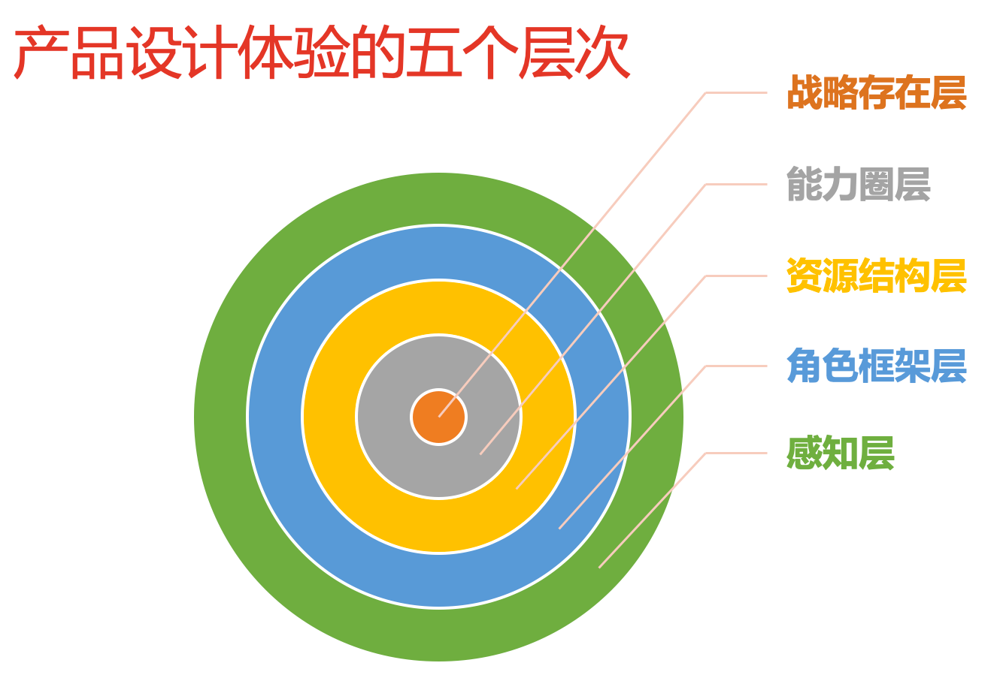

---
date: "2019-06-23"
---  
      
# 22 | 产品设计之道：DevOps产品设计的五个层次
你好，我是石雪峰。

在上一讲中，我们聊到了企业DevOps平台建设的三个阶段。那么，一个平台产品到底做到什么样，才算是好的呢？不知道你有没有想过这个问题，反正做产品的这些年来，我一直都在思考这个事儿。直到我听到了梁宁的专栏里面讲到的用户体验的五层要素，才发现，**无论什么产品，其实都是为了解决一群特定的人在特定场景的特定问题**。

那么，回到我们的DevOps产品，我们可以借鉴一下梁宁老师的思路，来看看DevOps产品设计体验的五个层次：**战略存在层、能力圈层、资源结构层、角色框架层和感知层**。

这么多专有名词一股脑地蹦出来，估计你头都大了吧？没关系，接下来我会逐一解释一下。

## 第一个层次：战略存在层

在决定开发一个DevOps产品的时候，我们首先要回答的根本问题就是，这个产品解决了什么样的痛点问题？换句话说，我们希望用户通过这个产品得到什么？显然，目标用户和痛点问题的不同，会从根本上导致两套DevOps产品之间相距甚远。

举个例子，业界很多大公司在内部深耕DevOps平台很多年，有非常多很好的实践。但是，当他们准备把这些内部平台对外开放，提供给C端用户使用的时候，会发现存在着严重的水土不服问题。

有些时候，内外部产品团队有独立的两套产品，对外提供的产品版本甚至比对内的版本要差上几年。这就是用户群体的不同造成的。C端用户相对轻量级，需要的功能大多在具体的点上，而企业内部因为多年的积累，有大量的固有流程、系统、规则需要兼顾。所以，整套产品很重，甚至是完全封闭的一套体系，难以跟用户现有的平台进行打通。

<!-- [[[read_end]]] -->

所以，我见过很多产品团队，他们对自己初期的产品定位并非在用户需求本身，而是在同类竞争对手身上。也就是说，他们先从模仿业界做得比较好的同类产品开始，从产品设计、功能模块到用户交互等，一股脑地参考同类产品，美其名曰“至少先赶上业界主流水平再说”。于是乎，团队开足马力在这条路上渐行渐远。

当然，借鉴同类产品的先进经验，这个做法本身并没有什么问题，毕竟，这些经验已经经过市场和用户的检验，至少走偏的风险不大。可问题是，**同类产品的经验并不能作为自己产品的战略**。

亚马逊的CEO贝佐斯就说过一句特别著名的话：“**要把战略建立在不变的事物上。**”比如，如果竞争对手推出了一项新的功能，或者他们改变了自己的方向，那么我们的战略是否要随之变化，继续迎头赶上呢？这是一个值得产品团队深思的问题。

以我所在的电商行业为例，我们的产品始终在强调用户体验，但好的产品设计和用户体验绝不是因为友商做了什么花哨的改变，而是始终着眼于那些长久不变的事物之上，也就是**多、快、好、省**。因为，不管什么时候，用户选择在你的平台购物，肯定不会是因为你的产品比其他家的要贵吧？同样的道理，对于DevOps产品来说，也是这样。

那么，有没有永远不变的内容可以作为DevOps产品的战略定位呢？显然也是有的，那就是：**效率、质量、成本和安全**。归根结底，**产品的任何功能都是要为战略服务的**。比如，构建加速，要解决的就是效率问题，而弹性资源池，自然更加关注成本方面的问题。在任何时候，如果你的产品能在某个点上做到极致，那么恭喜你，你就找到了自己产品的立身之本。

**明确目标用户，定义刚性需求，服务于典型场景，并最终在某一个点上突出重围，这就是我们在准备做DevOps产品的时候首先要想清楚的问题**。无论是对内产品，还是对外产品，道理都是一样的。

## 第二个层次：能力圈层

战略很好，但是不能当饭吃。为了实现战略目标，我们需要做点什么，这就是需要产品化的能力。所谓产品化，就是将一个战略或者想法通过产品分析、设计、实验并最终落地的过程。

很少公司会有魄力一上来就投入百人团队开发DevOps产品，大多数情况下，都是一两个有志青年搭建起草台班子，从一个最简单的功能开始做起。资源的稀缺性决定了我们永远处于喂不饱的状态，而在这个时候，最重要的就是所有为，有所不为。

我们一定要明确，哪些是自己产品的核心竞争力，而哪些是我们的边界和底线，现阶段是不会去触碰的。当我们用这样一个圈子把自己框起来的时候，至少在短期内，目标是可以聚焦的。

当然，随着产品的价值体现，资源会随之而扩充，这个时候，我们就可以调整、扩大自己的能力圈。但说到底，**这些能力都是为了实现产品战略而存在的，这一点永远不要忘记**。

我还是拿个实际的案例来说明这个问题。之前在企业内部启动持续交付流水线项目的时候，我们这个草台班子总共才4个人，而我们面对的是千人的协同开发团队。在每个业务领域内部，都有很多的产品工具平台在提供服务，缺少的就是平台间的打通。

对于企业而言，一套完整覆盖端到端的研发协作平台看起来很美，但是，要做这么一套东西，投入巨大不说，还会同现有的工具平台产生冲突，这样就变成了一个零和游戏。

所谓零和游戏，就是所有玩家资源总和保持固定，只是在游戏过程中，资源的分配方式发生了改变。

就现在的这个例子来说，如果平台潜在用户总量是一定的，有一方向前一步，必定有另外一方向后一步，这显然不是我们这个“小虾米团队”现阶段能做到的。

所以，我们就给自己的产品定义了一个能力圈，它的边界就在于不去替换现有的工具平台，而是只专注于做链路打通的事情。这样一来，既有平台仍然可以单独提供服务，也可以通过标准化的方式提供插件，对接到我们的平台上来，我们的平台就成了它们的另外一套入口，有助于用户规模的扩大。

而对于我们自己来说，这些平台能力的注入，也扩展了我们自己的能力圈外沿，这些既有平台的用户就成了我们的潜在用户群体。这种双赢的模式，后来被证明是行之有效的，平台获得了很大的成功。

在跟很多朋友交流产品思路的时候，我总是把**主航道和护城河理论**挂在嘴边。**所谓主航道，就是产品的核心能力，直接反射了产品战略的具体落地方式**。对于流水线产品来说，这个能力来源于对软件交付过程的覆盖，而不论你将来开发任何产品，这条主路径都是无法回避的。那么，产品就有了茁壮成长的环境和土壤。而**护城河就是你这个产品的不可替代性，或者是为了替代你的产品需要付出的高额代价**。

还是引用流水线产品的例子，我们的护城河一方面来源于用户数据的沉淀，另一方面就在于这些外部能力的接入。你看，随着接入平台的增多，我们自身产品的护城河也越发难以逾越，这就是对于能力圈更加长远的考量了。

## 第三个层次：资源结构层

为什么做和做什么的问题，我们已经解决了，接下来，我们就要掂量掂量自己在资源方面有哪些优势了。

资源这个事儿吧，就像刚才提到的，永远是稀缺的，但这对于所有人来说都是公平的。所以，**对资源的整合和调动能力就成了核心竞争力**。当你没有竞争对手的时候，用户选择你的产品并不是什么难事，因为既然解决了一个痛点问题，又没有更好的选择，用一用也无妨。

可现实情况是，无论是企业内部，还是外部，我们都身处在一个充满竞争的环境，最开始能够吸引用户的点，说起来也很可笑，很多时候就在于让用户占了你的资源的便宜，也就是用户认为你的产品有一些资源是他们不具备的。

举个例子，在很长一段时间内，App的构建和打包都是基于本地的一台电脑来做的，这样做的风险不用多说，但是大家也没什么更好的选择。尤其是面对iOS这种封闭的生态环境，想要实现虚拟化、动态化也不是一句话的事情，甚至有可能触犯苹果的规则红线。

这时，如果你的产品申请了一批服务器，并且以标准化的方式部署在了生产机房，那么这些资源就成了产品的核心能力之一。

随着越来越多的用户跑来占便宜，产品对于大规模资源的整合能力就会不断提升，从而进一步压低平均使用成本，这就形成了一个正向循环。

产品蕴含的资源除了这些看得见、摸得着的机器以外，还有很多方面，比如，硬实力方面的，像速度快、机器多、单一领域技术沉淀丰富，又比如，强制性的，像审批入口、安全规则，还有软性的用户习惯，数据积累等等。

对于内部DevOps产品来说，还有一项资源是至关重要的，那就是**领导支持**。这一点我们已经在专栏[第6讲](https://time.geekbang.org/column/article/154695)中深入讨论过了，我就不再赘述了。

## 第四个层次：角色框架层

当用户开始使用你的产品时，不要忘了，他们是来解决问题的，而每一个问题背后都存在一个场景，以及在这个场景中用户的角色。脱离这个场景和角色的设定，单纯讨论问题是没有意义的。

所以，我们总说，**要站在用户的角度来看待问题，要在他们当时的场景下，去解决他们的问题，而不是远远地观望着，甚至以上帝视角俯视全局**。

举个例子，当你和其他部门在为了一个功能设计争得面红耳赤，差点就要真人PK的时候，你们的领导走进了会议室，你猜怎样，瞬间气氛就缓和起来，似乎刚才什么也没发生过。这难道是因为我们的情绪管理能力很强吗？其实不然，这主要是因为我们身处的场景发生了变化，我们的角色也发生了改变。

再举个产品的例子，当我们在开发流水线产品的时候，为了满足用户不同分支构建任务的需求，我们提供了分支参数的功能。但是，在收集反馈的时候，全都是负面声音，难道这是个“伪需求”吗？

其实不是。通过实际数据，我们可以看到，很多用户已经开始使用这个功能了。这不是得了便宜又卖乖吗？问题就在于，**我们没有站在用户当时的角色框架下，来思考这个问题**。

因为，分支功能是需要用户手动输入的，但分支名又长又容易出错，每次都要从另外一个系统或者本地复制粘贴。当这个场景出现一次的时候并不是什么大事，但是，如果每个人每天都要做几十次的话，这就是大问题了。其实，解决思路很简单，增加历史信息或者自动关联的功能就可以啦。

所以你看，有时候我们不需要多么伟大的创造和颠覆，基于核心场景的微创新也能起到正向的作用。

说到底，其实就是一句话：**不要让你的产品只有专业人士才会使用。**

为了兼容灵活性，很多产品都提供了很多配置，但是，对于当时这个场景来说，绝大多数配置，都是没人关心的。**产品应该提供抽象能力屏蔽很多细节，而不是暴露很多细节，甚至，好的产品自身就是使用说明书**。这一点，在注意力变得格外稀缺的现在，重要性不可忽视。

## 第五个层次：感知层

现在，我们来看看最后一个层次：**感知层**，这也是距离用户最近的一个层次。

不可否认，这是一个看脸的时代，但是产品终究是给人用的，而不是给人看的。所以，很多人甚至强调，对于内部产品来说，UI完全不重要，家丑不外扬就好了。

可是，换位思考一下，你希望自己每天打交道的是一个设计凌乱、完全没有美感的产品吗？

答案很有可能是否定的。可这对于很多DevOps的产品经理来说，是最难的一点。这是因为，没有人天生就是DevOps产品经理，很多人都是半路出家，做开发的，做测试的，甚至是当老板的。

让不专业的人做专业的事情，结果可想而知，好多产品功能的设计都堪称是“反人类”的。

关于这个层次，我提供两点建议：

1.  **多跟前端工程师交流**。现在的前端框架已经非常成熟了，基于模板，我们可以快速地搭建出一个平台。而且，模板的框架自身，也蕴含着很多的设计思想。

2.  **多学习一些基本的设计原则**。你可以参考[Element官网](https://element.eleme.cn/)上的设计理念章节，里面谈到了**一致、反馈、效率和可控**四个方面，每个方面又涉及很多细节。参照着成熟的产品，再对照这些基本设计理念，你放心，你会进步神速的。

## 总结

今天，我们介绍了DevOps产品设计的五个层次，包括：战略存在层、能力圈层、资源结构层、角色框架层和感知层。其实，当用户吐槽你的产品，或者产品迟迟没有提升的时候，我们可能就要沉下心来，对照着这五个层次，来看看问题到底出在哪里了。

## 思考题

你有用到过什么好的DevOps产品吗？它们有哪些功能，让你眼前一亮，不由得为这个产品点赞吗？

欢迎在留言区写下你的思考和答案，我们一起讨论，共同学习进步。如果你觉得这篇文章对你有所帮助，欢迎你把文章分享给你的朋友。