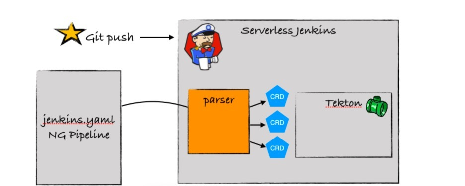

---
date: "2019-06-23"
---  
      
# 28 | 迈向云端：云原生应用时代的平台思考
你好，我是石雪峰。

最近几年，相信你一定从各种场合听到过“云原生”这个词。比如云原生应用的[12要素](https://12factor.net/zh_cn/)、最近大火的现象级技术Docker，以及容器编排技术Kubernetes。其中，Kubernetes背后的CNCF，也就是云原生应用基金会，也成了各大企业争相加入的组织。

DevOps似乎也一直跟云技术有着说不清的关系，比如容器、微服务、不可变基础设施以及服务网格、声明式API等都是DevOps技术领域中的常客。云原生应用似乎天生就和DevOps是绝配，自带高可用、易维护、高扩展、持续交付的光环。

那么，所谓的云原生，到底是什么意思呢？我引用一下来自于CNCF的官方定义：

> Cloud native computing uses an open source software stack to deploy applications as microservices, packaging each part into its own container, and dynamically orchestrating those containers to optimize resource utilization.  
> 云原生使用一种开源软件技术栈来部署微服务应用，将每个组件打包到它自己的容器中，并且通过动态编排来优化资源的利用率。

<!-- [[[read_end]]] -->

我总结一下这里面的关键字：**开源软件、微服务应用、容器化部署和动态编排**。那么，简单来说，云原生应用就是将微服务风格的架构应用，以容器化的方式部署在云平台上，典型的是以Kubernetes为核心的云平台，从而受益于云服务所带来的各种好处。

我在专栏中也反复强调过，容器技术和Kubernetes是划时代的技术，是每一个学习DevOps的工程师的必备技能。就像很多年前要人手一本《鸟哥的Linux私房菜》在学习Linux一样，Kubernetes作为云时代的Linux，同样值得你投入精力。

今天，我并不是要跟你讲Kubernetes，我想通过一个项目，以及最近两年我的亲身经历，给你分享一下，云原生究竟会带给DevOps怎样的改变。这个项目就是Jenkins X。

在2018年初，我分享过有关Jenkins X的文章，在短短几天的时间内，阅读量就过万了。这一方面体现了Jenkins在国内的巨大影响力，另外一方面，也凸显了Jenkins与这个时代的冲突和格格不入。为什么这么说呢？因为Jenkins作为一个15年的老系统，浑身上下充满了云原生的反模式 ，比如：

1.  Jenkins是一个Java单体应用，运行在JVM之上，和其他典型的Java应用并没有什么区别；
2.  Jenkins使用文件存储，以及各种加载模式、资源调度机制等，确保了它天生不支持高可用；
3.  Jenkins虽然提供了流水线，但是流水线依然是执行在主节点上，这就意味着随着任务越来越多，主节点消耗的资源也就越来越多，不仅难以扩展，还非常容易被随便一个不靠谱的任务搞挂掉。

举个最简单的例子，如果一个任务输出了500MB的日志，当你在Jenkins上点击查看全部日志的时候，那就保佑自己的服务器能挺过去吧。因为很多时候，服务器可能直接就死掉了。当然，**我非常不建议你在生产环境做这个实验。**

那么，如果想让Jenkins实现云原生化，要怎么做呢？有的同学可能会说：“把Jenkins放到容器中，然后丢给Kubernetes管理不就行了吗？”如果你也是这么想的，那就说明，无论是对Kubernetes还是云原生应用，你的理解还不够到位。我来给你列举下，如果要把Jenkins改造为一个真正的云原生应用，要解决哪些问题：

1.  可插拔式的存储（典型的像是S3、OSS）
2.  外部制品管理
3.  Credentials管理
4.  Configuration管理
5.  测试报告和覆盖率报告管理
6.  日志管理
7.  Jenkins Job
8.  ……

你看，我还只是列举了其中一部分，以云原生应用12要素的标准来说，要做的改造还有很多。

以日志为例，当前Jenkins的所有日志都是写在Master节点上的，如果想改造成云原生应用的方法，首先就是要把日志看作一种输出流。输出流不应该由应用管理，写在应用运行节点的本地，而是应该由专门的日志服务来负责收集、分析、整理和展示。比如ElasticSearch、Fluent，或者是AWS的CloudWatch Logs，都可以实现这个功能。

那么，Jenkins X是怎么解决这个问题的呢？

我们来试想一个场景：当开发工程师想要开发一个云原生应用的时候，他需要做什么？

首先，他需要有一套可以运行的Kubernetes环境。考虑到各种不可抗力因素，这绝对不是一件简单的事情。尤其是在几年前，如果有人能够通过二进制的方式完成Kubernetes集群的搭建和部署，这一定是一件值得吹牛的事情。好在现在公司里面都有专人负责Kubernetes集群维护，各大公有云厂商也都提供了这方面的支持。

现在，我们继续回到工程师的视角。

当他接到一个需求后，他首先需要修改代码，然后把代码编译打包，在本地测试通过。接下来，他要将代码提交到版本控制系统，手动触发流水线任务，并等待执行完毕。如果碰巧这次调整了编译命令，他还要修改流水线配置文件。最后，经过千辛万苦，生成了一个镜像文件，并把镜像文件推送到镜像服务器上。这还没完，他还需要修改测试环境的Kubernetes资源配置，调用kubectl命令完成应用的更新并等待部署完成。如果对于这次修改，系统验证出了新的问题，那么不好意思，刚刚的这些步骤都需要重头来过。

你看，虽然云原生应用有这么多好处，但是大大提升了开发的复杂度。一个工程师必须要熟悉Kubernetes、流水线、镜像、打包、部署等一系列的环节和新技术新工具，才有可能完成一次部署。如果这些操作都依赖于外部门或者其他人，那你就且等着吧。这么看来，这条路是走不下去的。

**在云时代，一切皆服务**。那么，在云原生应用时代，DevOps或持续交付理应也是以一种服务的形式存在。就好比你在用电的时候，一定不会去考虑电厂是怎么运转的，电是怎么送到家里来的，你只要负责用就可以了。

那么，我们来看看Jenkins X是怎么一步步地把Jenkins“干掉”的。其实，我希望你能记得，**是不是Jenkins X本身并不重要，在这个过程中使用到的工具和技术，以及它们背后的设计理念，才是更重要的**。

## 1.自动化生成依赖的配置文件

对于一个云原生应用来说，除了源代码本身之外，还依赖于哪些配置文件呢？其中就包括：

* Dockerfile：用于生成Docker镜像
* Jenkinsfile：应用关联的流水线配置
* Helm Chart：把应用打包并部署运行在Kubernetes上的资源文件
* Skaffold：用于在Kubernetes中生成Docker image的工具

考虑到你可能不太熟悉这个Skaffold工具，我简单介绍一下。

实际上，如果想在 Kubernetes 环境中生成Docker镜像，你会发现，一般来说，这都依赖于Docker服务，也就是Docker daemon。那么常见的做法无外乎Docker-in-Docker和Docker-outside-Docker。

其中，Docker-in-Docker就是在基础镜像中提供内建的Docker daemon和镜像生成环境，这依赖于官方镜像的支持。而Docker-outside-Docker比较好理解，就是将宿主机的Docker daemon挂载到Docker镜像里面。

有三种典型的实现方式：第一种是挂载节点的Docker daemon，第二种就是使用云平台提供的外部服务，比如Google Cloud Builder，第三种就是使用无需Docker daemon也能打包的方案，比如常见的Kaniko。

而Skaffold想要解决的就是，你不需要再关心如何生成镜像、推送镜像和运行镜像，它会通通帮你搞定，依赖的就是skaffold.yaml文件。

这些文件如果让研发手动生成，那会让研发的门槛变得非常高。好在你可以通过Draft工具来自动化这些操作。Draft是微软开源的一个工具，它包含两个部分。

* 源代码分析器。它可以自动扫描你的源代码，根据代码特征，识别出你所用到的代码类型，比如JavaScript、Python等。
* build pack。简单来说，build pack就是一种语言对应的模板。通过在模板中定义好预设的环境依赖配置文件，包括上面提到的Dockerfile、Jenkinsfile等，从而实现依赖项的自动生成和创建。当然，你也可以定义自己的build pack，并作为模板在内部项目中使用。

很多时候，模板都是一种特别好的思路，它可以大大简化初始配置成本，提升环境和服务的标准化程度。对于流水线来说，也是如此，毕竟，不是很多人都是这方面的专家，只要能针对90\%的场景提供一组或几组最佳实践的模板就足够了。

这样一来，无论是已经存在的代码，还是权限初始化的项目，研发都不需要操心如何实现代码打包、生成镜像，以及部署的过程。这也会大大节省研发的精力。毕竟，就像我刚刚提到的，不是每个人都是容器和构建方面的专家。

## 2.自动化流水线过程

当应用初始化完成之后，流水线应该是开箱即用的状态。也就是说，比如项目采用的是特性分支加主干开发分支发布的策略，那么，build pack中就预置了针对每条分支的流水线配置文件。这些文件定义了每条分支需要经过的检查过程。

那么，当研发提交代码的时候，对应的流水线就会被自动触发。对于研发来说，这一切都是无感知的。只有在必要的时候（比如出现了问题），系统才会通知研发查看错误信息。这就要求**流水线的Jenkinsfile要自动生成，版本控制系统和CI/CD系统也需要自动打通**。比如，Webhook的注册和配置、MR的评审条件、自动过滤的分支信息等等，都是需要自动化完成的。

这里所用到的技术主要有三点。

1.  **流水线即代码**。毕竟，只有代码化的流水线配置才有可能自动化。
2.  **流水线的抽象和复用**。以典型的Jenkinsfile为例，大多数操作应该提取到公共库，也就是shared library中，而不应该hard code在流水线配置文件里面，以提升抽象水平和能力复用。
3.  **流水线的条件判断**。对于同一条流水线来说，根据不同的条件，可以实现不同的执行路径。

## 3.自动化多环境部署

对于传统应用来说，尤其是对上下游依赖比较复杂的应用来说，环境管理是个老大难的问题。Kubernetes的出现大大简化了这个过程。当然，**前提是云原生应用部署在Kubernetes上时，所有依赖都是环境中的资源**。

依靠Kubernetes强大的资源管理能力，能够动态初始化出来一套环境，是一种巨大的进步。

Jenkins X默认就提供了预发环境和生产环境。不仅如此，对于每一次的代码提交所产生的PR，Jenkins X都会自动初始化一个预览环境出来，并自动完成应用在预览环境的部署。这样一来，每次代码评审的时候，都能够打开预览环境查看应用的功能是否就绪。通过借助用户视角来验收这些功能，也提升了最终交付的质量。

这里面所用到的技术，除了之前我在第16讲中给你介绍过的GitOps，主要就是**Prow工具**。

你可以把Prow看作ChatOps的一种具体实现。实际上，它提供的是一种**高度扩展的Webhook时间处理能力**。比如，你可以通过对话的方式，输入 /approve 命令，Prow接收到这个命令后，就会触发对应的Webhook，并实现流水线的自动执行以及一系列的后台操作。

## 4\. 使用云原生流水线

在今年年初，Jenkins X进行了一次全面的升级，开始支持Tekton流水线。Tekton的前身是2018年初创建的KNative项目，这是一个面向Kubernetes的Serverless解决方案。但随着这个项目边界的扩大，它渐渐地把整个交付流程的编排都纳入了进来，于是就成立了Tekton项目，用来提供Kubernetes原生的流水线能力。

Tekton提供了最底层的能力，Jenkins X提供了上层抽象，也就是通过一个yaml文件的形式来描述整个交付过程。我给你分享了一个流水线配置文件的例子：

```
    agent:
      label: jenkins-maven
      container: maven
    pipelines:
      pullRequest:
        build:
          steps:
          - sh: mvn versions:set -DnewVersion=$PREVIEW_VERSION
          - sh: mvn install
      release:
        setVersion:
          steps:
          - sh: echo \$(jx-release-version) > VERSION
            comment: so we can retrieve the version in later steps
          - sh: mvn versions:set -DnewVersion=\$(cat VERSION)
          - sh: jx step tag --version \$(cat VERSION)
        build:
          steps:
          - sh: mvn clean deploy
    

```

在这个例子中，你可以看到，流水线过程是通过yaml格式来描述的，而不是通过我们之前所熟悉的groovy格式。另外，在这个文件中，你基本上也看不到Tekton中的资源类型，比如Task、TaskRun等。

实际上，Jenkins X基于Jenkins原有的流水线语法结构，重新定义了一套基于yaml格式的语法。你依然可以使用以前的命令在yaml中完成整个流水线的定义，但是，在后台，Jenkins X会将这个文件转换成Tekton需要使用的CRD资源并触发Kubernetes执行。

说白了，用户看起来还是在使用Jenkins，但实际上，流水线的执行引擎已经从原来的JVM变成了现在Kubernetes。流水线的执行和调度由Kubernetes来完成，整个过程中每一步的环境都是动态初始化生成的容器，所有的数据都是通过外部存储来保存的。

经过这次升级，终于实现了真正意义上的平台云原生化改造。关于这个全新的Jenkins流水线语法定义，你可以参考下[官方文档](https://jenkins-x.io/docs/reference/pipeline-syntax-reference/)。

我再给你分享一幅Serverless Jenkins和Tekton的关系示意图，希望可以帮助你更好地理解背后的实现机制。



> <https://dzone.com/articles/move-toward-next-generation-pipelines>

最终，我们希望达到的目的，就是不再有一个一直存在的Jenkins Master实例等待用户调用，而是一种被称为是“Ephemeral Jenkins”的机制，也就是一次性的Jenkins，只有在需要的时候才会启动一个Master实例，用完了就关闭掉，从一种静态服务变成了一种转瞬即逝的动态服务，也就是看似不在、又无处不在的形式，以此来驱动云原生应用的CI/CD之旅。

讲到这里，我们回头再看看最开始的那个场景。对于享受了云原生流水线服务的工程师而言，他所需要关注的就只有把代码写好这一件事情，其他原本需要他操心的事情，都已经通过后台的自动化、模板化实现了。

即便是在本地开发调试，你也完全可以利用Kubernetes提供的环境管理能力，甚至在IDE里面，只要保存代码，就能完成从打包、镜像生成、推送、环境初始化和部署的完整过程。我相信，这也是云原生工具赋能研发的终极追求。

## 总结

最近这两年，经常有人问我，Jenkins是不是过时了？类似Argo、Drone等更轻量化的解决方案是否更加适合云原生应用的发展？

其实，社区的开发者也在问自己这样的问题，而答案就是Jenkins X项目。这个项目整合了大量的开源工具和云原生解决方案，其中包括：

* 基于Kubernetes的云原生开发体验
* 自动化的CI/CD流程
* 多套预置的环境，并能够灵活初始化环境
* 使用GitOps在多环境之间进行部署晋级
* 云原生的流水线架构和面向用户的易用配置
* 可插接自定义的流水线执行引擎

我必须要承认，云原生带给平台的改变是巨大且深刻的。这两年，我一方面惊叹于社区的巨大活力和创新力，另一方面，我也深刻地意识到“未来已来”，这种变更的脚步越来越近。

在云原生时代，我们需要打造的也应该是一个自动化、服务化、高度扩展的平台。这也就是说，**用于打造云原生应用的平台自身也应该具备云原生应用的特征**，并通过平台最大化地赋能研发工程师，提升他们的生产力水平。

## 思考题

对于DevOps的落地推行来说，建设工具仅仅是完成了第一步，那么，如何让工具发挥真正的威力，并在团队中真正地进行推广落地呢？你有哪些建议呢？

欢迎在留言区写下你的思考和答案，我们一起讨论，共同学习进步。如果你觉得这篇文章对你有所帮助，也欢迎你把文章分享给你的朋友。