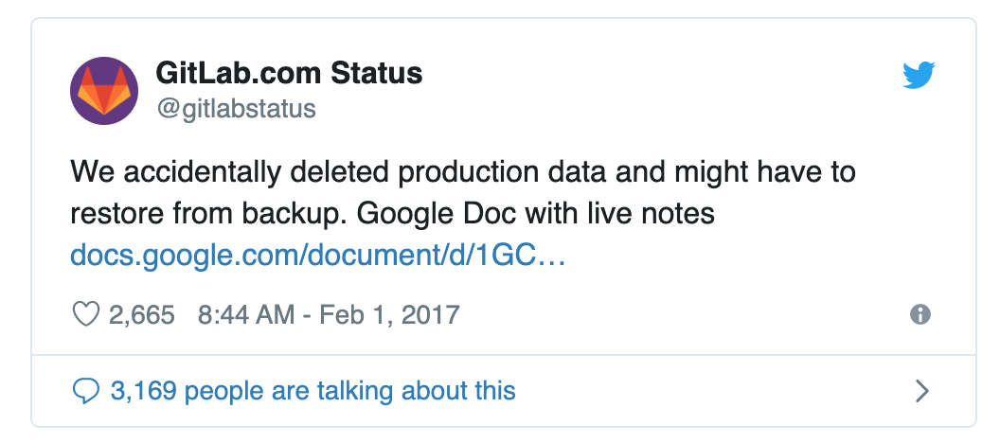
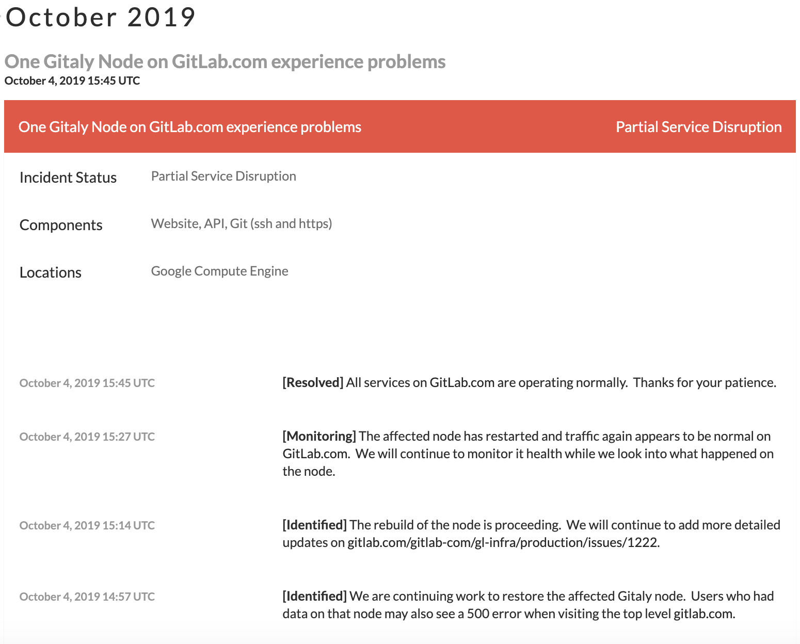
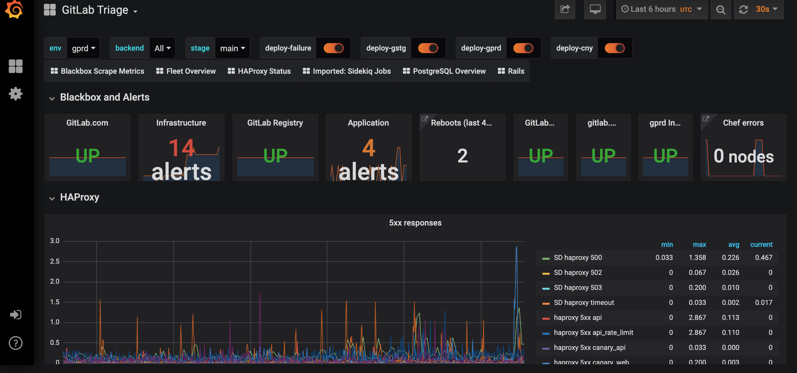

---
date: "2019-06-23"
---  
      
# 特别放送（五）| 关于DevOps组织和文化的那些趣事儿
你好，我是石雪峰，今天又到了特别放送环节。写到这儿，专栏已经接近尾声了，我想再跟你聊聊DevOps的组织和文化。

DevOps文化好像是一个矛盾结合体：一方面，文化这种东西似乎只可意会不可言传；另一方面，文化对DevOps实践的重要性又是毋庸置疑的。

在各种行业大会上，关于文化的议题总是屈指可数。原因也很简单，关于文化，一般都说不明白，即便能说明白，也改变不了什么。因为文化的改变可不是像引入一个工具那么简单，很多时候都需要思想上的转变。

谈到DevOps文化，我想到去年我和几个朋友一起组织《DevOps实践指南》的拆书帮活动。这个活动就是，通过连续几周的线上分享，我们帮助大家总结提炼书中的核心知识。

在分享的过程中，有这样一件事，我印象特别深刻。事情的起源是原书的第14章中有这样一段描述：

> 团队在客户面前没有任何需要隐藏的，对自己也同样如此。与其把影响线上系统的问题视为一种秘密，不如尽可能地将它透明化，主动将内部的问题广而告之给外部用户。

某大型公司的IT负责人刚好负责分享这个章节，他表示，为了尊重原文，他保留了这段描述，但是在国内的环境下，这并不现实。即便是他自己，一个坚定的DevOps实践者，也很难做到这种程度。因为如果把公司内部的问题通通开放给客户，那估计转天就可以收拾东西回家了。

<!-- [[[read_end]]] -->

也正因为公司一般不会在第一时间对外公布故障，所以也难怪，这些事情基本都是通过“云头条”这类公众号第一时间公布出来的。

但是，似乎大家的记忆力也都不太好，很多时候，这些事情过去了也就不了了之了，除了听说“谁又背锅了，谁又被牵连了“之类的流言蜚语之外，也没有什么特别之处。

这也可以理解，毕竟家丑不可外扬，内部吐吐槽也就罢了，如果凡事都到外面去宣传，那公司岂不是形象全无？更有甚者，还会影响用户对公司的信心。你想，如果天天就你问题最多，那谁还敢用你的服务呢？

我们都知道DevOps文化的几个关键词：**协作**、**分享共担**、**无指责文化**、**在错误中学习**……这些道理大家都懂，但真正遇到问题、需要平衡不同部门利益的时候，是否还能以这些文化为准则，来指导行为模式，就是另外一码事了。

说白了，如果想看团队是否具备DevOps文化，与嘴上说说相比，更重要的是看怎么做。所以，今天我给你分享几个故事，看看在面对同样的问题时，其他公司是怎么做的，并思考一下，为什么这样是一种更好的做法？

## GitLab删库的故事

时间回到2017年1月31日，全球最大的代码托管协作平台之一的GitLab出现了一次长达18小时的停机事故，原因居然是一个IT工程师把生产数据库的数据给清空了。

由于遇到了爬虫攻击，主备数据库之间的同步延迟已经超过了WAL的记录上限，导致数据同步无法完成。当时，遇到这种问题的操作就是移除所有备份数据库上的数据记录，然后全量触发一次新的同步。但是，由于数据库配置并发数和连接数等一系列的配置问题，导致数据库的数据备份一直失败。

这个时候，时间已经来到了标准国际时间的晚上11点半。由于时差的关系，对于身在荷兰的工程师来说，这时已经是深夜1点半了。当值工程师认为有可能是之前失败的同步遗留的数据导致的数据库备份失败，所以决定再一次手动清空备份服务器的数据。

但是，也许是由于疏忽，他并没有意识到，当时他操作的是**生产数据库**。几秒钟后，当他回过神来取消操作的时候，一切都已经来不及了。最终的结果是，总共有超过300G的线上数据丢失，直接导致了服务进入恢复模式。

按道理说，这种事情虽然难以接受，但其实并不少见。更加严重的是，当GitLab尝试恢复数据的时候才发现，他们所谓的“精心设计”的多重备份机制，竟然都无法拯救被删除的数据。

最夸张的是，直到这会儿，他们才发现，由于升级后工具版本不匹配，数据库的定时备份一直处于失败状态。他们原以为邮件会告警这个问题，但巧合再一次出现，针对自动任务的报警也没有生效。

事已至此，要么是隐藏事实，然后给外界一个不疼不痒的解释，要么就是把问题完全公开，甚至是具体到每一个细节，你会选择怎么处理呢？

GitLab公司的选择是后者。他们第一时间将系统离线，并将事件的所有细节和分析过程记录在一个公开的谷歌文档中。不仅如此，他们还在世界上最大的视频网站YouTube上对恢复过程进行全程直播。

考虑到有些用户不看YouTube，他们还在Twitter上同步更新问题状态，硬生生地将一场事故变成了一个热门话题。当时，同时在线观看直播的用户超过5000人，甚至一度冲到了热门榜的第二位。

除此之外，在几天后，公司的CEO亲自给出了一篇长达4000字的问题回溯记录，包含问题发生的背景、时间线、核心原因分析，针对每一种备份机制的说明，以及将近20条后续改进事项，由此获取了用户的信任和认可。可以说，在这一点上，他们真的做到了透明、公开和坦诚相待，并且做到了极致。

> 问题回溯的资料： <https://about.gitlab.com/2017/02/10/postmortem-of-database-outage-of-january-31/>

至于那位倒霉的工程师的结果，估计你也听说了，对他的惩罚就是强迫他看了几十分钟的《彩虹猫》动画。说实话，这个动画有点无聊。但是，如果这种事情发生在咱们身边，估计直接就被开掉了。我知道你肯定好奇这个《彩虹猫》到底是个啥动画片，我也特别无聊地找来看了下，如下所示：

从此以后，GitLab的开放越发“变本加厉”。现在你可以在任何时间去查看服务的实时状态，包括每一次过往的事故分析。同时，名叫“GitLab状态”的Twitter账号实时更新当前的问题，目标就是在任何用户发现问题之前，尽量主动地将问题暴露出来，至今已经发布了将近6000条问题。

同时，你还可以查看GitLab服务的详细监控视图和监控数据，包括GitLab的运维标准手册、备份脚本。这些通通都是对外开放的。只要你想用，你就可以直接拿来使用；如果你觉得哪里不靠谱，也可以直接提交改动给他们。我提取了一些截图和地址，你可以参考一下。

1.GitLab状态Twitter：[https://twitter.com/gitlabstatus](https://twitter.com/gitlabstatus%5Breference_end%5D)

2.GitLab状态网页：[https://status.gitlab.com/](https://status.gitlab.com/%5Breference_end%5D)

3.GitLab内部监控大屏：[https://dashboards.gitlab.com/](https://dashboards.gitlab.com/%5Breference_end%5D)

> 

这并不是GitLab公司发疯了，实际上，开放已经成为了主流公司的标配。比如，在GitHub上，你同样可以看到类似的信息。

故事讲到这儿，就可以告一段落了。**面对事故的态度，很大程度上体现了公司的文化**。

首先，就是**在错误中学习**。

GitLab的分析报告不仅是对问题本身的描述，很大程度上也是希望把他们的经验，尤其是修复过程中的经验分享出来，通过错误来积累经验，改善现有的流程和工具，从而彻底地避免类似问题的出现。

每个人、每个公司都会犯错，**对错误的态度和重视程度，决定了成长的高度**。所以，假如说我要去一家公司面试，面试官问我有没有问题，那我非常关心的一定是他们公司对错误的态度，以及具体的实际行动。

另外，就是**建立信任和及时反馈，公开透明是关键**。这不仅是对外部用户而言的，对内部协作的部门和组织来说，也是这样。因为只有充分的透明，才能赢得对方的信任，很多事情才有得聊，否则，建立协作、责任共担的文化，就成了一句空谈。

在开始建立DevOps文化的时候，你首先要明白，上下游所需要的信息是否能够自主简单、随时地获取到，如果不能的话，这就是一个很好的潜在改进事项。

## Etsy三只袖子毛衣的故事

Etsy是美国的一家手工艺电商平台，从2015年上市以来，它的市值一度接近80亿美元。当然，除了快速增长的市值以外，最为人称道的就是它们的DevOps能力，而它们的案例也大量出现在了《DevOps实践指南》一书中。

那么，为什么这个名不见经传的公司能够做到这种程度呢？实际上，通过一件小事，我们就能看出来原因。

你可能不知道的是，一家在线电子商务公司每日浏览频率最高的单体页面不是首页，也不是具体哪个商品的页面，而是**网站的不可用页面**，也就是我们习惯说的502页面。有些公司甚至为了提升502页面的用户体验，利用好这部分流量，在502页面做了很多文章，比如把502页面作为一个产品推广的阵地等。

当Etsy的网站不可用的时候，你看到的是一个小姑娘在织毛衣的画面，而这个毛衣竟然有三只袖子。

实际上，“三只袖子的毛衣”代表了Etsy对于错误的态度。我们都知道，一件毛衣应该只有两只袖子，这是常识。如果有人真的织出来第三只袖子，我们的第一反应就是觉得这很可笑，这只是个人的问题，却很少去想他为什么会做这种反常识的事情，背后的根因是什么。

但是，Etsy公司却不是这样的。在每年的年终总结大会上，公司都会颁发各种奖项，其中一个奖项的奖品就是“三只袖子的毛衣”，获奖者是公司年度引入最大问题的个人。

这是因为，在他们看来，**犯错误并不是什么大不了的事情。错误本身并不是个人的问题，而是公司系统和制度的问题，正因为有了这样的错误，才给了公司改进和成长的空间**。从某种意义上说，这也是一种贡献。

当然，除了制造噱头之外，通过这种行为，其实公司想表达的是它们对文化的偏好，也就是要**建立一种心理安全**、**快速变化**、**及时反馈**、**鼓励创新的文化**，由此来激发整个团队的士气和战斗力。

无独有偶，2019年的DevOps状态报告也特别指出，**心理安全的文化氛围，有助于团队生产力的提升**。更重要的是，状态报告还把它作为一条重要能力，放入了DevOps能力模型之中。

因为，只有当员工感受到心理安全时，才会把注意力集中在解决问题和快速完成工作上，而不是花费大量的时间用于互相攻击和部门政治。在跨部门寻求合作的时候，才会思考如何让组织的价值最大化，而不是想“谁过来动了我的奶酪，我要如何制造更高的门槛来保护自己的利益”。对于DevOps这种注重协作的研发模式来说，这一点真的太重要了。

## Netflix招聘成年人的故事

美国硅谷聚集了世界上大多数精英的IT公司，但是精英中的精英，就是FAANG，也就是Facebook、Apple、Amazon、Netflix和Google这五家公司的首字母简称，这五家公司基本引领了硅谷技术的风向标。大多数人对其中的4家公司都非常熟悉，但是对Netflix却知之甚少。那么，这家公司凭啥能跻身为精英中的精英呢？

如果我告诉你，在Netflix，每个工程师不仅拿着数一数二的薪水，还可以自己决定什么时候休假，爱休多长时间就休多长时间，而且报销不需要经过审批，填多少就报多少。另外，即便只加入公司一天就离职了，公司给予的补偿也足够他们活上一年半载。

看到这里，你是不是觉得这家公司的老板疯了呢？

这个叫作里德·哈斯廷斯的人还真没疯。我所说的这一切，背后的原因都被记录在了《奈飞文化手册》一书中，这也是号称硅谷最重要的文件的作者在离开Netflix之后写的一本阐述Netflix文化的书。

Netflix认为，**与其建立种种流程来约束员工，不如砍掉所有不必要的流程，给员工一个自由发挥自我价值的空间**。因为，把所有员工都视为一个成年人是他们的行为准则。**作为一个成年人，你应该能够为自己的行为负责，同时为公司的发展负责，由此做出最好的选择，并付出最大的努力**。

正是这种开放的氛围，使得Netflix至今开源了171个项目和插件。其中，像混沌工程的鼻祖混乱猴子（[Chaos Monkey](https://github.com/Netflix/chaosmonkey)）、断路器工具[Hystrix](https://github.com/Netflix/Hystrix)、服务注册工具[Eureka](https://github.com/Netflix/eureka)、部署工具[Spinnaker](https://www.spinnaker.io/) ，都是DevOps领域最为著名的开源工具。

**开源为先的共享精神**正在成为越来越多的公司重视开源的动力之一。让真正优秀的人做有价值的事情，而不是让他们整日为复杂的流程、公司的内部政治和无意义的工作所影响，他们才能发挥最大的价值。对DevOps来说，也是如此。

## 总结

说到这儿，三个故事已经讲完了。我们来总结一下在DevOps文化中最为知名的几点内容：

1.  建立免责的文化，并在错误中学习；
2.  通过对外开放透明，建立信任，促进协作；
3.  打造心理安全的氛围，鼓励创新；
4.  开源为先的共享精神。

改变企业文化，绝不是一个人、一句话的事情，管理层的认同和导向非常重要。但是，我们并不能期望每家公司都能成为FAANG一样的硅谷巨头。所以，从我做起，从力所能及的范围做起，别觉得文化跟自己没有关系，这才是最重要的。

最后，希望你看完这一讲以后，可以重新审视一下，团队内部是否建立了正向的错误回溯机制？是否鼓励内部分享和创新？是否和上下游之间做到了开放和协作为先？是否在身体力行地减少重复建设？

## 思考题

你对今天的哪些内容印象最深刻呢？你又有哪些跟DevOps文化相关的故事可以拿来分享呢？

欢迎在留言区写下你的思考和答案，我们一起讨论，共同学习进步。如果你觉得这篇文章对你有所帮助，也欢迎你把文章分享给你的朋友。