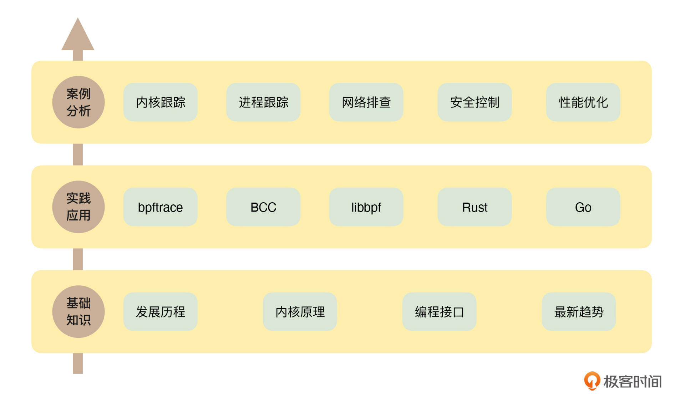
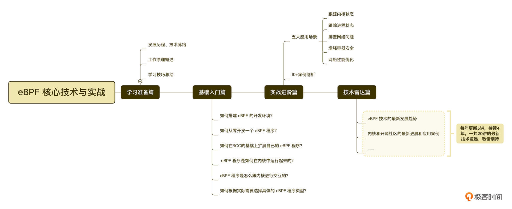

---
date: "2019-06-23"
---  
      
# 开篇词 | 想要洞悉系统底层的黑盒？先掌握 eBPF！
你好，我是倪朋飞，一名云计算从业者。

自从十年前参加工作以来，我一直都在云计算领域工作，特别专注于包括虚拟化、软件定义网络、容器等在内的云计算基础设施领域。

我其实是极客时间的老朋友了，曾在几年前开过[《Linux 性能优化实战》](https://time.geekbang.org/column/intro/100020901?tab=catalog)专栏。这门课聚焦于 Linux 性能优化技术，从系统底层原理、性能指标再到实际工作的优化技巧，带你准确分析和优化 Linux 性能问题。

这门课上线后，同学们的交流热情完全出乎我的意料，也激励着我把专栏的篇幅延长了10多篇。同时，我也注意到，很多同学在学习涉及系统底层知识较多的模块时掉了队，特别是面对系统内核的原理时有些畏惧的心理。

所以，今天我又给你带来了一门全新的课程。这门课的主要目标就是带你利用 eBPF 去洞悉内核的运行状态，并去解决性能优化、网络观测、安全控制等实际生产环境中的问题。在 eBPF 的助力下，你并不需要成为内核开发者，也可以掌控内核的运行状态。

## 为什么要学习 eBPF？

其实，我与 eBPF 的“初次接触”，还要从最流行的网络抓包和分析工具 tcpdump 开始说起。

我相信你和我一样，在一开始学习 TCP/IP 网络原理时，大量借助了 tcpdump 来了解网络协议的工作原理。而在实际的工作中，大多数网络问题的排查也是借助了 tcpdump 才能了解到网络层面上到底发生了什么事情。

<!-- [[[read_end]]] -->

后来，在排查断断续续的网络丢包问题时，我才发现只有 tcpdump 是不够的。tcpdump 只能告诉你网络上传输了哪些包，至于为什么这么传输，它就无能为力了。所以，当时我也搜索了大量的网络资料，偶然发现了 [BCC](https://github.com/iovisor/bcc) 这个工具，并借助它顺利解决了很多类似的网络问题。自此以后，网络问题就不再是我的心魔。

**这里我要说的是，tcpdump 和 BCC 之所以这么高效强大，都是得益于 BPF/eBPF 技术。**

eBPF 是什么呢？ 从它的全称“扩展的伯克利数据包过滤器 \(Extended Berkeley Packet Filter\)” 来看，它是一种数据包过滤技术，是从 BPF \(Berkeley Packet Filter\) 技术扩展而来的。

BPF 提供了一种在内核事件和用户程序事件发生时安全注入代码的机制，这就让非内核开发人员也可以对内核进行控制。随着内核的发展，BPF 逐步从最初的数据包过滤扩展到了网络、内核、安全、跟踪等，而且它的功能特性还在快速发展中，这种扩展后的 BPF 被简称为 eBPF（相应的，早期的 BPF 被称为经典 BPF，简称 cBPF）。实际上，现代内核所运行的都是 eBPF，如果没有特殊说明，内核和开源社区中提到的 BPF 等同于 eBPF（在我们的专栏里，它们的含义也完全相同）。

我想你已经知道，在 eBPF 之前，内核模块是注入内核的最主要机制。由于缺乏对内核模块的安全控制，内核的基本功能很容易被一个有缺陷的内核模块破坏。**而 eBPF 则借助即时编译器（JIT），在内核中运行了一个虚拟机，保证只有被验证安全的 eBPF 指令才会被内核执行。**同时，因为 eBPF 指令依然运行在内核中，无需向用户态复制数据，这就大大提高了事件处理的效率。

正是由于这些突出的特性，eBPF 现如今已经在故障诊断、网络优化、安全控制、性能监控等领域获得大量应用。比如，Facebook 开源的高性能网络负载均衡器 [Katran](https://github.com/facebookincubator/katran)、Isovalent 开源的容器网络方案 [Cilium](https://cilium.io) ，以及著名的内核跟踪排错工具 [BCC](https://github.com/iovisor/bcc) 和 [bpftrace](https://github.com/iovisor/bpftrace) 等，都是基于 eBPF 技术实现的。

下图（来自 [ebpf.io](https://ebpf.io)）是对eBPF 技术及其应用的一个概览：

可以说，如果你想洞悉内核的运行状态，优化内核网络性能，控制诸如容器等应用程序的安全，那么eBPF 就是一个你必须要掌握的技能。

## 要掌握 eBPF 是不是得先成为内核开发者？

到这里，我已经带你初步了解了 eBPF 强大的功能特性，我想你应该对进一步深入学习 eBPF 迫不及待了吧！不过，我猜你也有可能像 5 年前的我一样，在看到 eBPF 需要运行在内核中，并且还涉及到一些内核的编程开发时，心里有点打退堂鼓。那么，我们是不是需要先成为内核开发者，才可以掌握 eBPF 呢？

实际上，前面我提到的 BCC、bpftrace 等一系列的开源项目已经提供了大量工具，可以帮你解决像故障诊断、性能监控、安全控制等绝大部分场景中的问题。而在你需要开发新的 eBPF 程序时，内核社区提供的 [libbpf](https://github.com/libbpf/libbpf) 库不仅帮你避免了直接调用内核函数，而且还提供了跨内核版本的兼容性（即一次编译到处执行，简称 CO-RE）。

所以，掌握 eBPF 并不需要掌握内核开发。我认为，学习最快的方法就是理解原理的同时配合大量的实践，eBPF 也不例外。下面这三点是学习 eBPF 的重中之重：

只要理解了 eBPF 的基本原理，掌握了 eBPF 的运行机制和核心的编程接口，再结合大量的实践技巧，你也可以掌握 eBPF，并把它应用到真实的工作场景中。而这门课会针对不同场景，把这三个方面给你讲清楚。下面我们来具体看看这门课的设计思路。

## 这门课是怎么设计的？

为了帮你吃透 eBPF，在理解 eBPF 的同时更好地把它用起来，我会以案例驱动的思路，给你讲解 eBPF 的基本原理、使用方法以及相应的实践案例。

因为 eBPF 是一个实践性很强的技术，为了更好地掌握它，我希望你在学习这门课之前熟悉 Linux 的基本使用方法，并看得懂简单的 C、Python 等编程语言的基础语法。这样，你就能在后续课程中更好地掌握 eBPF 的实践方法。如果你觉得这些基础知识还没掌握好，也不用太担心，我会在 02 讲中为你详细介绍具体的学习路径、方法技巧，帮你快速查漏补缺，补足基础。

我会尽量把这门课的内容写得通俗易懂，并帮你划出重点、理出知识脉络，再通过案例分析和套路总结，让你学得更透、用得更熟。总之，我会带你从基础到实践，再结合实际案例，逐层深入 eBPF 相关的系统知识。

由于 eBPF 还是一个快速发展的技术，也是 Linux 内核社区最活跃和变更最频繁的模块之一，这门课将尝试用全新的方式向你交付。具体来看，**这门课的内容并不会一次性发布完毕，而是按时间分成两大阶段：常规更新阶段 + 动态更新阶段。**

第一个阶段，是像常规的专栏一样，每周更新三篇。这个阶段的内容分成学习准备篇、基础入门篇、实战进阶篇三个模块。

我会讲解 eBPF 的基本原理、使用方法、案例分析，以及常用工具、学习资料和学习经验总结。这些基本的知识，并不会随着时间的发展过时，它们是你理解 eBPF 机制、把握 eBPF 进化方向的抓手。

* **学习准备篇**，介绍 eBPF 的发展历程、工作原理以及主要的应用场景。同时，我也会带你梳理 eBPF 的技术脉络和学习路线，并分享我在学习 eBPF 时总结的技巧。
* **基础入门篇**，介绍 eBPF 的基本原理、编程接口，以及进行详细的原理讲解，这包括：
  * 如何搭建 eBPF 的开发环境；
  * 如何用好 BCC 并在它的基础上扩展自己的 eBPF 程序；
  * 如何从零开发一个 eBPF 程序；
  * 如何根据实际需要选择具体的 eBPF 程序类型。
* **实战进阶篇**，在了解了 eBPF 的基本使用方法后，我会通过一些案例，带你实践 eBPF 的主要应用场景，这包括：
  * 如何使用 eBPF 跟踪内核状态；
  * 如何使用 eBPF 跟踪进程状态；
  * 如何使用 eBPF 排查网络问题；
  * 如何使用 eBPF 增强容器安全；
  * 如何开发一个 eBPF 负载均衡程序。

我相信学完第一个阶段的内容后，你就能掌握 eBPF 的运行原理，并且可以编写自己的 eBPF 程序，观测内核的运行状态，并对 eBPF 常见的应用场景了然于胸。

**第二个阶段则是一个动态的过程，我们准备把它叫作“技术雷达篇”。**在第一阶段结束后的 4 年里，每个季度我都会更新一篇文章，带你持续跟踪内核和开源社区的最新进展和应用案例。

也就是说，这门课会全方位地解决你在学习、应用 eBPF 时候的一切重点问题。我会先在第一阶段把基础知识交付给你，然后在第二阶段定期向你交付 eBPF 技术的最新进展、发展趋势。 eBPF 技术时时刻刻在发展变化，但是只要你紧跟这颗“雷达”，就能在第一时间获得我为你梳理的最新信息。这样，你就不用再漫无目的地看资讯、查资料、找重点，可以把更多时间花在用好 eBPF 上。

由于这是一个全新的动态交付过程，我希望你可以和我，还有学习这门课的其他同学保持交流，分享你的学习心得和实践经验，并为课程未来的内容提供建议。

我邀请你在接下来的时间里，跟我一起走入 eBPF 的奇妙世界。我希望这门课可以帮你掌握 eBPF 的基础原理，并且学会如何把它们真正落地到你的产品之中，解决真实生产环境中的各种问题。同时，我们还会一起见证未来几年中 eBPF 技术的快速更新，共同探索技术发展的更多可能。接下来，就让我们正式开始这段旅程吧！