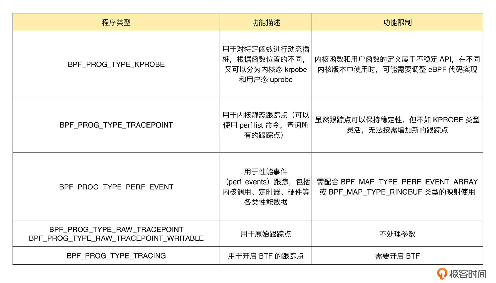
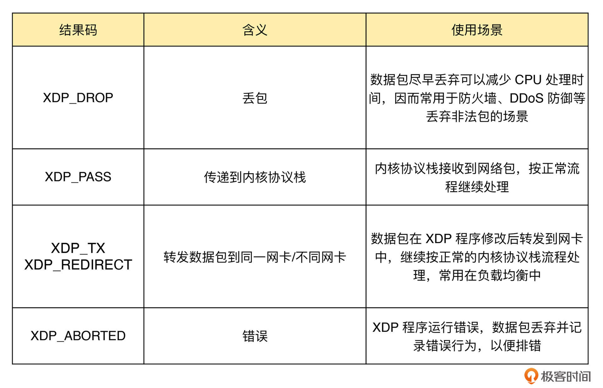
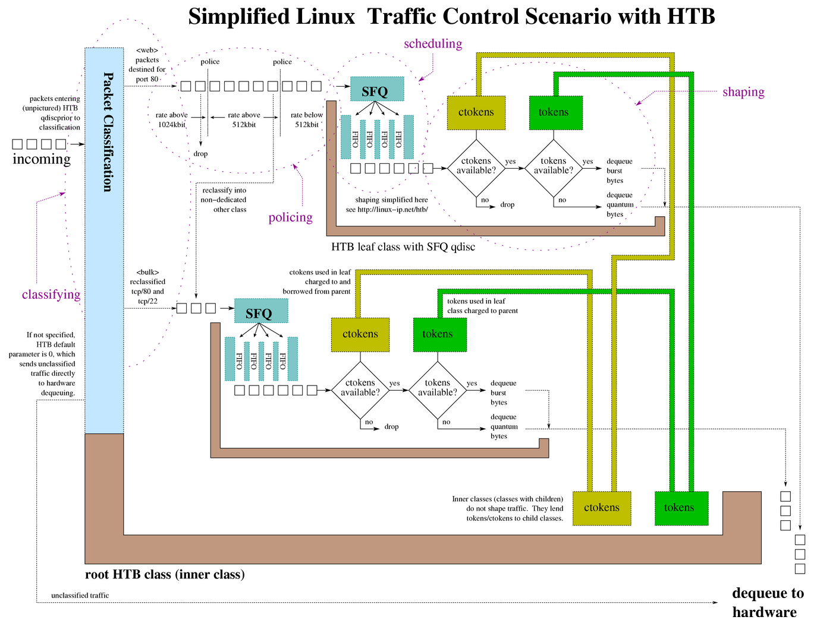
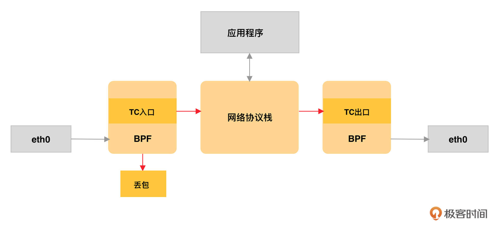
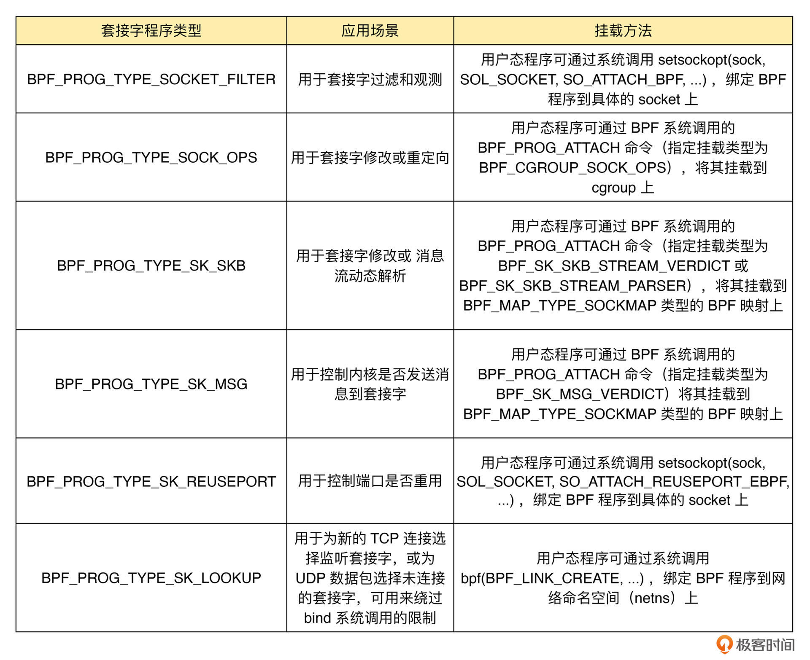
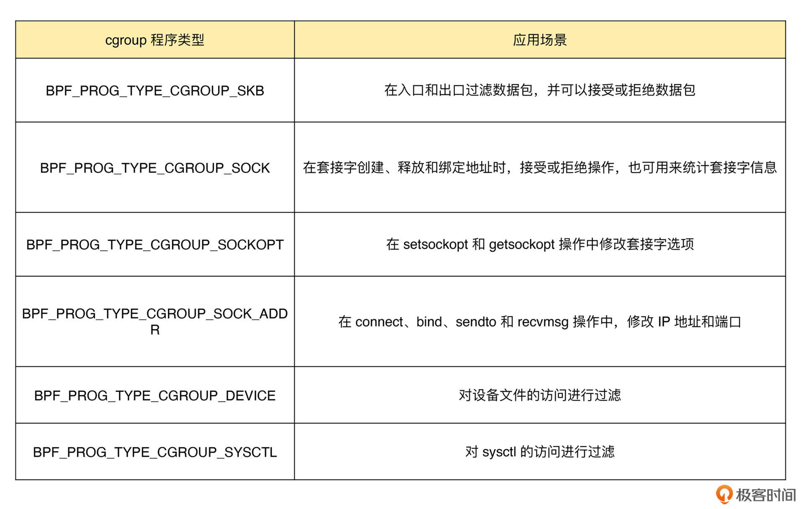

---
date: "2019-06-23"
---  
      
# 06 | 事件触发：各类 eBPF 程序的触发机制及其应用场景
你好，我是倪朋飞。

上一讲，我带你一起梳理了 eBPF 程序跟内核交互的基本方法。一个完整的 eBPF 程序通常包含用户态和内核态两部分：用户态程序通过 BPF 系统调用，完成 eBPF 程序的加载、事件挂载以及映射创建和更新，而内核态中的 eBPF 程序则需要通过 BPF 辅助函数完成所需的任务。

在上一讲中我也提到，并不是所有的辅助函数都可以在 eBPF 程序中随意使用，不同类型的 eBPF 程序所支持的辅助函数是不同的。那么，eBPF 程序都有哪些类型，而不同类型的 eBPF 程序又有哪些独特的应用场景呢？今天，我就带你一起来看看。

## eBPF 程序可以分成几类？

eBPF 程序类型决定了一个 eBPF 程序可以挂载的事件类型和事件参数，这也就意味着，内核中不同事件会触发不同类型的 eBPF 程序。

根据内核头文件 [include/uapi/linux/bpf.h](https://elixir.bootlin.com/linux/v5.13/source/include/uapi/linux/bpf.h#L908) 中 `bpf_prog_type` 的定义，Linux 内核 v5.13 已经支持 30 种不同类型的 eBPF 程序（注意， `BPF_PROG_TYPE_UNSPEC`表示未定义）：

```
    enum bpf_prog_type {
    	BPF_PROG_TYPE_UNSPEC, /* Reserve 0 as invalid program type */
    	BPF_PROG_TYPE_SOCKET_FILTER,
    	BPF_PROG_TYPE_KPROBE,
    	BPF_PROG_TYPE_SCHED_CLS,
    	BPF_PROG_TYPE_SCHED_ACT,
    	BPF_PROG_TYPE_TRACEPOINT,
    	BPF_PROG_TYPE_XDP,
    	BPF_PROG_TYPE_PERF_EVENT,
    	BPF_PROG_TYPE_CGROUP_SKB,
    	BPF_PROG_TYPE_CGROUP_SOCK,
    	BPF_PROG_TYPE_LWT_IN,
    	BPF_PROG_TYPE_LWT_OUT,
    	BPF_PROG_TYPE_LWT_XMIT,
    	BPF_PROG_TYPE_SOCK_OPS,
    	BPF_PROG_TYPE_SK_SKB,
    	BPF_PROG_TYPE_CGROUP_DEVICE,
    	BPF_PROG_TYPE_SK_MSG,
    	BPF_PROG_TYPE_RAW_TRACEPOINT,
    	BPF_PROG_TYPE_CGROUP_SOCK_ADDR,
    	BPF_PROG_TYPE_LWT_SEG6LOCAL,
    	BPF_PROG_TYPE_LIRC_MODE2,
    	BPF_PROG_TYPE_SK_REUSEPORT,
    	BPF_PROG_TYPE_FLOW_DISSECTOR,
    	BPF_PROG_TYPE_CGROUP_SYSCTL,
    	BPF_PROG_TYPE_RAW_TRACEPOINT_WRITABLE,
    	BPF_PROG_TYPE_CGROUP_SOCKOPT,
    	BPF_PROG_TYPE_TRACING,
    	BPF_PROG_TYPE_STRUCT_OPS,
    	BPF_PROG_TYPE_EXT,
    	BPF_PROG_TYPE_LSM,
    	BPF_PROG_TYPE_SK_LOOKUP,
    };
    

```
<!-- [[[read_end]]] -->

对于具体的内核来说，因为不同内核的版本和编译配置选项不同，一个内核并不会支持所有的程序类型。你可以在命令行中执行下面的命令，来查询当前系统支持的程序类型：

```
    bpftool feature probe | grep program_type
    

```

执行后，你会得到如下的输出：

```
    eBPF program_type socket_filter is available
    eBPF program_type kprobe is available
    eBPF program_type sched_cls is available
    eBPF program_type sched_act is available
    eBPF program_type tracepoint is available
    eBPF program_type xdp is available
    eBPF program_type perf_event is available
    ...
    eBPF program_type ext is NOT available
    eBPF program_type lsm is NOT available
    eBPF program_type sk_lookup is available
    

```

在这些输出中，你可以看到当前内核支持 kprobe、xdp、perf\_event 等程序类型，而不支持 ext、lsm 等程序类型。

根据具体功能和应用场景的不同，这些程序类型大致可以划分为三类：

* 第一类是跟踪，即从内核和程序的运行状态中提取跟踪信息，来了解当前系统正在发生什么。
* 第二类是网络，即对网络数据包进行过滤和处理，以便了解和控制网络数据包的收发过程。
* 第三类是除跟踪和网络之外的其他类型，包括安全控制、BPF 扩展等等。

接下来，我就带你一起分别看看，每一类 eBPF 程序都有哪些具体的类型，以及这些不同类型的程序都是由哪些事件触发执行的。

## 跟踪类 eBPF 程序

先看第一类，也就是跟踪类 eBPF 程序。

**跟踪类 eBPF 程序主要用于从系统中提取跟踪信息，进而为监控、排错、性能优化等提供数据支撑。**比如，我们前几讲中的 Hello World 示例就是一个 `BPF_PROG_TYPE_KPROBE` 类型的跟踪程序，它的目的是跟踪内核函数是否被某个进程调用了。

为了方便你查询，我把常见的跟踪类 BPF 程序的主要功能以及使用限制整理成了一个表格，你可以在需要时参考。



这其中，KPROBE、TRACEPOINT 以及 PERF\_EVENT 都是最常用的 eBPF 程序类型，大量应用于监控跟踪、性能优化以及调试排错等场景中。我们前几讲中提到的 [BCC](https://github.com/iovisor/bcc)工具集，其中包含的绝大部分工具也都属于这个类型。

## 网络类 eBPF 程序

看完跟踪类 eBPF 程序，我们再来看看网络类 eBPF 程序。

**网络类 eBPF 程序主要用于对网络数据包进行过滤和处理，进而实现网络的观测、过滤、流量控制以及性能优化等各种丰富的功能。**根据事件触发位置的不同，网络类 eBPF 程序又可以分为 XDP（eXpress Data Path，高速数据路径）程序、TC（Traffic Control，流量控制）程序、套接字程序以及 cgroup 程序，下面我们来分别看看。

### **XDP 程序**

XDP 程序的类型定义为 `BPF_PROG_TYPE_XDP`，它在**网络驱动程序刚刚收到数据包时**触发执行。由于无需通过繁杂的内核网络协议栈，XDP 程序可用来实现高性能的网络处理方案，常用于 DDoS 防御、防火墙、4 层负载均衡等场景。

你需要注意，XDP 程序并不是绕过了内核协议栈，它只是在内核协议栈之前处理数据包，而处理过的数据包还可以正常通过内核协议栈继续处理。你可以通过下面的图片（图片来自 [iovisor.org](https://www.iovisor.org/technology/xdp)）加深对 XDP 相对内核协议栈位置的理解：


根据网卡和网卡驱动是否原生支持 XDP 程序，XDP 运行模式可以分为下面这三种：

* 通用模式。它不需要网卡和网卡驱动的支持，XDP 程序像常规的网络协议栈一样运行在内核中，性能相对较差，一般用于测试；
* 原生模式。它需要网卡驱动程序的支持，XDP 程序在网卡驱动程序的早期路径运行；
* 卸载模式。它需要网卡固件支持 XDP 卸载，XDP 程序直接运行在网卡上，而不再需要消耗主机的 CPU 资源，具有最好的性能。

无论哪种模式，XDP 程序在处理过网络包之后，都需要根据 eBPF 程序执行结果，决定数据包的去处。这些执行结果对应以下 5 种 XDP 程序结果码：



通常来说，XDP 程序通过 `ip link` 命令加载到具体的网卡上，加载格式为：

```
    # eth1 为网卡名
    # xdpgeneric 设置运行模式为通用模式
    # xdp-example.o 为编译后的 XDP 字节码
    sudo ip link set dev eth1 xdpgeneric object xdp-example.o
    

```

而卸载 XDP 程序也是通过 `ip link` 命令，具体参数如下：

```
    sudo ip link set veth1 xdpgeneric off
    

```

除了 `ip link`之外， BCC 也提供了方便的库函数，让我们可以在同一个程序中管理 XDP 程序的生命周期：

```
    from bcc import BPF
    
    # 编译XDP程序
    b = BPF(src_file="xdp-example.c")
    fn = b.load_func("xdp-example", BPF.XDP)
    
    # 加载XDP程序到eth0网卡
    device = "eth0"
    b.attach_xdp(device, fn, 0)
    
    # 其他处理逻辑
    ...
    
    # 卸载XDP程序
    b.remove_xdp(device)
    

```

### **TC 程序**

TC 程序的类型定义为 `BPF_PROG_TYPE_SCHED_CLS` 和 `BPF_PROG_TYPE_SCHED_ACT`，分别作为 [Linux 流量控制](https://tldp.org/HOWTO/Traffic-Control-HOWTO/index.html) 的分类器和执行器。Linux 流量控制通过网卡队列、排队规则、分类器、过滤器以及执行器等，实现了对网络流量的整形调度和带宽控制。

下图（图片来自 [linux-ip.net](http://linux-ip.net/articles/Traffic-Control-HOWTO/)）展示了 HTB（Hierarchical Token Bucket，层级令牌桶）流量控制的工作原理：



由于 Linux 流量控制并非本课程的重点，这里我就不过多展开了。如果你对它还不熟悉，可以参考 [官方文档](https://tldp.org/HOWTO/Traffic-Control-HOWTO/index.html) 进行学习。

得益于内核 v4.4 引入的 [direct-action](https://docs.cilium.io/en/v1.8/bpf/#tc-traffic-control) 模式，TC 程序可以直接在一个程序内完成分类和执行的动作，而无需再调用其他的 TC 排队规则和分类器，具体如下图所示：



同 XDP 程序相比，TC 程序可以**直接获取内核解析后的网络报文数据结构**`sk_buff`（XDP 则是 `xdp_buff`），并且可**在网卡的接收和发送两个方向上执行**（XDP 则只能用于接收）。下面我们来具体看看 TC 程序的执行位置：

* 对于接收的网络包，TC 程序在网卡接收（GRO）之后、协议栈处理（包括 IP 层处理和 iptables 等）之前执行；
* 对于发送的网络包，TC 程序在协议栈处理（包括 IP 层处理和 iptables 等）之后、数据包发送到网卡队列（GSO）之前执行。

除此之外，由于 TC 运行在内核协议栈中，不需要网卡驱动程序做任何改动，因而可以挂载到任意类型的网卡设备（包括容器等使用的虚拟网卡）上。

同 XDP 程序一样，TC eBPF 程序也可以通过 Linux 命令行工具来加载到网卡上，不过相应的工具要换成 `tc`。你可以通过下面的命令，分别加载接收和发送方向的 eBPF 程序：

```
    # 创建 clsact 类型的排队规则
    sudo tc qdisc add dev eth0 clsact
    
    # 加载接收方向的 eBPF 程序
    sudo tc filter add dev eth0 ingress bpf da obj tc-example.o sec ingress
    
    # 加载发送方向的 eBPF 程序
    sudo tc filter add dev eth0 egress bpf da obj tc-example.o sec egress
    

```

### **套接字程序**

套接字程序用于过滤、观测或重定向套接字网络包，具体的种类也比较丰富。根据类型的不同，套接字 eBPF 程序可以挂载到套接字（socket）、控制组（cgroup ）以及网络命名空间（netns）等各个位置。你可以根据具体的应用场景，选择一个或组合多个类型的 eBPF 程序，去控制套接字的网络包收发过程。

这里，我把常见的套接字程序类型，以及它们的应用场景和挂载方法整理成了一个表格，你可以在需要时参考：



### **cgroup 程序**

cgroup 程序用于**对 cgroup 内所有进程的网络过滤、套接字选项以及转发等进行动态控制**，它最典型的应用场景是对容器中运行的多个进程进行网络控制。

cgroup 程序的种类比较丰富，我也帮你整理了一个表格，方便你在需要时查询：



这些类型的 BPF 程序都可以通过 BPF 系统调用的 `BPF_PROG_ATTACH` 命令来进行挂载，并设置[挂载类型](https://elixir.bootlin.com/linux/v5.13/source/include/uapi/linux/bpf.h#L942)为匹配的 `BPF_CGROUP_xxx` 类型。比如，在挂载 `BPF_PROG_TYPE_CGROUP_DEVICE` 类型的 BPF 程序时，需要设置 `bpf_attach_type` 为 `BPF_CGROUP_DEVICE`：

```
    union bpf_attr attr = {};
    attr.target_fd = target_fd;            // cgroup文件描述符
    attr.attach_bpf_fd = prog_fd;          // BPF程序文件描述符
    attr.attach_type = BPF_CGROUP_DEVICE;  // 挂载类型为BPF_CGROUP_DEVICE
    
    if (bpf(BPF_PROG_ATTACH, &attr, sizeof(attr)) < 0) {
      return -errno;
    }
    
    ...
    

```

注意，这几类网络 eBPF 程序是在不同的事件触发时执行的，因此，在实际应用中我们通常可以把多个类型的 eBPF 程序结合起来，一起使用，来实现复杂的网络控制功能。比如，最流行的 Kubernetes 网络方案 Cilium 就大量使用了 XDP、TC 和套接字 eBPF 程序，如下图（图片来自 Cilium [官方文档](https://docs.cilium.io/en/v1.11/concepts/ebpf/lifeofapacket/)，图中黄色部分即为 Cilium eBPF 程序）所示：


## 其他类 eBPF 程序

除了上面的跟踪和网络 eBPF 程序之外，Linux 内核还支持很多其他的类型。这些类型的 eBPF 程序虽然不太常用，但在需要的时候也可以帮你解决很多特定的问题。

我将这些无法划分到网络和跟踪的 eBPF 程序都归为其他类，并帮你整理了一个表格：


这个表格列出了一些不太常用的 eBPF 程序类型，你可以先大致浏览下，在需要的时候再去深入了解。

## 小结

今天，我带你一起梳理了 eBPF 程序的主要类型，以及不同类型 eBPF 程序的应用场景。

根据具体功能和应用场景的不同，我们可以把 eBPF 程序分为跟踪、网络和其他三类：

* 跟踪类 eBPF 程序主要用于从系统中提取跟踪信息，进而为监控、排错、性能优化等提供数据支撑；
* 网络类 eBPF 程序主要用于对网络数据包进行过滤和处理，进而实现网络的观测、过滤、流量控制以及性能优化等；
* 其他类则包含了跟踪和网络之外的其他 eBPF 程序类型，如安全控制、BPF 扩展等。

虽然每个 eBPF 程序都有特定的类型和触发事件，但这并不意味着它们都是完全独立的。通过 BPF 映射提供的状态共享机制，各种不同类型的 eBPF 程序完全可以相互配合，不仅可以绕过单个 eBPF 程序指令数量的限制，还可以实现更为复杂的控制逻辑。

## 思考题

最后，我想邀请你来聊一聊：

1.  你是怎么理解 eBPF 程序类型的呢？
2.  如果让你来重新设计类似于 Cilium 的网络方案，你会如何选择 eBPF 程序类型呢？

期待你在留言区和我讨论，也欢迎把这节课分享给你的同事、朋友。让我们一起在实战中演练，在交流中进步。