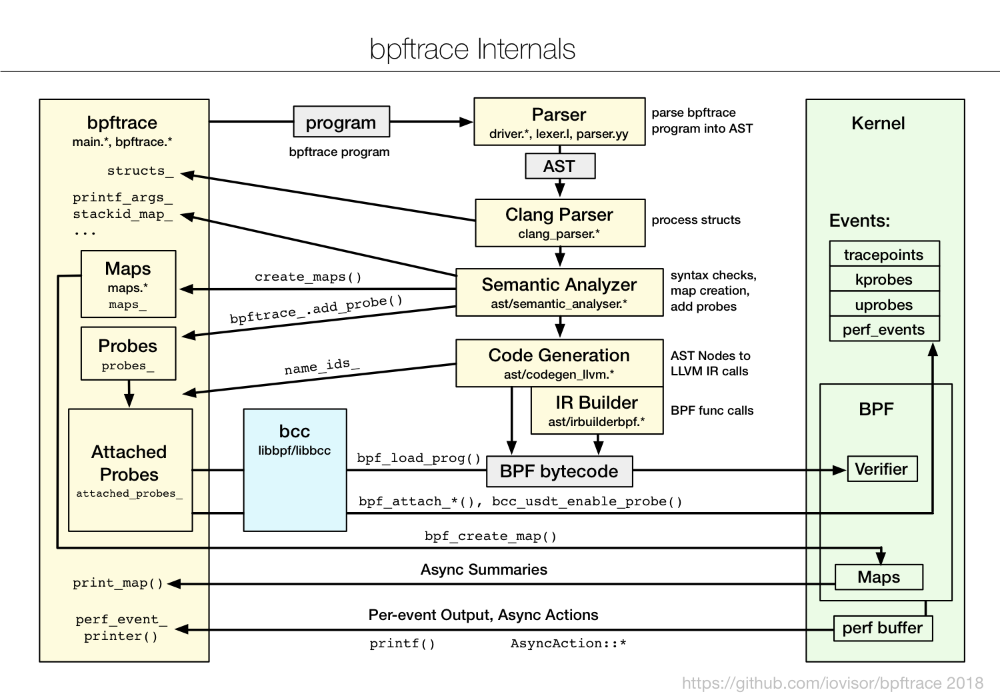
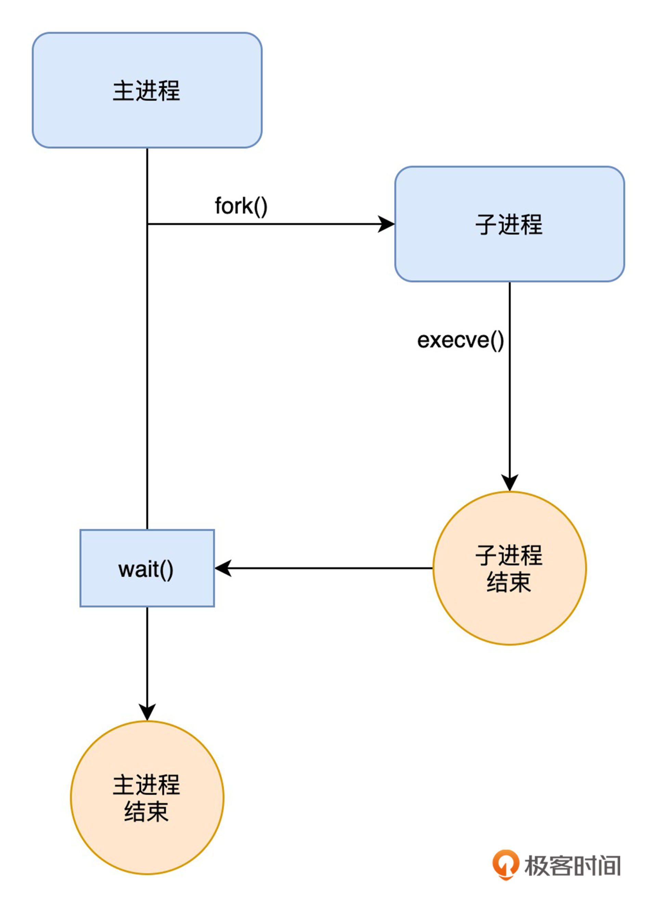

---
date: "2019-06-23"
---  
      
# 07 | 内核跟踪（上）：如何查询内核中的跟踪点？
你好，我是倪朋飞。

在上一个模块“基础入门篇”中，我带你搭建了 eBPF 的开发环境，并详细介绍了 eBPF 程序的工作原理、编程接口以及事件触发机制。学习完这些内容，我想你已经掌握了 eBPF 必备的基础知识，并通过简单的示例，初步体验了 eBPF 程序的开发和执行过程。

我在前面的内容中反复强调过，学习一门新技术，最快的方法就是在理解原理的同时配合大量的实践，eBPF 也不例外。所以，从这一讲起我们开始“实战进阶篇”的学习，一起进入 eBPF 的实践环节，通过真实的应用案例把 eBPF 技术用起来。

今天我们先来看看，怎样使用 eBPF 去跟踪内核的状态，特别是最简单的 bpftrace 的使用方法。在下一讲中，我还将介绍两种 eBPF 程序的进阶编程方法。

上一讲我提到过，跟踪类 eBPF 程序主要包含内核插桩（`BPF_PROG_TYPE_KPROBE`）、跟踪点（`BPF_PROG_TYPE_TRACEPOINT`）以及性能事件（`BPF_PROG_TYPE_PERF_EVENT`）等程序类型，而每类 eBPF 程序类型又可以挂载到不同的内核函数、内核跟踪点或性能事件上。当这些内核函数、内核跟踪点或性能事件被调用的时候，挂载到其上的 eBPF 程序就会自动执行。

<!-- [[[read_end]]] -->

那么，你可能想问了：当我不知道内核中都有哪些内核函数、内核跟踪点或性能事件的时候，可以在哪里查询到它们的列表呢？对于内核函数和内核跟踪点，在需要跟踪它们的传入参数和返回值的时候，又该如何查询这些数据结构的定义格式呢？别担心，接下来就跟我一起去探索下吧。

## **利用调试信息查询跟踪点**

实际上，作为一个软件系统，内核也经常会发生各种各样的问题，比如安全漏洞、逻辑错误、性能差，等等。因此，内核本身的调试与跟踪一直都是内核提供的核心功能之一。

比如，为了方便调试，内核把所有函数以及非栈变量的地址都抽取到了 `/proc/kallsyms` 中，这样调试器就可以根据地址找出对应的函数和变量名称。很显然，具有实际含义的名称要比 16 进制的地址易读得多。对内核插桩类的 eBPF 程序来说，它们要挂载的内核函数就可以从 `/proc/kallsyms` 这个文件中查到。

注意，内核函数是一个非稳定 API，在新版本中可能会发生变化，并且内核函数的数量也在不断增长中。以 v5.13.0 为例，总的内核符号表数量已经超过了 16 万：

```
    $ cat /proc/kallsyms | wc -l
    165694
    

```

不过需要提醒你的是，这些符号表不仅包含了内核函数，还包含了非栈数据变量。而且，并不是所有的内核函数都是可跟踪的，只有显式导出的内核函数才可以被 eBPF 进行动态跟踪。因而，通常我们并不直接从内核符号表查询可跟踪点，而是使用我接下来介绍的方法。

为了方便内核开发者获取所需的跟踪点信息，内核[调试文件系统](https://www.kernel.org/doc/html/latest/filesystems/debugfs.html)还向用户空间提供了内核调试所需的基本信息，如内核符号列表、跟踪点、函数跟踪（ftrace）状态以及参数格式等。你可以在终端中执行 `sudo ls /sys/kernel/debug` 来查询内核调试文件系统的具体信息。比如，执行下面的命令，就可以查询 `execve` 系统调用的参数格式：

```
    sudo cat /sys/kernel/debug/tracing/events/syscalls/sys_enter_execve/format
    

```

如果你碰到了 `/sys/kernel/debug` 目录不存在的错误，说明你的系统没有自动挂载调试文件系统。只需要执行下面的 mount 命令就可以挂载它：

```
    sudo mount -t debugfs debugfs /sys/kernel/debug
    

```

注意，**eBPF 程序的执行也依赖于调试文件系统**。如果你的系统没有自动挂载它，那么我推荐你把它加入到系统开机启动脚本里面，这样机器重启后 eBPF 程序也可以正常运行。

有了调试文件系统，你就可以从 `/sys/kernel/debug/tracing` 中找到所有内核预定义的跟踪点，进而可以在需要时把 eBPF 程序挂载到对应的跟踪点。

除了内核函数和跟踪点之外，性能事件又该如何查询呢？你可以使用 Linux 性能工具 [perf](https://man7.org/linux/man-pages/man1/perf.1.html) 来查询性能事件的列表。如下面的命令所示，你可以不带参数查询所有的性能事件，也可以加入可选的事件类型参数进行过滤：

```
    sudo perf list [hw|sw|cache|tracepoint|pmu|sdt|metric|metricgroup]
    

```

## **利用 bpftrace 查询跟踪点**

虽然你可以利用内核调试信息和 perf 工具查询内核函数、跟踪点以及性能事件的列表，但它们的位置比较分散，并且用这种方法也不容易查询内核函数的定义格式。所以，我再给你推荐一个更好用的 eBPF 工具 [bpftrace](https://github.com/iovisor/bpftrace/blob/master/docs/reference_guide.md)。

bpftrace 在 eBPF 和 BCC 之上构建了一个简化的跟踪语言，通过简单的几行脚本，就可以实现复杂的跟踪功能。并且，多行的跟踪指令也可以放到脚本文件中执行（脚本后缀通常为 `.bt`）。

如下图（图片来自 bpftrace[文档](https://github.com/iovisor/bpftrace/blob/master/docs/internals_development.md)）所示，bpftrace 会把你开发的脚本借助 BCC 编译加载到内核中执行，再通过 BPF 映射获取执行的结果：



因此，在编写简单的 eBPF 程序，特别是编写的 eBPF 程序用于临时的调试和排错时，你可以考虑直接使用 bpftrace ，而不需要用 C 或 Python 去开发一个复杂的程序。

那 bpftrace 该如何安装呢？对于 Ubuntu 19.04+、RHEL8+ 等系统，你可以直接运行下面的命令来安装 bpftrace：

```
    # Ubuntu 19.04
    sudo apt-get install -y bpftrace
    
    # RHEL8/CentOS8
    sudo dnf install -y bpftrace
    

```

而对于其他旧版本的系统或其他的发行版，你可以通过源代码编译的形式安装。至于具体的步骤，你可以参考它的[安装文档](https://github.com/iovisor/bpftrace/blob/master/INSTALL.md)，这里我就不展开讲了。

安装好 bpftrace 之后，你就可以执行 `bpftrace \-l` 来查询内核插桩和跟踪点了。比如你可以通过以下几种方式来查询：

```
    # 查询所有内核插桩和跟踪点
    sudo bpftrace -l
    
    # 使用通配符查询所有的系统调用跟踪点
    sudo bpftrace -l 'tracepoint:syscalls:*'
    
    # 使用通配符查询所有名字包含"execve"的跟踪点
    sudo bpftrace -l '*execve*'
    

```

对于跟踪点来说，你还可以加上 `-v` 参数查询函数的入口参数或返回值。而由于内核函数属于不稳定的 API，在 bpftrace 中只能通过 `arg0`、`arg1` 这样的参数来访问，具体的参数格式还需要参考内核源代码。

比如，下面就是一个查询系统调用 `execve` 入口参数（对应系统调用`sys_enter_execve`）和返回值（对应系统调用`sys_exit_execve`）的示例：

```
    # 查询execve入口参数格式
    $ sudo bpftrace -lv tracepoint:syscalls:sys_enter_execve
    tracepoint:syscalls:sys_enter_execve
        int __syscall_nr
        const char * filename
        const char *const * argv
        const char *const * envp
    
    # 查询execve返回值格式
    $ sudo bpftrace -lv tracepoint:syscalls:sys_exit_execve
    tracepoint:syscalls:sys_exit_execve
        int __syscall_nr
        long ret
    

```

所以，你既可以通过内核调试信息和 perf 来查询内核函数、跟踪点以及性能事件的列表，也可以使用 bpftrace 工具来查询。

在这两种方法中，我更推荐使用更简单的 bpftrace 进行查询。这是因为，我们通常只需要在开发环境查询这些列表，以便去准备 eBPF 程序的挂载点。也就是说，虽然 bpftrace 依赖 BCC 和 LLVM 开发工具，但开发环境本来就需要这些库和开发工具。综合来看，用 bpftrace 工具来查询的方法显然更简单快捷。

到这里，我已经带你了解了内核函数、跟踪点以及性能事件的查询方法，你是不是迫不及待地想去开发一个内核跟踪的 eBPF 程序了？

别急，在开发 eBPF 程序之前，你还需要在这些长长的函数列表中进行选择，确定你应该挂载到哪一个上。那么，具体该如何选择呢？接下来，就进入我们的案例环节，一起看看内核跟踪点的具体使用方法。

## **如何利用内核跟踪点排查短时进程问题？**

在排查系统 CPU 使用率高的问题时，我想你很可能遇到过这样的困惑：明明通过 `top` 命令发现系统的 CPU 使用率（特别是用户 CPU 使用率）特别高，但通过 `ps`、`pidstat` 等工具都找不出 CPU 使用率高的进程。这是什么原因导致的呢？你可以先停下来思考一下，再继续下面的内容。

你想到可能的原因了吗？在我看来，一般情况下，这类问题很可能是以下两个原因导致的：

* 第一，应用程序里面直接调用其他二进制程序，并且这些程序的运行时间很短，通过 `top` 工具不容易发现；
* 第二，应用程序自身在不停地崩溃重启中，且重启间隔较短，启动过程中资源的初始化导致了高 CPU 使用率。

使用 `top`、`ps` 等性能工具很难发现这类短时进程，这是因为它们都只会按照给定的时间间隔采样，而不会实时采集到所有新创建的进程。那要如何才能采集到所有的短时进程呢？你肯定已经想到了，那就是**利用 eBPF 的事件触发机制，跟踪内核每次新创建的进程**，这样就可以揪出这些短时进程。

要跟踪内核新创建的进程，首先得找到要跟踪的内核函数或跟踪点。如果你了解过 Linux 编程中创建进程的过程，我想你已经知道了，创建一个新进程通常需要调用 `fork()` 和 `execve()` 这两个标准函数，它们的调用过程如下图所示：



因为我们要关心的主要是新创建进程的基本信息，而像进程名称和参数等信息都在 `execve()` 的参数里，所以我们就要找出 `execve()` 所对应的内核函数或跟踪点。

借助刚才提到的 `bpftrace` 工具，你可以执行下面的命令，查询所有包含 `execve` 关键字的跟踪点：

```
    sudo bpftrace -l '*execve*'
    

```

命令执行后，你会得到如下的输出内容：

```
    kprobe:__ia32_compat_sys_execve
    kprobe:__ia32_compat_sys_execveat
    kprobe:__ia32_sys_execve
    kprobe:__ia32_sys_execveat
    kprobe:__x32_compat_sys_execve
    kprobe:__x32_compat_sys_execveat
    kprobe:__x64_sys_execve
    kprobe:__x64_sys_execveat
    kprobe:audit_log_execve_info
    kprobe:bprm_execve
    kprobe:do_execveat_common.isra.0
    kprobe:kernel_execve
    tracepoint:syscalls:sys_enter_execve
    tracepoint:syscalls:sys_enter_execveat
    tracepoint:syscalls:sys_exit_execve
    tracepoint:syscalls:sys_exit_execveat
    

```

从输出中，你可以发现这些函数可以分为内核插桩（kprobe）和跟踪点（tracepoint）两类。在上一小节中我曾提到，内核插桩属于不稳定接口，而跟踪点则是稳定接口。因而，**在内核插桩和跟踪点两者都可用的情况下，应该选择更稳定的跟踪点，以保证 eBPF 程序的可移植性（即在不同版本的内核中都可以正常执行）**。

排除掉 `kprobe` 类型之后，剩下的 `tracepoint:syscalls:sys_enter_execve`、`tracepoint:syscalls:sys_enter_execveat`、`tracepoint:syscalls:sys_exit_execve` 以及 `tracepoint:syscalls:sys_exit_execveat` 就是我们想要的 eBPF 跟踪点。其中，`sys_enter_` 和 `sys_exit_` 分别表示在系统调用的入口和出口执行。

只有跟踪点的列表还不够，因为我们还想知道具体启动的进程名称、命令行选项以及返回值，而这些也都可以通过 bpftrace 来查询。在命令行中执行下面的命令，即可查询：

```
    # 查询sys_enter_execve入口参数
    $ sudo bpftrace -lv tracepoint:syscalls:sys_enter_execve
    tracepoint:syscalls:sys_enter_execve
        int __syscall_nr
        const char * filename
        const char *const * argv
        const char *const * envp
    
    # 查询sys_exit_execve返回值
    $ sudo bpftrace -lv tracepoint:syscalls:sys_exit_execve
    tracepoint:syscalls:sys_exit_execve
        int __syscall_nr
        long ret
    
    # 查询sys_enter_execveat入口参数
    $ sudo bpftrace -lv tracepoint:syscalls:sys_enter_execveat
    tracepoint:syscalls:sys_enter_execveat
        int __syscall_nr
        int fd
        const char * filename
        const char *const * argv
        const char *const * envp
        int flags
    
    # 查询sys_exit_execveat返回值
    $ sudo bpftrace -lv tracepoint:syscalls:sys_exit_execveat
    tracepoint:syscalls:sys_exit_execveat
        int __syscall_nr
        long ret
    

```

从输出中可以看到，`sys_enter_execveat()` 比 `sys_enter_execve()` 多了两个参数，而文件名 `filename`、命令行选项 `argv` 以及返回值 `ret`的定义都是一样的。

到这里，我带你使用 bpftrace 查询到了 execve 相关的跟踪点，以及这些跟踪点的具体格式。接下来，为了帮你全方位掌握 eBPF 程序的开发过程，我会以 bpftrace、BCC 和 libbpf 这三种方式为例，带你开发一个跟踪短时进程的 eBPF 程序。这三种方式各有优缺点，在实际的生产环境中都有大量的应用：

* **bpftrace 通常用在快速排查和定位系统上，它支持用单行脚本的方式来快速开发并执行一个 eBPF 程序。**不过，bpftrace 的功能有限，不支持特别复杂的 eBPF 程序，也依赖于 BCC 和 LLVM 动态编译执行。
* **BCC 通常用在开发复杂的 eBPF 程序中，其内置的各种小工具也是目前应用最为广泛的 eBPF 小程序。**不过，BCC 也不是完美的，它依赖于 LLVM 和内核头文件才可以动态编译和加载 eBPF 程序。
* **libbpf 是从内核中抽离出来的标准库，用它开发的 eBPF 程序可以直接分发执行，这样就不需要每台机器都安装 LLVM 和内核头文件了。**不过，它要求内核开启 BTF 特性，需要非常新的发行版才会默认开启（如 RHEL 8.2+ 和 Ubuntu 20.10+ 等）。

在实际应用中，你可以根据你的内核版本、内核配置、eBPF 程序复杂度，以及是否允许安装内核头文件和 LLVM 等编译工具等，来选择最合适的方案。

### **bpftrace 方法**

这一讲我们先来看看，如何使用 bpftrace 来跟踪短时进程。

由于 `execve()` 和 `execveat()` 这两个系统调用的入口参数文件名 `filename` 和命令行选项 `argv` ，以及返回值 `ret` 的定义都是一样的，因而我们可以把这两个跟踪点放到一起来处理。

首先，我们先忽略返回值，只看入口参数。打开一个终端，执行下面的 bpftrace 命令：

```
    sudo bpftrace -e 'tracepoint:syscalls:sys_enter_execve,tracepoint:syscalls:sys_enter_execveat { printf("%-6d %-8s", pid, comm); join(args->argv);}'
    

```

这个命令中的具体内容含义如下：

* `bpftrace \-e` 表示直接从后面的字符串参数中读入 bpftrace 程序（除此之外，它还支持从文件中读入 bpftrace 程序）；

* `tracepoint:syscalls:sys_enter_execve,tracepoint:syscalls:sys_enter_execveat` 表示用逗号分隔的多个跟踪点，其后的中括号表示跟踪点的处理函数；

* `printf()` 表示向终端中打印字符串，其用法类似于 C 语言中的 `printf()` 函数；

* `pid` 和 `comm` 是 bpftrace 内置的变量，分别表示进程 PID 和进程名称（你可以在其[官方文档](https://github.com/iovisor/bpftrace/blob/master/docs/reference_guide.md#1-builtins)中找到其他的内置变量）；

* `join(args->argv)` 表示把字符串数组格式的参数用空格拼接起来，再打印到终端中。对于跟踪点来说，你可以使用 `args->参数名` 的方式直接读取参数（比如这里的 `args->argv` 就是读取系统调用中的 `argv` 参数）。

在另一个终端中执行 `ls` 命令，然后你会在第一个终端中看到如下的输出：

```
    Attaching 2 probes...
    157286 zsh     ls --color=tty
    157289 zsh     git rev-parse --git-dir
    

```

你可以发现，我的系统使用了 `zsh` 终端，在 `zsh` 终端中执行了`ls` 和 `git` 命令。这儿多了个 `git` 命令，是因为我为 `zsh` 配置了 `git` 插件，而插件是由 `zsh` 自动调用的。

恭喜你，现在你已经可以通过一个简单的单行命令来跟踪短时进程问题了。不过，这个程序还不够完善，因为它的返回值还没有处理。那么，如何处理返回值呢？

一个最简单的思路就是在系统调用的入口把参数保存到 BPF 映射中，然后再在系统调用出口获取返回值后一起输出。比如，你可以尝试执行下面的命令，把新进程的参数存入哈希映射中：

```
    # 其中，tid表示线程ID，@execs[tid]表示创建一个哈希映射
    sudo bpftrace -e 'tracepoint:syscalls:sys_enter_execve,tracepoint:syscalls:sys_enter_execveat {@execs[tid] = join(args->argv);}'
    

```

很遗憾，这条命令并不能正常运行。根据下面的错误信息，你可以发现，`join()` 这个内置函数没有返回字符串，不能用来赋值：

```
    stdin:1:92-108: ERROR: join() should not be used in an assignment or as a map key
    

```

实际上，在 bpftrace 的 GitHub 页面上，已经有其他用户汇报了同样的[问题](https://github.com/iovisor/bpftrace/issues/1390)，并且到现在还是没有解决。

正如我前面提到的，bpftrace 本身并不适用于所有的 eBPF 应用。如果是复杂的应用，我还是推荐使用 BCC 或者 libbpf 开发。关于 BCC 和 libbpf 的具体使用方法，我会在下一讲，也就是“内核跟踪”的下篇中继续为你讲解。

## **小结**

今天，我带你梳理了查询 eBPF 跟踪点的常用方法，并以短时进程的跟踪为例，通过 bpftrace 实现了短时进程的跟踪程序。

在跟踪内核时，你要记得，所有的内核跟踪都是被内核函数、内核跟踪点或性能事件等事件源触发后才执行的。所以，在跟踪内核之前，我们就需要通过调试信息、perf、bpftrace 等，找到这些事件源，然后再利用 eBPF 提供的强大功能去跟踪这些事件的执行过程。

bpftrace 是一个使用最为简单的 eBPF 工具，因此在初学 eBPF 时，建议你可以从它开始。bpftrace 提供了一个简单的脚本语言，只需要简单的几条脚本就可以实现很丰富的 eBPF 程序。它通常用在快速排查和定位系统上，并支持用单行脚本的方式来快速开发并执行一个 eBPF 程序。

虽然 bpftrace 很好用，但你也要注意，它并不适合所有的 eBPF 应用场景。我通常把它作为 eBPF 跟踪程序的原型使用，当需要在生产环境运行 eBPF 程序时，再切换到 BCC 或者 libbpf。

## **思考题**

虽然使用 bpftrace 时还有很多的限制，但今天我带你开发的这个跟踪程序，其实已经可以用到短时进程问题的排查中了。因为通常来说，在解决短时进程引发的性能问题时，找出短时进程才是最重要的。至于短时进程的执行结果，我们一般可以通过日志看到详细的运行过程。

不过，这个跟踪程序还是有一些比较大的限制，比如：

* 没有输出时间戳，这样去大量日志里面定位问题就比较困难；
* 没有父进程 PID，还需要一些额外的工具或经验，才可以找出父进程。

那么，这些问题该如何解决呢？你可以在今天的 bpftrace 脚本基础上改进，把时间戳和父进程 PID 也输出到结果中吗？欢迎在评论区留下你的思考和实践经验。

期待你在留言区和我讨论，也欢迎把这节课分享给你的同事、朋友。让我们一起在实战中演练，在交流中进步。