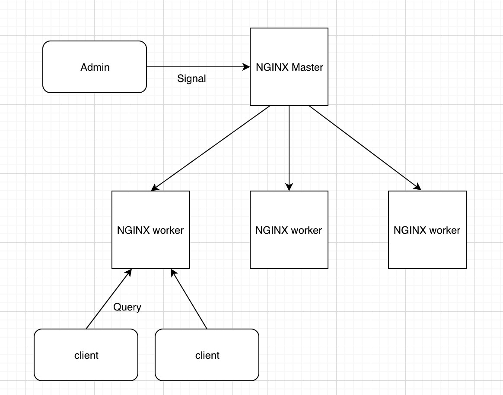
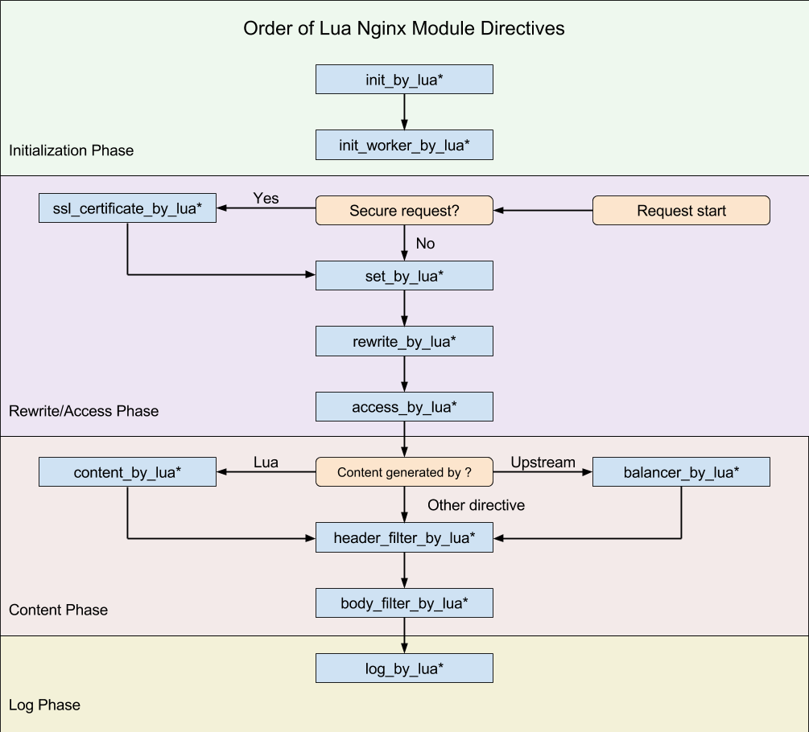

---
date: "2019-06-23"
---  
      
# 06 | OpenResty 中用到的 NGINX 知识
你好，我是温铭。

通过前面几篇文章的介绍，相信你对 OpenResty 的轮廓已经有了一个大概的认知。下面几节课里，我会带你熟悉下 OpenResty 的两个基石：NGINX 和 LuaJIT。万丈高楼平地起，掌握些这些基础的知识，才能更好地去学习 OpenResty。

今天我先来讲 NGINX。这里我只会介绍下，OpenResty 中可能会用到的一些 NGINX 基础知识，这些仅仅是 NGINX 很小的一个子集。如果你需要系统和深入学习 NGINX，可以参考陶辉老师的《NGINX 核心知识 100 讲》，这也是极客时间上评价非常高的一门课程。

说到配置，其实，在 OpenResty 的开发中，我们需要注意下面几点：

* 要尽可能少地配置 nginx.conf；
* 避免使用if、set 、rewrite 等多个指令的配合；
* 能通过 Lua 代码解决的，就别用 NGINX 的配置、变量和模块来解决。

这样可以最大限度地提高可读性、可维护性和可扩展性。

下面这段 NGINX 配置，就是一个典型的反例，可以说是把配置项当成了代码来使用：

```
    location ~ ^/mobile/(web/app.htm) {
                set $type $1;
                set $orig_args $args;
                if ( $http_user_Agent ~ "(iPhone|iPad|Android)" ) {
                    rewrite  ^/mobile/(.*) http://touch.foo.com/mobile/$1 last;
                }
                proxy_pass http://foo.com/$type?$orig_args;
    }
    

```

这是我们在使用 OpenResty 进行开发时需要避免的。

## **NGINX 配置**

我们首先来看下 NGINX 的配置文件。NGINX 通过配置文件来控制自身行为，它的配置可以看作是一个简单的 DSL。NGINX 在进程启动的时候读取配置，并加载到内存中。**如果修改了配置文件，需要你重启或者重载 NGINX，再次读取后才能生效**。只有 NGINX 的商业版本，才会在运行时, 以 API 的形式提供部分动态的能力。

<!-- [[[read_end]]] -->

我们先来看下面这段配置，里面的内容非常简单，我相信大部分工程师都能看懂：

```
    worker_processes auto;
    
    pid logs/nginx.pid;
    error_log logs/error.log notice;
    
    worker_rlimit_nofile 65535;
    
    events {
        worker_connections 16384;
    }
    
    http {
        server {
    	listen 80;
    	listen 443 ssl;
    
            location / {
    	    proxy_pass https://foo.com;
    	    }
        }
    }
    
    stream {
        server {
            listen 53 udp;
        }
    }
    

```

不过，即使是简单的配置，背后也涉及到了一些很重要的基础概念。

第一，每个指令都有自己适用的上下文（Context），也就是NGINX 配置文件中指令的作用域。

最上层的是 main，里面是和具体业务无关的一些指令，比如上面出现的 worker\_processes、pid 和 error\_log，都属于 main 这个上下文。另外，上下文是有层级关系的，比如 location 的上下文是 server，server 的上下文是 http，http 的上下文是 main。

指令不能运行在错误的上下文中，NGINX 在启动时会检测 nginx.conf 是否合法。比如我们把

`listen 80;` 从 server 上下文换到 main 上下文，然后启动 NGINX 服务，会看到类似这样的报错：

```
    "listen" directive is not allowed here ......
    

```

第二，NGINX 不仅可以处理 HTTP 请求 和 HTTPS 流量，还可以处理 UDP 和 TCP 流量。

其中，七层的放在 HTTP 中，四层的放在 stream中。在 OpenResty 里面， lua-nginx-module 和 stream-lua-nginx-module 分别和这俩对应。

这里有一点需要注意，**NGINX 支持的功能，OpenResty 并不一定支持，需要看 OpenResty 的版本号**。OpenResty 的版本号是和 NGINX 保持一致的，所以很容易识别。比如 NGINX 在 2018 年 3 月份发布的 1.13.10 版本中，增加了对 gRPC 的支持，但 OpenResty 在 2019 年 4 月份时的最新版本是 1.13.6.2，由此可以推断 OpenResty 还不支持 gRPC。

上面 nginx.conf 涉及到的配置指令，都在 NGINX 的核心模块 [ngx\_core\_module](http://nginx.org/en/docs/ngx_core_module.html)、[ngx\_http\_core\_module\_](http://nginx.org/en/docs/http/ngx_http_core_module.html) 和 [ngx\_stream\_core\_module\_](http://nginx.org/en/docs/stream/ngx_stream_core_module.html) 中，你可以点击这几个链接去查看具体的文档说明。

## **MASTER-WORKER 模式**

了解完配置文件，我们再来看下 NGINX 的多进程模式。这里我放了一张图来表示，你可以看到，NGINX 启动后，会有一个 Master 进程和多个 Worker 进程（也可以只有一个 Worker 进程，看你如何配置）。



先来说 Master 进程，一如其名，扮演“管理者”的角色，并不负责处理终端的请求。它是用来管理 Worker 进程的，包括接受管理员发送的信号量、监控 Worker 的运行状态。当 Worker 进程异常退出时，Master 进程会重新启动一个新的 Worker 进程。

Worker 进程则是“一线员工”，用来处理终端用户的请求。它是从 Master 进程 fork 出来的，彼此之间相互独立，互不影响。多进程的模式比 Apache 多线程的模式要先进很多，没有线程间加锁，也方便调试。即使某个进程崩溃退出了，也不会影响其他 Worker 进程正常工作。

而 OpenResty 在 NGINX Master-Worker 模式的前提下，又增加了独有的特权进程（privileged agent）。这个进程并不监听任何端口，和 NGINX 的 Master 进程拥有同样的权限，所以可以做一些需要高权限才能完成的任务，比如对本地磁盘文件的一些写操作等。

如果特权进程与 NGINX 二进制热升级的机制互相配合，OpenResty 就可以实现自我二进制热升级的整个流程，而不依赖任何外部的程序。

减少对外部程序的依赖，尽量在 OpenResty 进程内解决问题，不仅方便部署、降低运维成本，也可以降低程序出错的概率。可以说，OpenResty 中的特权进程、ngx.pipe 等功能，都是出于这个目的。

## **执行阶段**

执行阶段也是 NGINX 重要的特性，与 OpenResty 的具体实现密切相关。NGINX 有 11 个执行阶段，我们可以从 ngx\_http\_core\_module.h 的源码中看到：

```
    typedef enum {
        NGX_HTTP_POST_READ_PHASE = 0,
    
        NGX_HTTP_SERVER_REWRITE_PHASE,
    
        NGX_HTTP_FIND_CONFIG_PHASE,
        NGX_HTTP_REWRITE_PHASE,
        NGX_HTTP_POST_REWRITE_PHASE,
    
        NGX_HTTP_PREACCESS_PHASE,
    
        NGX_HTTP_ACCESS_PHASE,
        NGX_HTTP_POST_ACCESS_PHASE,
    
        NGX_HTTP_PRECONTENT_PHASE,
    
        NGX_HTTP_CONTENT_PHASE,
    
        NGX_HTTP_LOG_PHASE
    } ngx_http_phases;
    

```

如果你想详细了解这 11 个阶段的作用，可以学习陶辉老师的视频课程，或者 NGINX 文档，这里我就不再赘述。

不过，巧合的是，OpenResty 也有 11 个 `*_by_lua`指令，它们和 NGINX 阶段的关系如下图所示（图片来自 lua-nginx-module 文档）：



其中， `init_by_lua` 只会在 Master 进程被创建时执行，`init_worker_by_lua` 只会在每个 Worker 进程被创建时执行。其他的 `*_by_lua` 指令则是由终端请求触发，会被反复执行。

所以在 init\_by\_lua 阶段，我们可以预先加载 Lua 模块和公共的只读数据，这样可以利用操作系统的 COW（copy on write）特性，来节省一些内存。

对于业务代码来说，其实大部分的操作都可以在 content\_by\_lua 里面完成，但我更推荐的做法，是根据不同的功能来进行拆分，比如下面这样：

* set\_by\_lua：设置变量；
* rewrite\_by\_lua：转发、重定向等；
* access\_by\_lua：准入、权限等；
* content\_by\_lua：生成返回内容；
* header\_filter\_by\_lua：应答头过滤处理；
* body\_filter\_by\_lua：应答体过滤处理；
* log\_by\_lua：日志记录。

我举一个例子来说明这样拆分的好处。我们假设，你对外提供了很多明文 API，现在需要增加自定义的加密和解密逻辑。那么请问，你需要修改所有 API 的代码吗？

```
    # 明文协议版本
    location /mixed {
        content_by_lua '...';       # 处理请求
    }
    

```

当然不用。事实上，利用阶段的特性，我们只需要简单地在 access 阶段解密，在 body filter 阶段加密就可以了，原来 content 阶段的代码是不用做任何修改的：

```
    # 加密协议版本
    location /mixed {
        access_by_lua '...';        # 请求体解密
        content_by_lua '...';       # 处理请求，不需要关心通信协议
        body_filter_by_lua '...';   # 应答体加密
    }
    

```

## **二进制热升级**

最后，我来简单说一下 NGINX 的二进制热升级。我们知道，在你修改完 NGINX 的配置文件后，还需要重启才能生效。但在 NGINX 升级自身版本的时候，却可以做到热升级。这看上去有点儿本末倒置，不过，考虑到 NGINX 是从传统静态的负载均衡、反向代理、文件缓存起家的，这倒也可以理解。

热升级通过向旧的 Master 进程发送 USR2 和 WINCH 信号量来完成。对于这两步，前者的作用，是启动新的 Master 进程；后者的作用，是逐步关闭 Worker 进程。

执行完这两步后，新的 Master 和新的 Worker 就已经启动了。不过此时，旧的 Master 并没有退出。不退出的原因也很简单，如果你需要回退，依旧可以给旧的 Master 发送 HUP 信号量。当然，如果你已经确定不需要回退，就可以给旧 Master 发送 KILL 信号量来退出。

至此，大功告成，二进制的热升级就完成了。

关于二进制升级，我主要就讲这些。如果你想了解这方面更详细的资料，可以查阅[官方文档](http://nginx.org/en/docs/control.html#upgrade)继续学习。

## **课外延伸**

OpenResty 的作者多年前写过一个 [NGINX 教程](https://openresty.org/download/agentzh-nginx-tutorials-zhcn.html)，如果你对此感兴趣，可以自己学习下。这里面的内容比较多，即使看不懂也没有关系，并不会影响你学习 OpenResty。

## 写在最后

总的来说，在 OpenResty 中用到的都是 Nginx 的基础知识，主要涉及到配置、主从进程、执行阶段等。而**其他能用 Lua 代码解决的，尽量用代码来解决，而非使用Nginx 的模块和配置**，这是在学习 OpenResty 中的一个思路转变。

最后，我给你留了一道开放的思考题。Nginx 官方支持 NJS，也就是可以用 JS 写控制部分 Nginx 的逻辑，和 OpenResty 的思路很类似。对此，你是怎么看待的呢？

欢迎留言和我分享，也欢迎你把这篇文章转发给你的同事、朋友。