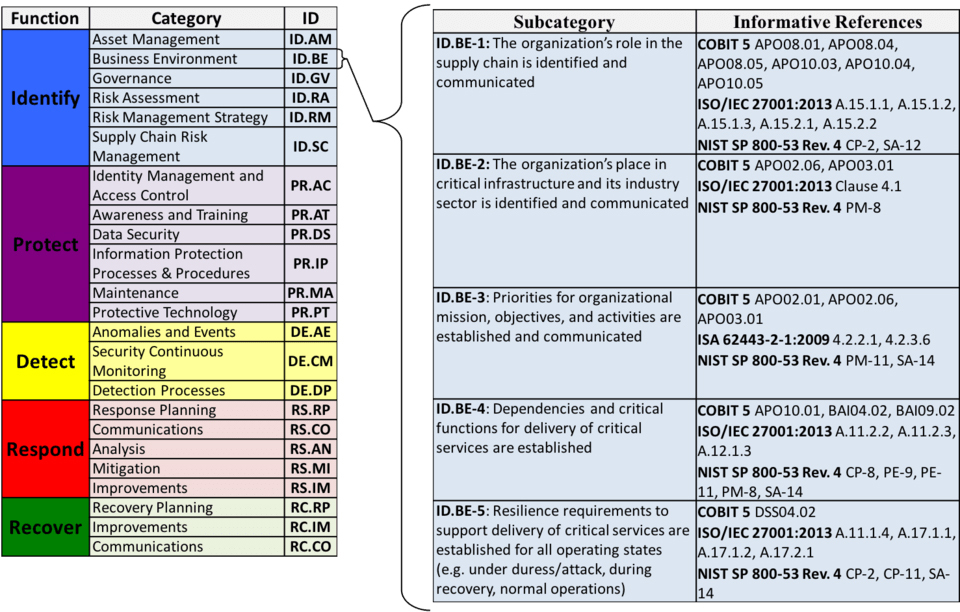

---
date: "2019-06-23"
---  
      
# 18 | 安全标准和框架：怎样依“葫芦”画出好“瓢”？
你好，我是何为舟。

感谢你来学习安全专栏，如果有任何疑惑或者建议欢迎留言和我沟通。新的一年祝你工作顺利、事业有成、升职加薪！

从这一讲开始，我们讨论安全防御工具。实际上，每个公司都需要进行安全体系建设，业内将这些通用性的建设经验进行总结，形成了各种安全标准和框架。从这些标准和框架中，我们能了解到建设安全体系的思路和方向，对于实际的安全落地工作，有很大的指导作用。

根据安全等级和关注点的不同，不同的安全标准和框架都有各自的具体要求。这些要求都非常简单直接，也很容易理解，所以，这不是我们要讲解的重点。在今天的课程中，我更想通过这些标准和框架的设计思路来讲一讲，作为公司的安全人员，该如何推动公司整体的安全体系建设。

## 安全标准和框架有哪些？

首先，我们来看看，安全标准和框架都有哪些。

国内的安全标准和框架，就是我们常听到的等级保护制度（方便起见，后文都简称“等保”）。等级保护根据公司的安全性高低，划分了由一到五这五个等级。每个等级都有需要满足和达标的[安全要求](https://baike.baidu.com/item/%E4%BF%A1%E6%81%AF%E5%AE%89%E5%85%A8%E7%AD%89%E7%BA%A7%E4%BF%9D%E6%8A%A4/2149325?fromtitle=%E7%AD%89%E7%BA%A7%E4%BF%9D%E6%8A%A4&fromid=2104129&fr=aladdin#2)。等级越高说明公司的安全水平越高，越被政府认可。安全等级三级以上的公司，还会受到国家信息安全监管部门的监督和检查。

在国外，比较知名的安全标准和框架包括：ISO27000系列、NIST、COBIT和ITIL。接下来，我们一一来讲。

<!-- [[[read_end]]] -->

我们前面讲了等级保护制度，实际上，NIST也被称为“美国版等保”。因为NIST是美国政府提出的，对公司的安全能力进行监督和管控的安全框架。但是，NIST并未考虑公司在实施安全标准时需要付出的成本，所以除了美国政务之外，NIST很少被使用。

而ISO27000系列和COBIT都是不包含具体实施细节的安全标准和框架。

其中，ISO27000系列是国际上比较认可的安全标准之一。它提供了兼容性极高的安全体系和信息安全管理的最佳实践指导。但是，ISO27000系列更关注于方向上的指导，没有覆盖具体的实施细节，所以无法作为技术手册来使用。

COBIT（ Control Objectives for Information and related Technology）则是给安全管理者提供了一个内控的框架，它本身更关注于内控和审计。

最后，我们来看ITIL（ Information Technology Infrastructure Library ）。ITIL是一个提升服务质量的标准框架，而安全只是影响服务质量的一个因子。因此，ITIL会更多地考虑如何提高公司的研发和管理效率，在机密性、可用性和完整性上只给予了比较基本的关注。

以上这些安全标准和框架，除了能对企业的安全建设进行指导，也提供了测评的服务。测评的目的，一方面是帮助公司认识到自身安全水平，另一方面也是公司对外宣传的一个标杆。比如说，国内目前最流行的ISO27001测评。各个公司都会以通过了ISO27001测评，来对用户和合作伙伴表明，自己的安全水平达到了一个比较成熟的高度。这就是一个对外宣传的表现。

除此之外，等级保护制度作为国家标准，还具备规避和降低公司法律风险的能力。比如，当公司出现了某个安全事件导致数据泄露，如果这个公司没有做过“等保”的话，那么法院就可能认为公司在安全上没有尽到自己的职责，而根据《网络安全法》给予这个公司很严厉的惩罚。但是，如果公司做了“等保”的话，法院可能会认为公司有努力在做，只是仍然有缺陷，而不会给予非常严厉的惩罚。所以，完全不做“等保”和做了但不到位，处罚的标准就完全不同了。

## 现有安全标准和框架有哪些可以借鉴的地方？

### 1\. 等保：为什么安全体系建设要区分管理与技术？

首先，我们来看一下等保的分类思路。等保对公司的安全要求划分为了十类，分别是：

* 技术要求：安全物理环境、安全通信网络、安全区域边界、安全计算环境、安全管理中心；
* 管理要求：安全管理制度、安全管理机构、安全管理人员、安全建设管理、安全运维管理。

对于每个分类的具体含义，你通过名字应该就能够理解，这里我就不细说了。

从这些分类中，我们可以看出，等保的大体思路是将安全分为了管理和技术。我们之前就讲过，**安全往往是需要自上而下来推动的**。因此，安全并不是一个纯技术的“活”，它也需要在管理层面上作出改进。比如，等保要求公司必须要成立专门的安全管理机构，安排专门的安全管理人员，这样才有人能够对公司的整体安全来负责，去推动安全的落地。

### 2\. ISO27001：如何通过PDCA流程进行规划安全建设？

ISO27001是国内比较流行的安全评估认证之一。它提出了14个不同的安全方向，分别是：

* 安全策略
* 信息安全组织
* 人力资源安全
* 资产管理
* 访问控制
* 密码学
* 物理和环境安全
* 操作安全
* 通信安全
* 系统获取、开发和维护
* 供应关系
* 信息安全事件管理
* 业务连续性管理中的信息安全考虑
* 符合性

可以看到，这个划分还是很全面的。这些安全方向基本包括了安全行业内的各个知识领域。在每个安全方向中，ISO27001会列举出公司需要完成的安全事项，我觉得你甚至可以依照这个标准来学习安全。

不仅如此，ISO的一系列框架和标准其实都遵循PDCA流程，PDCA也是项目管理上经常被提到的管理方法。这里我就简单说一下。

* Plan：计划，确定安全的目标并制定建设的规划。
* Do：执行，按照计划的内容和时间来执行。
* Check：检查，对执行的结果进行总结，看是否符合预期。
* Action：改进，如果执行不符合预期，或者计划出现纰漏，则进行分析和改进。

那PDCA流程如何应用在安全体系的建设中呢？这里，我就举一个公司在做ISO27001例子。

* Plan：认证机构会先到公司进行调研和培训，然后和公司一块制定一个详细的安全规划。
* Do：公司会花几个月的时间，去执行这些规划。
* Check：完成之后，认证机构再次去公司进行回访，评估完成的情况。
* Action：如果达到预期，则通过认证；否则继续计划、执行、检查的操作。

其实，我们在实际去建设公司的安全体系时，也完全可以按照PDCA的流程来进行。我们可以先制定一个年度或者季度的规划，根据指定的规划去执行。当前阶段完成之后，我们要先检查是否满足了安全需求，以及还有哪些安全风险存在，然后提出改进的方案。基于这个方案，我们就可以接着制定下一个阶段的规划了。

### 3\. NIST：如何通过IPDRR建立纵深防御？

NIST提出了公司建立安全体系的IPDRR方法框架，主要包括Identiify、Protect、Detect、Respond和Recover这五个部分。

  
图片来源：[IPDRR方法框架](https://www.nist.gov/cyberframework/online-learning/components-framework)

我认为NIST所提出的IPDRR方法，是解决各类安全问题的一种通用思路。这里，我就以Web安全为例，结合IPDRR方法的五个步骤，来详细讲解一下，针对Web应用中可能出现的各种漏洞，我们该如何建立安全防护体系。

第一步是Identify（识别）。我们需要掌握公司有哪些Web应用，并对Web应用做威胁评估。

也就是说，我们需要定位公司的资产，衡量这些资产的价值，然后评估资产保护的优先级和投入成本。

第二步是Protect（保护）。我们要在安全事件发生之前，对数据和资产采取适当的保护措施。（比如：通过访问控制机制来避免越权访问、通过加密来保护数据的CIA、通过防火墙保护内网隔离等）。在开发上，我们需要采用安全的方法，尽量避免漏洞出现。同时，我们可以部署WAF等安全工具，统一对Web攻击进行防护检测。

第三步是Detect（检测）。在安全事件发生之中或者之后，我们要能及时发现和检测出安全事件或者攻击行为。这就需要对请求的日志和返回的结果进行分析，评估是否产生攻击行为和数据泄露。

第四步是Respond（响应）。当检测到安全事件后，我们需要采取有效的措施，来阻止攻击的持续进行，尽可能地降低事件所带来的影响。我认为最可行的操作，就是对出现漏洞的Web业务进行下线，对已经受到影响的数据进行隔离。这也要求我们制定好详细的应急预案，避免攻击发生时公司陷入手忙脚乱的无序状态。

第五步是Recover（恢复）。当事件响应完成后，我们要将应用或者服务恢复到攻击前的状态，也就是对应用和数据进行修复和重新上线。同时，也要对事件的原因进行复盘分析，然后进一步完善安全机制。

从这个例子中，我们知道，针对Web安全体系建设，我们可以根据IPDRR方法 采取多重安全策略进行保护。这也符合安全防护的一个原则：**纵深防御，即任何单点的安全策略都存在纰漏和被绕过的可能。因此，我们需要采取多重相互独立的安全策略，使得这些策略相互补充，降低安全策略被绕过的可能性。**

## 总结

好了，今天的内容讲完了。我们来一起总结回顾一下，你需要掌握的重点内容。

通过对等保、ISO27001和NIST这三个安全标准的分析，我们知道，除了一些比较细的安全机制指导之外，安全标准本身也包含了我们自己去做安全的思路。比如：等保告诉我们安全要分为技术和管理；ISO27001告诉我们要通过PDCA流程去规划安全建设；NIST告诉我们安全可以通过IPDRR建立纵深防御。

对于安全标准的思维提炼，远远不止我提出的这些点。在各个标准和框架的细节中，也都给出了公司在各个安全方向上需要去落地的内容，比如，根据ISO27001的访问控制的标准，你可以学习如何制定合适的访问控制机制。

总而言之，我认为，在实际建立安全体系的过程中，我们不应该一味地按照这些安全标准实施，也要主动学习当中的设计思路。这样你才能更高效、更完善地建立公司自有的安全体系。  

## 思考题

最后，我们还是来看一道思考题。

你还接触过哪些安全标准和框架，它们又包括了哪些内容和思想？你认为该如何依靠这些思想，去推动公司的安全建设？

欢迎留言和我分享你的思考和疑惑，也欢迎你把文章分享给你的朋友。我们下一讲再见！