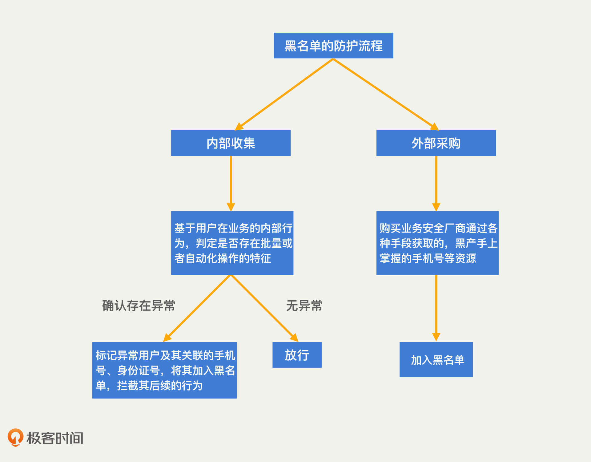

---
date: "2019-06-23"
---  
      
# 25 | 业务安全体系：对比基础安全，业务安全有哪些不同？
你好，我是何为舟。

从这一讲开始，我们讨论业务安全。近几年，随着互联网的快速发展，很多公司为了获取用户增长，在业务中投入了大量的资本。向来都是向钱看齐的黑客（在业务安全中，我们称之为黑产），自然就将攻击的重心放到了业务中。业务安全也变得越来越热门，成为各大公司安全投入的重心之一。

对比于传统的基础安全，业务安全有哪些特点呢？为什么它能够成为一个独立的领域呢？在业务安全中，我们需要重点关注的防护方法又有哪些呢？

以上这些问题，在这个模块中我会详细来讲。今天，我们先从业务安全的特点和防护重点入手，让你对业务安全的体系和框架有一个清晰的认识。

## 如何理解业务安全？

学习一个新知识的最好方法，一定是从我们学过的知识入手。所以，今天我会对比基础安全，来帮助你理解业务安全。基础安全其实就是我们前几个模块关注的安全攻防视角下的安全概念和知识，也叫网络安全。

想要理解业务安全，我们先来认识一下黑产。黑产是基于正常的业务产品逻辑，采取非正常或者批量的操作，来获取利益的行为。业务安全就是通过各类产品策略，来对黑产进行识别和拦截，从而保障业务的正常运行。

你一定见过，或者参加过“红包雨”领红包的活动。在活动中，用户可以通过“红包雨”游戏领取一定金额的红包，金额大小由前端决定。通过这个例子，我们来对比一下黑客和黑产的攻击。

<!-- [[[read_end]]] -->

在基础安全的攻击视角中，黑客会逆向前端代码，找到最终决定金额的逻辑，然后自己伪造一个大额的红包请求。这样一来，黑客就可以不用玩游戏，同时还能获得一个大额的红包。在业务安全的攻击视角中，黑产会开发一个自动玩游戏领红包的工具，操纵大量的账号来参与活动。最终，将各个账号的小额红包汇总到一个账号下，从而实现获利。

## 黑产和黑客有哪些差异？

从前面的例子中，我能够看出，黑客在基础安全和业务安全中的攻击方式有很大不同，那它们之间具体有哪些差异呢？接下来，我们一起来分析。

在基础安全中，黑客会通过各种Web安全或者系统安全的漏洞，对公司的系统和应用发起攻击，最终侵入公司系统，窃取敏感信息等成果。“黑客”原意是指擅长各类计算机技术的人，也就是在基础安全领域中，掌握各种高端技巧，能够发现并利用漏洞的攻击者。但是，在业务安全中，业内普遍将攻击者称为“黑产”。之所以会改换一个名称，我认为主要有两点原因。

**第一，“黑产”强调的是“产业化”。**

尽管黑客也存在很多组织，但黑客组织更多的是将一群黑客进行统一管理，实际发起攻击的仍然是单人或者小组。

相比于黑客，在业务攻击中，黑产已经形成了完整的产业化链条：在上游，有人专门提供各类技术支持，如验证码绕过、手机群控、自动注册工具等；在中游，有人专门收集大量的手机号、身份证号、银行卡号等信息，在应用内注册大量的垃圾账号；在下游，有人利用工具和账号，进行薅羊毛、刷评论、欺诈等操作。可以说，任何个人或者小的团体都没有办法发起业务攻击，必须依靠上游提供的各类资源，才能够实现真正获利。产业链的结构如下图所示：

  
**第二，黑客强调的是技术对抗，而“黑产”更看重资源对抗。**

对于黑客来说，只要技术足够强大，并且手里掌握着一些“0 day”漏洞，就能够以一己之力攻破公司的安全防御体系。但是对于黑产来说，其本质是资源对抗，所以不可能有类似黑客的“单兵作战”。那什么是资源对抗呢？

我们来看一个例子。现在有一个“新用户注册得红包”的活动，公司可能会给每个新用户发放1元的现金红包，以此作为用户增长的激励措施。这个时候，如果黑产注册一个新用户的成本是2元（需要手机号、银行卡等各种资源支持），那显然是一个亏本的买卖。因此，黑产需要想尽办法去降低注册资源的成本。如果是你，你会怎么做呢？你可以先试着思考一下，然后再来看我下面的分析。

生活中就有很多这样的例子。以前，你想要骑一辆自行车，需要花几百块钱买一辆。而现在，你花上一块钱，就能够骑上共享单车，还能够“随停随走”。黑产的资源对抗也是利用的这种“共享”思想：在黑产的中上游，由专门的团伙负责大批量收集各类资源，供很多下游团伙使用，这样就能在很大程度上降低黑产发起攻击的成本。

现在，黑产购买一个手机号的成本只需要几毛钱，而互联网应用获取一个新用户需要花费几十元，这其中的利益之大可见一斑。

从黑客与黑产之间的攻击差异中，我们能够发现基础安全和业务安全的核心差异。基础安全是防御黑客的技术攻击，避免漏洞。业务安全是防御黑产的资源对抗，避免正常业务被攻击。

## 业务安全如何防护？

在基础安全中，我们说过应用的本质是数据，安全的本质是数据的CIA，我们可以通过黄金法则来保护数据。那么，对于业务安全来说，我们的防护思路又是怎么样的呢？

我们还是要从业务的本质入手来解决问题。我认为，业务的本质是一种投资，也就是公司投入成本来获取用户价值。投入的成本包括应用开发的成本、服务的成本以及获取用户的成本等。

用户的价值也多种多样，直接的如收取用户的服务费用，间接的如通过用户来获取广告收益、通过用户来吸引商家入驻收取租金等。那黑产是如何从中获利的呢？

黑产的获利手段是通过廉价的资源，降低用户的价值，从而赚取公司投入的成本。因此，业务安全的本质就是保障用户价值不受黑产的恶意影响。保障的方法就是提高黑产的资源成本，使得黑产无法获利。这也就是我所说的，业务安全的本质其实就是资源层次上的对抗。

那我们应该如何进行资源对抗呢？首先，我们要知道，黑产需要进行哪些资源投入。一般来说，黑产会从四个方面进行资源投入，分别是：用户资源、IP资源、设备资源和操作资源。下面，我们一一来看。

**首先是用户资源。**

黑产通常需要获取大量的用户身份，来进行大规模的业务操作，才能实现获利。这是因为，应用通常会要求用户绑定各种信息，比如手机号、身份证、银行卡等。而黑产需要满足应用的强制绑定要求，才能获得用户身份。因此，这些手机号、身份证以及银行卡等，其实就是黑产必须投入的用户资源。

现在，黑产有很多办法可以获取这些用户资源。我来总结了几个常见的方法：

* 通过虚拟运营商或者物联网卡来获取大量非实名手机卡
* 在网上搜集各类泄露的身份证图片
* 在偏远地区支付十几块钱，买到他人的手持身份证照片和视频
* 在类似[注册任务贴吧](https://tieba.baidu.com/f?kw=%D7%A2%B2%E1%C8%CE%CE%F1&fr=ala0&tpl=5&traceid=)这样的任务群中，注册一个账号之后，再转手卖给黑产

**对于用户资源的对抗，目前主要的方式就是黑名单**。这里，我把黑名单的防护流程总结了一张图。

  
从上图中我们可以看到，用户黑名单主要有两种收集方式：内部收集和外部采购。其中，内部收集是基于用户在业务内部的行为进行判定的，流程相对复杂一些，而外部采购是直接购买汇总好的黑名单。这样一来，我们就利用黑名单实现了对黑产的拦截。

**接着，我们来说IP资源。**

黑产往往是在同一个地方进行大量操作的，IP相对固定。所以，任何公司做业务安全的第一步，都是对IP进行限制，常见的手段是限制一个IP下能够登录的用户数量。为了绕过这种安全防控机制，黑产必须掌握大量的IP资源。

如果你有做过爬虫，一定知道通过[快代理](https://www.kuaidaili.com/free)这种网上的免费代理，来绕过反爬机制。而黑产更高级一些，黑产会利用“秒拨IP”来获取大量IP资源。所谓“秒拨”，就是指每一次拨号上网，都会分配一个新的IP给我们。只要持续地断网、拨号，我们就能够获得大量的IP资源。

下图是某个代理IP网站的报价，我们可以看到，目前代理IP的价格最低只要0.5分钱。也就是说，黑产只需要付出很少的成本就能获得大量IP资源。  
  
事实上，我们目前很难对IP资源进行有效防控。IP的变化十分频繁，一个IP上一分钟可能是黑产在操作，下一分钟可能就被正常用户所使用了。所以，即使我们能基于业务数据确定一个IP存在异常，也没有办法对它进行黑名单处理。

**除了IP之外，设备也是公司做业务安全的一个基础。**

在正常情况下，一个设备对应一个账号。但是，黑产可能会需要在一个设备上使用几十个账号进行操作，这就很容易被应用和公司检测到异常。因此，黑产必须想办法获取大量的设备。

黑产获取设备的方法比较多，最简单的一种是通过模拟器来模拟设备。但是，很多公司会对前端进行检测，来发现模拟设备。因此，黑产也就从使用模拟设备升级为使用真实的手机。所以，很多黑产案件中都会出现由大量手机设备组成的“手机墙”。除此之外，也有上游团队将手机做成云控模式，下游黑产可以直接花钱购入可远程操控的真实手机设备。

**设备资源的对抗原理是对虚拟设备进行识别**。这就需要依赖业务安全中比较关键的设备指纹技术了。所谓“设备指纹技术”，就是收集设备上的各类特征，对设备进行追踪，然后基于设备的行为和信息，判定是虚拟设备还是人为操作，以此对黑产进行拦截。

**最后是操作资源。**

黑产需要正常使用业务才能获利，所以在操作上会和正常用户一样花费时间和精力。这对黑产来说，也是一个不小的成本。

比如说，在开头的例子中，用户参加“红包雨”游戏领取红包的过程，就是一个操作的过程：用户为了领取一个几毛钱的红包，在APP上花几分钟玩一个游戏。这显然对黑产是不合算的。因此，黑产会尝试使用一些自动化的工具，比如[按键精灵](http://www.anjian.com)，让机器来完成游戏的过程。这样一来，黑产就释放了人力的操作资源投入，大大降低了操作成本。

所以说，我们和操作资源的对抗，就是在和黑产的自动化工具进行对抗。公司为了区分“人”和“机器”的操作，就需要使用验证码（如图片验证码、滑块验证码等）。通过这类“人”很容易完成，但“机器”很难完成的验证方式，黑产就没办法全自动地完成交互，我们也就提高了黑产的操作成本。

总之，业务安全的防护核心就是提高黑产的资源成本。更详细的防护方案，我们会在后面的课程中详细来讲，这里你只需要对这几种资源有一个全面的认知即可。

为了帮助你理解这4种资源的核心特点，我整理了一个表格供你参考，如下图所示：

## 总结

好了，今天的内容讲完了。我们一起总结回顾一下，你需要掌握的重点内容。

业务安全和基础安全在本质上就有很大的不同：在基础安全中，黑客将技术作为核心竞争力；在业务安全中，黑产将资源作为核心竞争力。谁能够以更低的成本掌握更多的资源，谁就能窃取公司更大的利益。因此，作为防守方，我们在关注业务安全的时候，也应当将关注的重点放在如何提高黑产的资源成本上，这样才能够为公司提供有力的业务安全防护。

## 思考题

最后，还是给你留一道思考题。

今天，我们讲了几个黑产必须要掌握的资源。你可以思考一下，假如你掌握了这些资源，你会如何对你的业务发起攻击？又会如何获利呢？

欢迎留言和我分享你的思考和疑惑，也欢迎你把文章分享给你的朋友。我们下一讲再见！