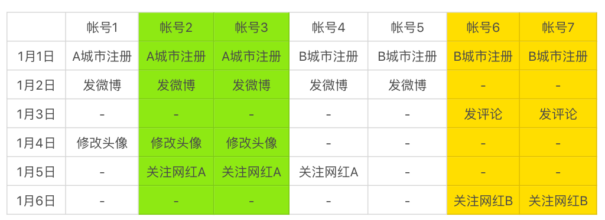
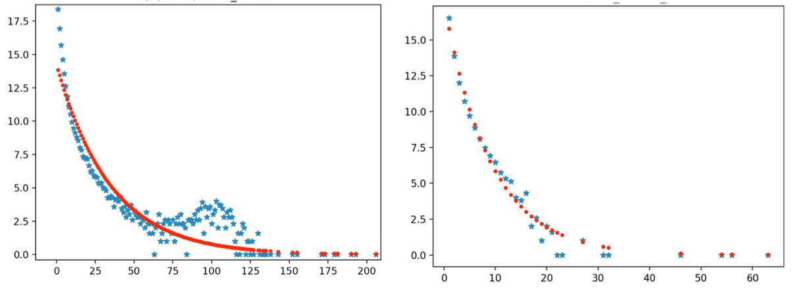
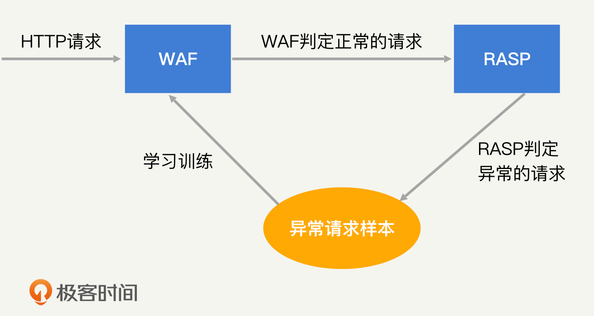

---
date: "2019-06-23"
---  
      
# 28 | 机器学习：如何教会机器识别黑灰产？
你好，我是何为舟。

通过建立一个成熟的风控系统，你能够快速建立起和黑产进行持续对抗的稳固防线。但是，风控系统和规则引擎仅仅是一个平台和工具。想要真正对黑产进行识别，我们还得依靠规则引擎中运行的规则策略。

当然，规则的维护主要是依靠人力来进行的。但是这样的维护方式会有两个弊端：首先，人的工作效率会受各种因素影响，所以对抗的时效性很难保障；其次，规则的维护受到人的主观意识的影响，可能会产生一些“偏见”。

对于上述这两个问题，机器学习是一个理想的解决方案。因为，机器学习不仅可以无休止地工作，还会完全依据客观事实产生结果。

而且，机器学习对于基础安全来说，同样是一个提升规则维护效率的理想方案。因为各类防御工具（如：防火墙、IDS、WAF等）也都是基于规则来运转的。

那么今天，我们就来聊一聊，在安全领域中尝试机器学习算法会遇到哪些问题，以及我们有哪些解决思路。

## 如何正确认识机器学习？

机器学习这几年非常火热，我相信你一定了解过一些相关的概念，对机器学习也有自己的理解。但是，很多人都对机器学习有着过高的预期，认为机器学习“无所不能”，而这种高预期会误导我们错误地使用机器学习。因此，我想先和你明确一下，机器学习在安全领域中能干什么、不能干什么，让我们对机器学习在安全领域中的应用有一个正确的预期。

<!-- [[[read_end]]] -->

一般来说，机器学习是通过找出未知的规则参数来区分已知的行为。这句话怎么理解呢？

我来举个例子你就懂了。在生活中，我们能够快速地分辨一张图片是猫还是狗。那你有没有思考过，我们是怎么进行识别的？根据五官、颜色还是形状？仔细回想一下，你就会发现，我们往往是根据经验来判断的，很难用文字描述出准确的判断依据。

同样地，对于一次请求或者操作，我们通常能够依据经验判定其是否是安全攻击。但是判定的依据具体有哪些，往往说不清楚。在这种情况下，机器学习就可以帮助我们将脑海中的模糊经验，总结成客观的规则参数，从而挖掘出恶意的攻击行为。

你会发现，机器学习挖掘恶意攻击的前提，是攻击行为必须能够被人为的判定，只是判定过程比较模糊和复杂，无法通过制定简单的规则进行人为的区分。因此，**机器学习实际上是对人为经验的一种总结，并不具备创新的能力，所以最终对抗效果的好坏，还是取决于人的对抗能力**。

## 无监督学习在安全中的应用

机器学习可以简单分为无监督学习和有监督学习，我今天也会按照这个分类来讲。我们先来看一下，无监督学习在安全中的应用。

很多人认为，无监督学习就是在没有标签的情况下去找寻分类，发现所谓的“未知的威胁”，其实不然。实际上，**无监督学习的目的是挖掘数据的分布特征，主要包括数据的聚集特征（也叫聚类特征，是通过聚类算法获得）和分布规律（也叫离群点，通过时序算法获得）。这些特征和规律能够帮助你发现异常的情况，但是不能帮你定位异常的行为**。

因此，如果想使用无监督学习来判定正常和异常行为，我们就需要对行为的整体分布有一个先验假设，常见的如：正常行为由正常用户产生，行为各有各的不同；恶意行为是少数人批量产生，行为会比较相似。

我曾经和几家乙方安全厂商聊过，有些厂商明确地表示过，他们正是基于这个假设，采用无监督学习进行业务风控识别的。从直觉上来说，这样的思路是没问题的，因为黑产大都是通过批量的行为来获取非法利益的，所以必然会在IP、设备、行为、关联关系等各个方面露出一些马脚，被我们识别出来。但是，当落地到具体的场景时，这个假设并不完全成立。

举个例子，在业务安全中经常会遇到“垃圾小号问题”，我们通常是通过批量特征来进行挖掘的。下表是同一天注册的一批账号，以及它们对应的行为特征。我们可以通过FP-Growth算法对其行为进行关联分析，找到行为相同的一批账号。比如，表中的账号2和账号3、账号6和账号7，就存在高度的相似性。

那这种相似是不是就意味着这几个账号是黑产呢？这个理由显然并不充分。因为这种相似性可能只是一种巧合。比如，一个寝室的同学都刚开始使用微博，他们的行为和兴趣都很相似。因此，我们并不能基于这个无监督学习挖掘出来的聚类特征，对这些账号进行处罚。

但是，如果1月1日注册了100个账号，其中一半的账号都被关联分析挖掘出了聚类，那我们就无法用巧合去解释了，这就说明必然出现了黑产的攻击。

因此，我们可以将无监督学习当成一个评价和监控方法。比如，在没有黑产攻击的时候，注册账号的聚类占比可能低于10\%，那当某一天的值高于10\%的时候，就说明可能出现黑产攻击了。但是，无监督无法准确地告诉你，哪些聚类是黑产的。所以接下来，我们就需要人工进行分析了。

在基础安全领域中，无监督学习也可以通过类似的原理来应用。

举个例子，IDS判定一台服务器是否被黑客控制的思路，可能是服务器访问的外部服务数量是否异常。通常来说，服务器访问的外部服务越多，越有可能存在扫描的嫌疑。同样地 ，这个假设也不绝对成立，因为你永远无法预估开发到底会使用多少外部服务。

但是，当我们去实际统计服务器访问的外部服务数量时，会发现它呈指数分布。也就是说大部分服务器只访问少量的外部服务，而访问服务数越多，对应的服务器就越少，如下方右图所示。（横轴是外部服务数量，纵轴是服务器数量）

如果你发现某一集群内的服务器对应外部服务数量分布和指数分布，存在了明显的偏离（如上方左图所示），就说明这个集群内的服务器出现了异常情况，有可能是被黑客控制了。那接下来，我们再针对这些偏离较远的服务器，进行人工排查即可。

所以说，通过应用无监督学习，我们能够发现整体数据中的异常情况，然后只需要根据相应的报警去分析疑似异常的数据就可以了。相比于人工去分析全量数据，无监督学习能够大大提升风控效率。

## 有监督学习在安全中的应用

说完了无监督学习的应用，我们再来说说有监督学习的应用。

有监督学习的基础是标签数据，标签就代表着已知。所以，有监督学习的最大作用就是用来挖掘“已知的威胁”。如果想要保持和黑灰产的持续对抗，我们就必须不断地生产标签数据（也叫“打标”），供有监督学习的算法来学习。但是，依靠人工去生产标签数据是不可行的。你可以先试着思考一下，不可行的原因都有哪些，然后再来看我下面的讲解。

我认为主要有三方面原因。

**第一，时间成本高。**

在图片识别等领域，对一个图片“打标”只需要一个普通人花几秒钟的时间。但是对于一个安全类的数据，一个安全人员可能需要花费几十分钟甚至几个小时，才能够确定这次行为到底是不是恶意行为。

**第二，覆盖面不全。**

由于时间成本高，我们无法进行全量数据的“打标”。而且人是存在懒惰心理的，因此人为“打标”时，总是会倾向于优先处理相对明显的数据，那么相对隐秘的攻击行为，就很容易在“打标”过程中被忽略。

**第三，标准偏差。**

恶意与正常往往没有明确的界限，不同的安全人员对于安全的认知和要求也不同。比如，一次简单的端口扫描算不算恶意行为呢？一个专刷明星的账号算不算垃圾账号呢？不同的人会有不同的判断，这种判断标准的偏差会导致最终产生的标签数据分布不一致，这对机器学习的结果也将产生较大的影响。

因此，想要成功地应用有监督学习，我们就必须找到客观、高效的“打标”方案。

在基础安全领域中，黑客的最终目的无非是获取数据、篡改程序、拒绝响应等。所以，我们其实可以通过数据的CIA是否受到影响来进行标记，获得最终的判定标签，然后将标签进行回溯，从而获得表层的标签数据。

举个例子，WAF是通过获取HTTP相关的数据（如：路径、参数、header、ua等）来找出恶意的HTTP请求，从而对Web攻击进行检测拦截的。但是WAF并不知道这个请求具体会干什么，执行什么样的逻辑，所以它的评判标准只能是“带有XXX特征的请求是恶意请求”。如果想持续不断为WAF提供标签数据，靠人力肯定不行，我们应该深入追踪下去，以最终结果对数据进行自动“打标”。

RASP的检测思路正是如此，就是直接深入到Web程序的逻辑，根据运行情况去评判该请求是否是攻击行为。因为是对HTTP请求的最终行为进行评判，所以RASP可以实现所谓的“无规则检测”，准确率和召回率都有保证。

如果我们利用RASP对影响数据CIA的HTTP请求进行打标，然后由WAF去学习这些HTTP请求具有什么样的特征，那么一个完整的机器学习闭环基本就形成了，如下图所示。

业务安全其实也可以尝试同样的思路来生产标签。比如，我们可以通过对接口签名校验、虚拟设备判定等方式，对异常的行为进行标记，作为业务安全中标签数据的来源。在此基础之上，我们再使用有监督学习算法去学习异常行为的特征，让业务风控的机器学习算法能够不断更新和迭代。

另外，我不建议直接根据标签数据进行拦截。因为我们一旦进行拦截，这些生产标签的指标就会暴露，就会促使黑产进行研究和对抗，那么标签的准确性就会受到影响。

除此之外，我们也可以采用一些相对间接的方法：比如，通过用户反馈来获取异常的行为数据；再比如，标记一部分已知的恶意用户，但是不处理这些用户，而是将它们产生的行为都当成恶意行为来标记。

总而言之，想要成功地运用有监督学习，我们必须找到一个合理的打标方案，持续不断地产出可靠的标签数据。在此基础上，我们才能够运用各种高上大的算法，去挖掘安全领域中的“已知的威胁”。

## 总结

好了，今天的内容讲完了。我们来一起总结回顾一下，你需要掌握的重点内容。

在安全领域应用机器学习的时候，我们要注意：机器学习并不是一个万能的工具，它无法发现“未知的威胁”。因此，在和黑产对抗的过程中，“人”始终是对抗过程中最关键的部分，而机器学习更多的是一种提升效率的工具。

对于无监督学习，我们可以利用它的原理，来发现异常的聚集和离群点。尽管这些聚集和离群点，因为准确率不足无法全部被判定成攻击行为，但聚集和离群点的数量和分布，仍然反映出了整体的异常情况。而对于有监督学习，我们需要设计一个合理的标签系统，来尽可能自动化地生成标签数据，从而保持算法的持续更新和迭代。

## 思考题

今天，我们留两道思考题。

基于今天给出的机器学习应用思路，你能分析一下，在你负责的业务安全场景中，有哪些风险是可以通过无监督或者有监督学习算法来分析的吗？应该如何进行分析呢？

另外，如果你了解深度学习和图算法的话，那么不妨试着思考一下，深度学习和图算法是如何在安全领域中使用的。

欢迎留言和我分享你的思考和疑惑，也欢迎你把文章分享给你的朋友。我们下一讲再见！