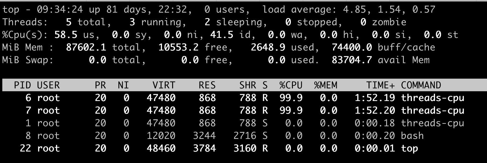
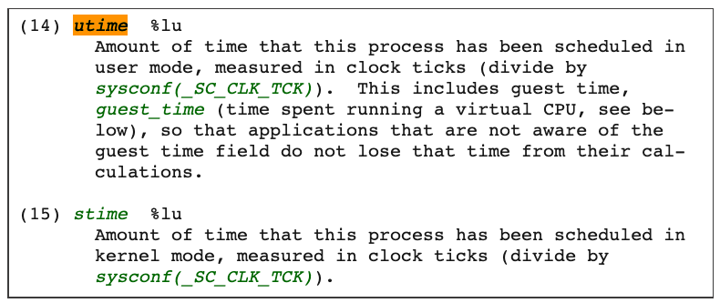

---
date: "2019-06-23"
---  
      
# 06 | 容器CPU（2）：如何正确地拿到容器CPU的开销？
你好，我是程远。今天我们聊一聊，如何正确地拿到容器CPU的开销。

为啥要解决这个问题呢，还是来源于实际工作中的需要。

无论是容器的所有者还是容器平台的管理者，我们想要精准地对运行着众多容器的云平台做监控，快速排查例如应用的处理能力下降，节点负载过高等问题，就绕不开容器CPU开销。**因为CPU开销的异常，往往是程序异常最明显的一个指标。**

在一台物理机器或者虚拟机里，如果你想得到这个节点的CPU使用率，最常用的命令就是top了吧？top一下子就能看到整个节点当前的CPU使用情况。

那么在容器里，top命令也可以做到这点吗？想要知道答案，我们还是得实际动手试一试。

## 问题重现

实际上，你在使用容器的时候，如果运行top命令来查看当前容器总共使用了多少CPU，你肯定马上就会失望了。

这是因为我们在容器中运行top命令，虽然可以看到容器中每个进程的CPU使用率，但是top中"\%Cpu\(s\)"那一行中显示的数值，并不是这个容器的CPU整体使用率，而是容器宿主机的CPU使用率。

就像下面的这个例子，我们在一个12个CPU的宿主机上，启动一个容器，然后在容器里运行top命令。

这时我们可以看到，容器里有两个进程threads-cpu，总共消耗了200\%的CPU（2 CPU Usage），而"\%Cpu\(s\)"那一行的"us cpu"是58.5\%。对于12CPU的系统来说，12 \* 58.5\%=7.02，也就是说这里显示总共消耗了7个CPU，远远大于容器中2个CPU的消耗。

<!-- [[[read_end]]] -->

这个例子说明，top这个工具虽然在物理机或者虚拟机上看得到系统CPU开销，但是如果是放在容器环境下，运行top就无法得到容器中总的CPU使用率。那么，我们还有什么其他的办法吗？

## 进程CPU使用率和系统CPU使用率

通过问题重现，我们发现top工具主要显示了宿主机系统整体的CPU使用率，以及单个进程的CPU使用率。既然没有现成的工具可以得到容器CPU开销，那我们需要自己开发一个工具来解决问题了。

其实我们自己推导，也没有那么难。我认为，最有效的思路还是从原理上去理解问题。

所以，在解决怎样得到单个容器整体的CPU使用率这个问题之前，我们先来学习一下，在Linux中到底是如何计算单个进程的CPU使用率，还有整个系统的CPU使用率的。

### 进程CPU使用率

Linux中每个进程的CPU使用率，我们都可以用top命令查看。

对照我们前面的那张示意图，我们可以发现，每个进程在top命令输出中都有对应的一行，然后“\%CPU”的那一列就是这个进程的实时CPU使用率了。

比如说，100\%就表示这个进程在这个瞬时使用了1个CPU，200\%就是使用了2个CPU。那么这个百分比的数值是怎么得到呢？

最直接的方法，就是从源头开始寻找答案。因为是top命令的输出，我们可以去看一下top命令的[源代码](https://gitlab.com/procps-ng/procps)。在代码中你会看到对于每个进程，top都会从proc文件系统中每个进程对应的stat文件中读取2个数值。我们先来看这个文件，再来解读文件中具体的两个数值。

这个stat文件就是 `/proc/[pid]/stat` ， `[pid]` 就是替换成具体一个进程的PID值。比如PID值为1的进程，这个文件就是 `/proc/1/stat` ，那么这个 `/proc/[pid]/stat` 文件里有什么信息呢？

其实这个stat文件实时输出了进程的状态信息，比如进程的运行态（Running还是 Sleeping）、父进程PID、进程优先级、进程使用的内存等等总共50多项。

完整的stat文件内容和格式在proc文件系统的 [Linux programmer’s manual](https://man7.org/linux/man-pages/man5/proc.5.html) 里定义了。在这里，我们只需要重点关注这两项数值，stat文件中的第14项utime和第15项stime。

那么这两项数值utime和stime是什么含义呢？utime是表示进程的用户态部分在Linux调度中获得CPU的ticks，stime是表示进程的内核态部分在Linux调度中获得CPU的ticks。

看到这个解释，你可能又冒出一个新问题，疑惑ticks是什么\?这个ticks就是Linux操作系统中的一个时间单位，你可以理解成类似秒，毫秒的概念。

在Linux中有个自己的时钟，它会周期性地产生中断。每次中断都会触发Linux内核去做一次进程调度，而这一次中断就是一个tick。因为是周期性的中断，比如1秒钟100次中断，那么一个tick作为一个时间单位看的话，也就是1/100秒。

我给你举个例子说明，假如进程的utime是130ticks，就相当于130 \* 1/100=1.3秒，也就是进程从启动开始在用户态总共运行了1.3秒钟。

这里需要你注意，utime和stime都是一个累计值，也就是说从进程启动开始，这两个值就是一直在累积增长的。

那么我们怎么计算，才能知道某一进程在用户态和内核态中，分别获得了多少CPU的ticks呢？

首先，我们可以假设这个瞬时是1秒钟，这1秒是T1时刻到T2时刻之间的，那么这样我们就能获得 T1 时刻的utime\_1 和stime\_1，同时获得T2时刻的utime\_2 和 stime\_2。

在这1秒的瞬时，进程用户态获得的CPU ticks就是 \(utime\_2 – utime\_1\), 进程内核态获得的CPU ticks就是 \(stime\_2 – stime\_1\)。

那么我们可以推导出，进程CPU总的开销就是用户态加上内核态，也就是在1秒瞬时进程总的CPU ticks等于 \(utime\_2 – utime\_1\) + \(stime\_2 – stime\_1\)。

好了，现在我们得到了进程以ticks为单位的CPU开销，接下来还要做个转化。我们怎样才能把这个值转化成我们熟悉的百分比值呢？其实也不难，我们还是可以去top的[源代码](https://gitlab.com/procps-ng/procps)里得到这个百分比的计算公式。

简单总结一下，这个公式是这样的：

**进程的CPU使用率=\(\(utime\_2 – utime\_1\) + \(stime\_2 – stime\_1\)\) \* 100.0 / \(HZ \* et \* 1 \)**

接下来，我再给你讲一下，这个公式里每一个部分的含义。

首先， \(\(utime\_2 – utime\_1\) + \(stime\_2 – stime\_1\)\)是瞬时进程总的CPU ticks。这个我们已经在前面解释过了。

其次，我们来看100.0，这里乘以100.0的目的是产生百分比数值。

最后，我再讲一下 **\(HZ \* et \* 1\)**。这是被除数这里的三个参数，我给你详细解释一下。

第一个HZ是什么意思呢？前面我们介绍ticks里说了，ticks是按照固定频率发生的，在我们的Linux系统里1秒钟是100次，那么HZ就是1秒钟里ticks的次数，这里值是100。

第二个参数et是我们刚才说的那个“瞬时”的时间，也就是得到utime\_1和utime\_2这两个值的时间间隔。

第三个“1”, 就更容易理解了，就是1个CPU。那么这三个值相乘，你是不是也知道了它的意思呢？就是在这“瞬时”的时间（et）里，1个CPU所包含的ticks数目。

解释了这些参数，我们可以把这个公式简化一下，就是下面这样：

进程的CPU使用率=（进程的ticks/单个CPU总ticks）\*100.0

知道了这个公式，就需要上手来验证一下这个方法对不对，怎么验证呢？我们可以启动一个消耗CPU的小程序，然后读取一下进程对应的/proc/\[pid\]/stat中的utime和stime，然后用这个方法来计算一下进程使用率这个百分比值，并且和top的输出对比一下，看看是否一致。

先启动一个消耗200\%的小程序，它的PID是10021，CPU使用率是200\%。  

然后，我们查看这个进程对应的stat文件/proc/10021/stat，间隔1秒钟输出第二次，因为stat文件内容很多，我们知道utime和stime第14和15项，所以我们这里只截取了前15项的输出。这里可以看到，utime\_1 = 399，stime\_1=0，utime\_2=600，stime\_2=0。

根据前面的公式，我们计算一下进程threads-cpu的CPU使用率。套用前面的公式，计算的过程是：

\(\(600 – 399\) + \(0 – 0\)\) \* 100.0 / \(100 \* 1 \* 1\) =201，也就是201\%。你会发现这个值和我们运行top里的值是一样的。同时，我们也就验证了这个公式是没问题的。

### 系统CPU使用率

前面我们介绍了Linux中如何获取单个进程的CPU使用率，下面我们再来看看Linux里是怎么计算系统的整体CPU使用率的。

其实知道了如何计算单个进程的CPU使用率之后，要理解系统整体的CPU使用率计算方法就简单多了。

同样，我们要计算CPU使用率，首先需要拿到数据，数据源也同样可以从proc文件系统里得到，对于整个系统的CPU使用率，这个文件就是/proc/stat。

在/proc/stat 文件的 `cpu` 这行有10列数据，同样我们可以在proc文件系统的 [Linux programmer’s manual](https://man7.org/linux/man-pages/man5/proc.5.html) 里，找到每一列数据的定义，而前8列数据正好对应top输出中"\%Cpu\(s\)"那一行里的8项数据，也就是在上一讲中，我们介绍过的user/system/nice/idle/iowait/irq/softirq/steal 这8项。

而在/proc/stat里的每一项的数值，就是系统自启动开始的ticks。那么要计算出“瞬时”的CPU使用率，首先就要算出这个“瞬时”的ticks，比如1秒钟的“瞬时”，我们可以记录开始时刻T1的ticks, 然后再记录1秒钟后T2时刻的ticks，再把这两者相减，就可以得到这1秒钟的ticks了。

这里我们可以得到，在这1秒钟里每个CPU使用率的ticks：

我们想要计算每一种CPU使用率的百分比，其实也很简单。我们只需要把所有在这1秒里的ticks相加得到一个总值，然后拿某一项的ticks值，除以这个总值。比如说计算idle CPU的使用率就是：

1203 /（ 0 + 0 + 0 + 1203 + 0 + 0 + 0 + 0）=100\%

好了，我们现在来整体梳理一下，我们通过Linux里的工具，要怎样计算进程的CPU使用率和系统的CPU使用率。

对于单个进程的CPU使用率计算，我们需要读取对应进程的/proc/\[pid\]/stat文件，将进程瞬时用户态和内核态的ticks数相加，就能得到进程的总ticks。

然后我们运用公式“\(进程的ticks / 单个CPU总ticks\) \* 100.0”计算出进程CPU使用率的百分比值。

对于系统的CPU使用率，需要读取/proc/stat文件，得到瞬时各项CPU使用率的ticks值，相加得到一个总值，单项值除以总值就是各项CPU的使用率。

## 解决问题

前面我们学习了在Linux中，top工具是怎样计算每个进程的CPU使用率，以及系统总的CPU使用率。现在我们再来看最初的问题：为什么在容器中运行top命令不能得到容器中总的CPU使用率？

这就比较好解释了，对于系统总的CPU使用率，需要读取/proc/stat文件，但是这个文件中的各项CPU ticks是反映整个节点的，并且这个/proc/stat文件也不包含在任意一个Namespace里。

那么，**对于top命令来说，它只能显示整个节点中各项CPU的使用率，不能显示单个容器的各项CPU的使用率**。既然top命令不行，我们还有没有办法得到整个容器的CPU使用率呢？

我们之前已经学习过了CPU Cgroup，每个容器都会有一个CPU Cgroup的控制组。在这个控制组目录下面有很多参数文件，有的参数可以决定这个控制组里最大的CPU可使用率外，除了它们之外，目录下面还有一个可读项cpuacct.stat。

这里包含了两个统计值，这两个值分别是**这个控制组里所有进程的内核态ticks和用户态的ticks**，那么我们就可以用前面讲过的公式，也就是计算进程CPU使用率的公式，去计算整个容器的CPU使用率：

CPU使用率=\(\(utime\_2 – utime\_1\) + \(stime\_2 – stime\_1\)\) \* 100.0 / \(HZ \* et \* 1 \)

我们还是以问题重现中的例子说明，也就是最开始启动容器里的那两个容器threads-cpu进程。

就像下图显示的这样，整个容器的CPU使用率的百分比就是 \( \(174021 \- 173820\) + \(4 – 4\)\) \* 100.0 / \(100 \* 1 \* 1\) = 201, 也就是201\%。**所以，我们从每个容器的CPU Cgroup控制组里的cpuacct.stat的统计值中，**可以比较快地得到整个容器的CPU使用率。

## 重点总结

Linux里获取CPU使用率的工具，比如top，都是通过读取proc文件系统下的stat文件来得到CPU使用了多少ticks。而这里的ticks，是Linux操作系统里的一个时间单位，可以理解成类似秒，毫秒的概念。

对于每个进程来说，它的stat文件是/proc/\[pid\]/stat，里面包含了进程用户态和内核态的ticks数目；对于整个节点，它的stat文件是 /proc/stat，里面包含了user/system/nice/idle/iowait等不同CPU开销类型的ticks。

**由于/proc/stat文件是整个节点全局的状态文件，不属于任何一个Namespace，因此在容器中无法通过读取/proc/stat文件来获取单个容器的CPU使用率。**

所以要得到单个容器的CPU使用率，我们可以从CPU Cgroup每个控制组里的统计文件cpuacct.stat中获取。**单个容器CPU使用率=\(\(utime\_2 – utime\_1\) + \(stime\_2 – stime\_1\)\) \* 100.0 / \(HZ \* et \* 1 \)。**

得到单个容器的CPU的使用率，那么当宿主机上负载变高的时候，就可以很快知道是哪个容器引起的问题。同时，用户在管理自己成百上千的容器的时候，也可以很快发现CPU使用率异常的容器，这样就能及早地介入去解决问题。

## 思考题

写一个小程序，在容器中执行，它可以显示当前容器中所有进程总的CPU使用率。

欢迎在留言区和我互动，一起探讨容器CPU的相关问题。如果这篇文章让你有所收获，也欢迎你分享给更多的朋友，一起学习进步。