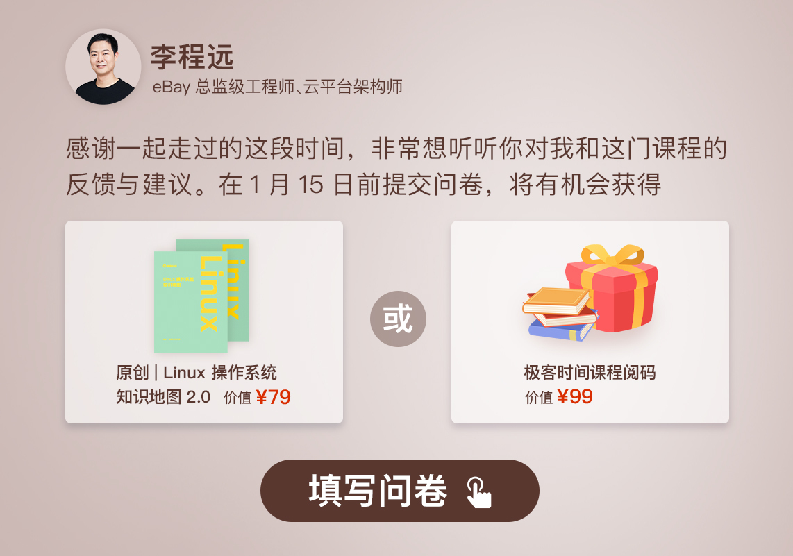

---
date: "2019-06-23"
---  
      
# 结束语 | 跳出舒适区，突破思考的惰性
你好，我是程远。

今天是我们专栏必学内容的最后一讲。当你读到这一讲内容的时候，刚好是元旦。首先我要祝你元旦快乐，2021年一切顺利！

在过去的二十多讲内容里，我们从基础开始，一起学习了容器进程、内存、存储、网络以及安全这几部分的内容。在每一讲里，我们都会从一个实际问题或者现象出发，然后一步步去分析和解决问题。一路走来，真是百感交集，我有好多心里话，但又不知该从何说起。

所以最后一讲，我想和你聊聊我个人的一些成长感悟，在辞旧迎新的元旦，正适合回顾过去和展望未来。所以这既是专栏的一次总结交流，也是我们开启新征程的“号角”。

在多年以前，我在书里读到一句话，说的是“每个人都有潜在的能量，只是很容易被习惯所掩盖，被时间所迷离，被惰性所消磨。”

今天再次回看这段话，还真是一语中的，感触良多，回想起专栏写作的整个过程，这件事带给我的最大感悟就是：**跳出自己的舒适区，才能有所突破。**

## 突破舒适区是很难的事儿

我们都知道，突破舒适区是一件很难的事儿。这里我给你分享一个我自己的故事，也许你也会从这个故事里找到自己的影子。

记得在2年前，我参加过eBay的一个内部培训，培训的目标就是要让自己有所“突破”。我必须承认，这个培训是我经历过的所有培训中最接地气的一个培训，在培训过程里我也是情绪激昂的，准备带着学到的东西回到工作里去大展身手，好好突破一番的。

<!-- [[[read_end]]] -->

不过等培训结束，再回到日常工作的时候，之前的雄心壮志、激情澎湃又被日常的琐事所淹没，积蓄的那股劲儿又慢慢被消磨了。周围的同事会开玩笑地对我说：“程远啊，我觉得你没有突破啊。”

其实，我心里也知道，所谓的“突破”就要跳出自己的舒适区。不过我始终不知道怎么跳出来，哪怕自己手上的工作再多，工作到再晚，但这仍然是处于自己舒适区。这是因为这一切的工作节奏还有思考的问题，都是我自己熟悉的。

这种熟悉很可能让我们沉湎其中，裹足不前。那问题来了，意识到自己处于舒适区，产生想要“跳出去”的念头的确是良好开局，难的是怎么有效突破。这就要聊到突破方法路径的问题了，我想结合自己的感悟给你说一说。

## 主动迎接挑战，在实战中进步

不知道你有没有听过热力学里熵增的定律，大概说的是：封闭系统的熵（能量）会不可逆地增加，最终导致整个系统崩溃。那怎么才能保持这个系统的活力呢？就是能量交换，不断去引入外部的能量，也就是负熵。

我们可以引申一下，自然会想到走出舒适区这件事，也是同样的道理。我们要有一种冒险家的勇气，主动去迎接挑战，在实战里迫使自己不断进步。

其实选择做这样一个专栏，对我来说就是走出舒适区的一项“挑战”。在今年7月份，那还是我们这个专栏筹备的前期，我当时就一个想法，就是把我这些年来在容器方面的积累给记录下来。

从7月份决定写容器这个专栏开始，到现在差不多也有半年的时间了，我真的觉得，在工作的同时把写专栏的这件事给坚持下来，真的是一件不容易的事情。**这里不仅仅是一个简单的时间投入问题，更多的是迫使自己再去思考的问题。**

估计你也发现了，我每一讲都涉及不少知识点。我在专栏写作的过程中，花时间最多的就是怎么把问题说清楚，这里要解释哪些关键知识点，适合用什么样的例子做解释，每个知识点要讲到什么程度，需要查阅哪些代码和资料来保证自己所讲内容的正确性。

这样的思考模式和我日常思考工作问题的模式是完全不同的。但也正是借着这样的机会，我才从自己原先的舒适区里跳了出来，工作之余同时也在思考写专栏的问题，每天都有大量的context switch，也就是上下文切换。

我很高兴自己可以坚持下来，完成了专栏的主体部分。可以说，这门课既是容器的实战课，也是我自己走出舒适区的实战训练。

## 突破舒适区，本质是突破思考的惰性

这次的专栏写作，还让我意识到，**突破舒适区的本质就是突破思考的惰性。只有不断思考，才能推着自己不断往前走，才能让我们更从容地解决工作上的问题。**

在2020年的12月初，Kubernetes宣布不再支持dockershim，也就是说Kubernetes节点上不能再直接用Docker来启动容器了。当时我看到这条新闻，觉得这是理所当然的，因为我们的容器云平台上在2019年初就从Docker迁移到了Containerd。

不过，后来我在专栏留言回复的过程中，连续有三位同学留言，问我怎么看Kubernetes的这个决定，这让我又回忆起了当初我们团队是怎么做的迁移决定。

这件事还要追溯到2018年的时候，我们发现kubelet通过CRI接口就可以集成Containerd了，于是我们就开始思考，是不是应该用Containerd来替换Docker呢\?

当时我们看到的好处有两点。第一点是这样替换之后**架构上的优势**，CRI可以说是kubelet连接Runtime的标准了，而用Dockershim接Docker再转Containerd，这样很累赘。第二点好处就是**降低了维护成本**。Containerd只是Docker中的一部分，维护Containerd明显要比维护庞大的Docker容易。

当然，这么做的挑战也是很大的。当时，我们在生产环境中已经有2万台物理机节点以及几十万个容器，而且那时候业界还几乎没有人在生产环境中用kubelet直接调用Containerd。没有前人的尝试可以借鉴，只能咬牙打一场硬仗。

后来我们通过一个多月的测试，发现直接使用Containerd，无论是稳定性还是性能都没有问题。有了实际测试做保障，我们在2019年初又花了3个月时间，才把生产环境上的Docker全部替换成Containerd。

这样的结果看似轻描淡写，一两句话就带过了。但实际过程里，已经不是过五关斩六将了，而是一直在发现问题、解决问题，大大小小的战役才汇聚成了最后的战果。其实，我在这个专栏里和你分享的一些容器问题，也来源于我们当时的迁移实践。

现在回想起来，当初的这个决定无疑是非常正确的了。不过再想想，如果当时看到Kubernetes的变化，我们没有主动思考，等到现在Kubernetes宣布不再支持Dockershim才去做应对，结果又会怎样呢？

这个问题，我觉得用数字来说话更直观。刚才提到当时迁移的时候，有2万台物理机节点以及几十万个容器。但如果等到现在才迁移，我们需要面对的就是6万台物理机和上百万的容器了。

你看，无论是写专栏也好，还是我们实际工作也好，呆在舒适区里，短期成本看着挺小，不需要你大动干戈，消耗脑细胞和精力。但是，当你习惯了这种思考的惰性，就会变成温水煮青蛙而不自知，等到外部条件发生变化时会很被动。

## 最后的彩蛋

前面我们聊了很多突破舒适区的事儿，不知道你有没有被触动呢？

其实学习也好，工作也罢，就是要有一种突破意识，走出舒适区，才能“开疆拓土”。那为了让你我都知行合一，我还要给你聊聊后面的专题加餐安排。

在开篇词我也提到了这个安排。虽然这一讲是我们课程的结束语，但我们课程的内容并没有结束。在这个专题里，我选择了一个真实案例。那这个案例我是怎么选的呢？

其实这是2020年初，我们在生产环境里遇到的一个真实的容器网络问题。我觉得这是一个很好的调试案例，它的好就在于可以用到Linux内核的最主要的几个调试工具，包括perf，ftrace和ebpf。我们逐个使用这些工具，就可以层层递进地揭开问题的本质。

通过这个案例的学习，我会带你掌握每种工具的特性。这样你在理解了容器基本原理的基础上，就能利用这些好的工具系统化地分析生产环境中碰到的容器问题了，就像我们开篇中说的那样——变黑盒为白盒。

写完结束语之后，我会认真为你准备这个专题加餐。而这一个月的时间，你还可以继续消化理解课程主体部分的内容，打牢基础，这样对你学习后面的专题加餐也有很大帮助。

最后的最后，我想和你说的是，希望你我都能主动思考，不断突破自己，走出舒适区，一起共勉吧！

这里我为你准备了一份[毕业问卷](https://jinshuju.net/f/socZck)，题目不多，希望你可以花两分钟填一下。也十分期待能听到你的声音，说说你对这门课程的想法和建议。

