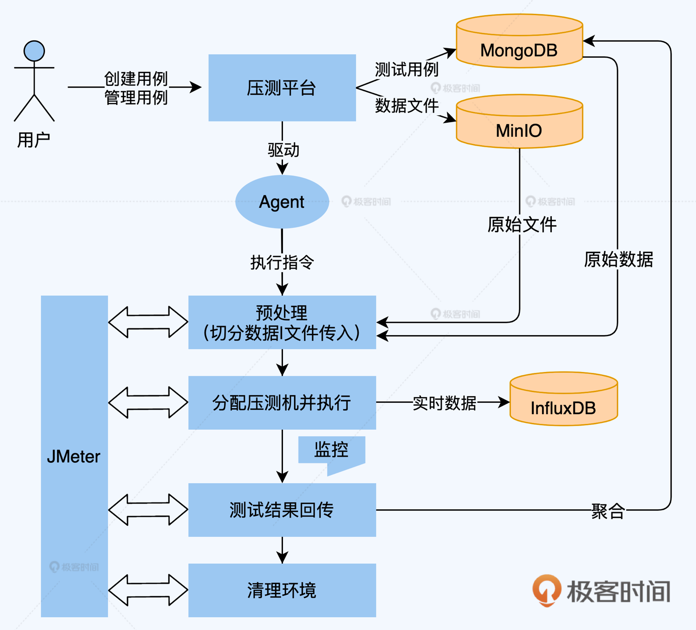
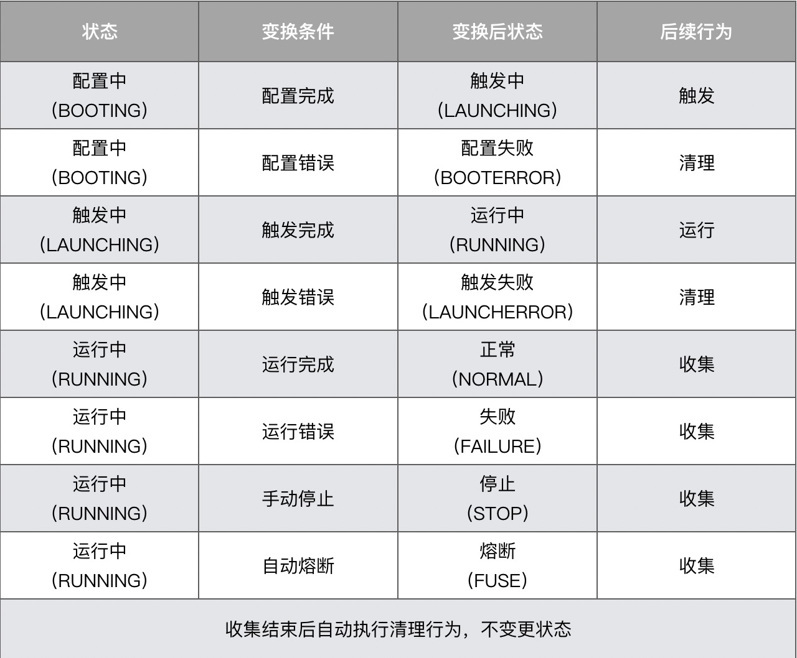
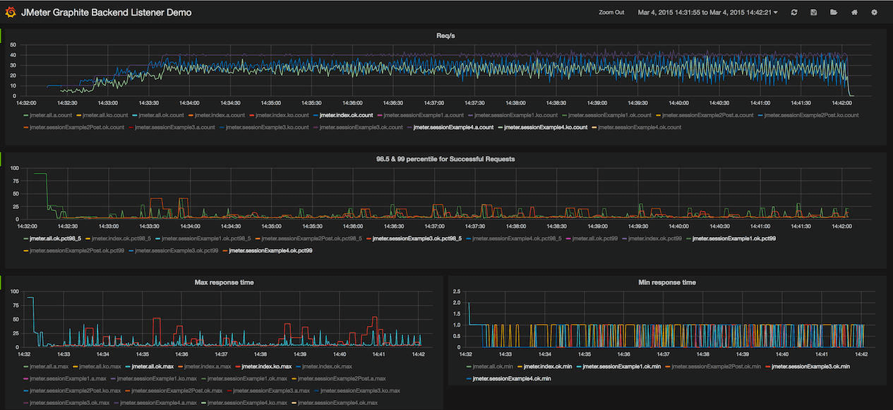
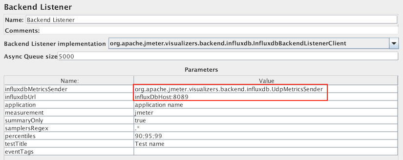

---
date: "2019-06-23"
---  
      
# 07 | 工具进化：如何实现一个分布式压测平台
你好，我是吴骏龙。工欲善其事必先利其器，今天我将与你分享如何自己实现一个分布式压测平台。

现在只要是规模大一些的互联网公司，都在不遗余力地开发自己的压测平台，比如[京东](https://mp.weixin.qq.com/s?__biz=MzAwMDU1MTE1OQ%3D%3D&mid=2653548195&idx=1&sn=7668528e8521196f6ef122e85f6028e9&chksm=813a7f3bb64df62dfabba5e9de1ac8373ece36c792a11e8255b57abdaeba8697236c6361f926&scene=0&key=a226a081696afed0b5c63e7489f9cdcbaeac6955294907c42)、[美团](https://tech.meituan.com/2018/09/27/quake-introduction.html)、[阿里](https://www.aliyun.com/product/pts)、[360](http://test.360.cn/dabai/)。可能你会问，市面上已经有无数的开源压测工具和平台，比如JMeter、Locust、nGrinder、Gatling等，为什么要自己做呢？我在和一些大厂的同行交流经验时，发现对于常见开源压测工具的诟病不外乎有以下几点。


从开源压测工具和平台的这些缺点中，我们可以看出，对于企业来说，自研压测平台就是要满足以下三点需求：

**1\. 平台化：** 企业需要一个平台化的压测工具，每个团队都可以在这个平台上协作，而开源工具大多是C/S类型（ 客户端/服务器体系结构），缺乏平台化支持。

**2\. 标准化：** 企业需要一个统一的标准化压测平台，最好能够和公司的审批流程、管理平台等集成，而开源工具在这方面的扩展性一般不强。

**3\. 控制成本：** 企业需要控制压测平台的维护成本，对于规模大的公司，自研优于使用开源。虽然开源压测工具由社区维护，但反馈较慢，自己维护的成本又比较高，不如重写一个或者二次开发。

在这一讲，我会介绍一套由我设计的基于JMeter的分布式压测平台实现方案，这套方案也兼顾了开源工具的一些成熟功能，目前已经在阿里本地生活团队使用了超过4年，能够支撑近百万压测并发量，累计输出了近4000亿次请求量，管理近600台压测机，依然没有出现明显瓶颈。这些成绩到底是怎么做到的，我们来一探究竟吧。

<!-- [[[read_end]]] -->

## 架构设计思路

首先，实现一个分布式压测平台，要能解决上面提到的绝大部分问题，需要实现的功能可以细化为以下几个方面：

* **用例管理：** 用户建立测试用例，包含脚本文件、数据文件和插件，平台进行分类管理并持久化。
* **压测执行：** 一键触发测试用例，可指定各种运行参数，可以指定多台压测机分布式执行，可以批量执行多个测试用例，压测过程中能够动态调节压测量。
* **实时结果（热数据）：** 压测过程中，实时展示响应时间、吞吐量、错误率等概要数据。由于这些数据都是在压测时需要高频关注的，我们将其称之为“热数据”。
* **压测结果（冷数据）：** 在压测结束后，展示平均响应时间、平均吞吐量，90/95/99线等更详尽的数据。这部分数据主要是供压测后的分析工作使用，不需要实时获取，因此被称之为“冷数据”。
* **压测机管理：** 平台能够与压测机进行交互，调度压测机完成压测执行工作。
* **安全保障：** 平台应具备一定的监控机制，对压测过程中的一些异常情况进行干预。

我们建设分布式压测平台的理念是“取其精华去其糟粕”，**尽可能复用已有开源工具的成熟功能，因为这部分功能相对稳定，不需要重复造轮子；对开源工具不成熟的功能应当规避，在压测平台中进行实现；对开源工具不具备的功能，则完全在压测平台中实现。**

下图是分布式压测平台的顶层设计图，它是典型的Java Web项目，平台本身不执行测试只做调度，避免成为施压的瓶颈，后台均使用JMeter执行测试。平台会对挂载的压测机进行心跳检测，确保压测机是可用的。用例和数据文件可以存储在服务器本地，或者采用[MinIO](https://min.io/)进行高可用的文件对象存储。压测期间产生的冷数据持久化至数据库，热数据持久化至时序数据库（InfluxDB）并定期清理。平台允许挂载外部监控模块，对压测过程进行干预。



这里，你需要注意，在使用JMeter进行压测时，如果并发量比较大，单机的资源配置可能无法支撑，这时需要联合多机进行分布式压测，然而JMeter自身的分布式压测功能是有一定缺陷的：

* JMeter的分布式执行和单机执行方式的差异较大，需要做很多额外配置，由此产生大量运维工作。
* JMeter分布式执行模式，master节点通常不参与压测，而是收集slave节点的压测信息，这会造成一定程度上的资源浪费。
* JMeter分布式执行模式，slave节点会将每个请求打点都实时回传给master节点，造成大量的带宽消耗。

这时候怎么办呢？上面我提到过，对开源工具不成熟的功能应当规避，因此，我们可以在每台压测机中植入一个Agent，它能够与压测平台服务器通过长连接的方式建立通信，这样平台就可以直接对压测机进行调度。这种方案相当于我们在平台层重新实现了JMeter的分布式调度功能，两者的实现对比见下表。


这个方案也一并实现了**压测过程中的冷热数据分离**，冷数据在测试完成后才会传输，如果不需要压测端数据，甚至可以配置不存储冷数据，因此该方案的扩展性是非常友好的，理论上支持的TPS没有上限。

## 主要功能实现方案和原理

说完了需要实现的功能和架构设计思路，相信你对我们要实现的压测平台已经有了初步认识，下面我就从平台的6大功能实现方案和原理进行展开，沿着基础功能到高阶功能的顺序进行讲解，展开的粒度大约控制在让你稍加思考就能上手实现的程度，你可以选择擅长的编程语言及前后端框架去实现具体功能。

如果你希望能更直观地看到整个平台的功能全貌，我也制作了一个预览视频，在这一讲的最后我会提供给你。

### 1.如何实现测试状态流转

测试状态流转是压测平台管理测试工作的核心，所以我放在第一个讲。和人类的生老病死一样，每一轮成功的测试工作会经历一个完整的生命周期，可以描绘成下面这条主线。


其中，我将**配置、触发、运行、收集、清理定义为五大内部行为**（平台内部逻辑管控），这五大内部行为都会改变测试的状态；同时，我们还会允许一些外部行为去干预测试工作，比如在运行过程中需要人为停止测试，外挂的监控组件判断异常后主动熔断测试等，这些外部行为也会改变测试的状态。你可以通过下面的表格，理解各个行为对测试状态的影响，以及对应的后续行为是什么。



将这些状态变换的触发条件和转换过程绘制成状态流转图，就是下面这个样子。


说白了，压测平台对测试状态的管理，就是通过代码实现出这张图的所有逻辑。其中的关键是，**无论测试流程出现何种分支（正常或异常），最后都要能形成闭环（即起点一定最终要达到终点）**，这对系统的健壮性非常重要，因为如果测试状态卡在任何中间状态，本质都是平台对其失去了管理，测试的信息都丢失了。

### 2.如何获取和展示实时数据（热数据）

上面我讲到了实现测试状态流转的整体思路，其中在“运行中”状态下，我们需要获取压测时的实时数据，以便实时观察压测情况。

我们这套分布式压测平台实现方案，是基于JMeter的，但遗憾的是，JMeter本身并不提供图形化的实时数据展示功能，以往我们只能通过输出日志看到一些粗略的信息。在压测平台中，我们就对实时数据展示功能进行了实现，主要原理是通过JMeter的Backend Listener将测试结果实时发往InfluxDB，同时平台向InfluxDB轮询查询数据，得到实时曲线并展示给用户。



当然，你也可以直接基于流行的开源数据可视化系统[Grafana](https://grafana.com/)进行数据展示。

另外，补充一句，我在2017年为JMeter贡献了基于UDP协议与InfluxDB传输数据的Backend Listener，比起当时官方支持的HTTP协议，传输效率更高，被列为JMeter 3.3的核心改进项，如果你也想使用这个UDP协议的Backend Listener的话，请确保JMeter版本 ≥ 3.3，欢迎你尝试。



### 3.如何处理结果数据（冷数据）

实时数据要讲究快，能实时观察压测结果，比如，我们只要看到响应时间和错误率就可以基本了解压测当时的状态了。但对结果数据要更讲究全，目的是在压测结束后对压测结果做详细分析时，能精细到看到每个报错信息是什么。

由于压测平台自己实现了分布式压测模式，因此在拿到每台压测机的结果文件后，也需要自行对这些结果文件的内容进行合并和解析，并持久化记录下来。这里所谓的结果文件其实就是压测生成的JTL文件，我们先来看下JTL文件的一个片段。

```
    timeStamp,elapsed,label,responseCode,responseMessage,threadName,dataType,success,failureMessage,bytes,sentBytes,grpThreads,allThreads,URL,Latency,IdleTime,Connect
    1617696530005,81,HTTP请求,200,OK,线程组 1-1,text,true,,2497,118,1,1,http://www.baidu.com/,78,0,43
    1617696530088,32,HTTP请求,200,OK,线程组 1-1,text,true,,2497,118,1,1,http://www.baidu.com/,32,0,0
    1617696530120,32,HTTP请求,200,OK,线程组 1-1,text,true,,2497,118,1,1,http://www.baidu.com/,32,0,0
    1617696530152,32,HTTP请求,200,OK,线程组 1-1,text,true,,2497,118,1,1,http://www.baidu.com/,32,0,0
    1617696530184,31,HTTP请求,200,OK,线程组 1-1,text,true,,2497,118,1,1,http://www.baidu.com/,31,0,0
    1617696530216,31,HTTP请求,200,OK,线程组 1-1,text,true,,2497,118,1,1,http://www.baidu.com/,31,0,0
    1617696530248,31,HTTP请求,200,OK,线程组 1-1,text,true,,2497,118,1,1,http://www.baidu.com/,31,0,0
    1617696530280,31,HTTP请求,200,OK,线程组 1-1,text,true,,2497,118,1,1,http://www.baidu.com/,31,0,0
    1617696530312,31,HTTP请求,200,OK,线程组 1-1,text,true,,2497,118,1,1,http://www.baidu.com/,31,0,0
    1617696530343,32,HTTP请求,200,OK,线程组 1-1,text,true,,2497,118,1,1,http://www.baidu.com/,31,0,0
    1617696530375,32,HTTP请求,200,OK,线程组 1-1,text,true,,2497,118,1,1,http://www.baidu.com/,32,0,0
    

```

JTL文件的特点很鲜明，可以看到，相对应每一行的单条结果数据的大小非常小（大约只有100多个字节），但总量很大（上面的例子只是片段，实际可能有几万到几百万条）。如果我们只是简单的将所有数据存储起来，将会占用大量的存储空间，因此结果数据需要做预聚合再存入。

预聚合是怎么做的呢？下面代码展示了聚合存储的数据结构，核心是以label（JTL中的label）作大分类，维度（errorMsg、errorCode等）作小分类，以时间作为聚合标准，interval固定，固定聚合为60个点，从而保证存储大小不会过大。

```
    {
        "label": "upload", -- 大分类，比如这条记录只针对upload label
        "totalCount": 428,
        "totalErrorCount": 12,
        "errorMsg": [ -- 维度字段，作小分类
            {
                "msg": "io.exception",
                "count": 12
            },... -- 固定聚合成60个点
        ],
        "errorCode": [
            {
                "code": "404",
                "count": 12
            },...
        ],
        "count": [
            12, …, 15
        ],
        "error": [
            12, …, 15
        ],
        "rt": [
            12, …, 15
        ],
        "minRt": [
            12, …, 15
        ],
        "maxRt": [
            12, …, 15
        ]
    }
    

```

结果数据的这种存储方式，既保证了不会占用太大的存储空间，又能够汇总出丰富全面的数据。

### 4.如何进行吞吐量限制与动态调节

测试状态流转、冷热数据的获取和处理是压测平台最基本的功能，下面我来介绍一些更高阶的功能，先从吞吐量控制与动态调节开始吧。在压测时，**“控量”是非常重要的**，JMeter是根据线程数大小来控制压力强弱的，但我们制定的压测目标中的指标往往是吞吐量（QPS/TPS），这就给测试人员带来了不便之处，必须一边调整线程数，一边观察QPS/TPS达到什么量级了。

为了解决这个问题，JMeter提供了吞吐量控制器的插件，我们可以通过设定吞吐量上限来限制QPS/TPS，达到控量的效果。


上面的做法能够确保将吞吐量控制在一个固定值上，但这样还远远不够，实际工作中我们希望在每次压测执行时能够随时调节吞吐量，比如，在某个压力下服务容量没有问题，我们希望在不停止压测的情况下，再加一些压力，这样的功能该如何实现呢？

我提供的方案也很简单，依然是基于吞吐量控制器，基本的实现原理是将吞吐量限制值设为占位符（如下图中的\$\{\_\_P\(throughput, 99999999\)\}，throughput就是占位符），利用JMeter的BeanShell功能，通过执行外部命令的方式，在运行时注入具体值，达到动态调节吞吐量的目的。


上面提到的外部命令具体为：

```
    java -jar <jmeter_path>/lib/bshclient.jar localhost 9000 update.bsh <qps>
    

```

其中，update.bsh文件的内容为：

```
    import org.apache.jmeter.util.JMeterUtils;
    
    getprop(p){ // get a JMeter property
        return JMeterUtils.getPropDefault(p,"");
    }
    
    setprop(p,v){ // set a JMeter property
        print("Setting property '"+p+"' to '"+v+"'.");
        JMeterUtils.getJMeterProperties().setProperty(p, v);
    }
    
    setprop("throughput", args[0]);
    

```

压测平台将上述这些工作统一封装后提供出接口，前端界面只要留出输入框供用户填写吞吐量的参数，就可以方便的使用了。

### 5.如何实现配置集功能

我们再来聊一个和压测运行相关的重要功能，称之为“配置集”。这个功能其实当初并不在平台设计的考虑范围内，但随着全链路压测规模的日益壮大，需要同时执行的用例数量越来越多，每次执行时都得一个一个去触发，手忙脚乱，有了这个痛点，引发了我们对配置集功能的探索。

**配置集功能的本质是“批量运行多个测试用例”**，如下图所示，用户只需提前在配置集中添加需要执行的测试用例，以及每个执行轮次的配置信息，比如线程数、持续时间等。配置集设定完成后，选择某个轮次，就能基于相应的配置一键触发所有测试用例。


从实现的角度来讲，配置集是映射多个用例的数据结构，而刚我们提到的“轮次”的概念，是指对同一个配置集设定多轮不同的配置项，每个配置项还是作用在测试用例上，目的是进一步提高可复用性。简而言之，**记住这个公式：“配置集 1：N 测试用例；测试用例 1：N 轮次配置”**，即一个配置集对应多个测试用例，一个测试用例对应多个轮次配置。再直观一些，你可以直接通过下面的代码理解这个逻辑。

```
    {
        "_id" : ObjectId("603c7f8f587ca226d257b144"),
        "testPlanName" : "addTestPlan",
        "testPlanUnitList" : [ -- 一个配置集对应多个测试用例
        {
            "testcaseId" : "5fc4dd4ee9d7d7b19d0f5152",
            ……
            "testRoundList" : [ -- 一个测试用例对应多个轮次配置
            {
               "threadCount" : 1,
               "duration" : NumberLong(60),
               "rampUp" : 0,
               "detailLog" : true,
               "realTimeLog" : true,
               "throughput" : 100,
               "name" : "配置1",
               "qpsStep" : 0
           }， ……
           ]
        }
        ],
     ……
    }
    

```

由于在配置集中同时管理着多个用例的所有信息，因此还可以实现一些高级操作，比如：某个用例先执行一段时间后，其他用例再启动，其本质就是单独先触发一个用例，等待固定时间后再触发其余用例；或是，运行时临时改变其中几个用例的QPS上限，其他用例保持不变，其本质就是对单个用例进行吞吐量调节，等等。

### 6\. 监控模块

我已经介绍了很多关于压测运行和压测数据的功能模块，最后我们来学习一下监控模块，它同样也是压测平台非常重要的组成部分，也是**几乎所有开源压测工具都缺乏的功能模块**。监控模块可以分为两类，分别是内部监控模块和外部监控模块。

内部监控模块主要针对压测平台自身运行过程进行监控和干预，观察压测是否处于正常进行中，如果遇到异常情况，如线程异常终止、没有持续的测试数据流出、磁盘打满等，则立刻终止测试，反馈异常结果并记录日志供排查。

内部监控模块实现起来也很简单，在触发压测后，我们也同时启动一个任务对使用的压测机进行监控，监控的内容可以是磁盘使用量、压测数据流的状态等等，如果识别到异常，则触发相应的异常逻辑即可。

第二类监控为外部监控模块，主要用来对接外部监控系统，这个模块很重要，除了方便观察系统指标以外，其最关键的作用是能够反向干预压测工作，协助用户规避风险，尤其是针对线上压测这类高风险工作。比如，当监控到服务端的错误率达到一定阈值时，立刻停止当次测试。

外部监控模块的实现，需要与外部监控系统提供的接口对接，如果有些监控系统自带报警功能，那么就更好了，压测平台在获取到报警信息后可以立刻停止测试。

以对接Grafana监控为例，最简单的方式莫过于采用Webhook的方式，我们只需要指定一个接口并配置到Grafana中，在监控告警事件发生时，Grafana就会回调这个接口，触发相应的停止测试的动作。当然，也可以触发其他动作，这取决于接口的逻辑。在[Grafana使用手册](https://grafana.com/docs/grafana/latest/alerting/notifications/#webhook)中提供了详细的对接案例，你可以进一步阅读，加深理解。

## 总结

工欲善其事必先利其器，压测平台作为容量保障的工具枢纽，其地位不言而喻。一个扩展性好、设计健壮、体验优秀的压测平台，能够对容量保障工作带来巨大帮助。

这一讲中，我介绍了一个基于JMeter的分布式压测平台的实现方案，它解决了企业对于压测工具的三个重要诉求：平台化、标准化和控制成本。如果你的团队已经习惯于使用流行的JMeter进行压测，那么上手这个平台几乎是没有什么成本的，因为它100\%兼容JMeter。

平台的主要功能可以分为几大部分去看，首先是测试状态，我们明确了测试行为和测试状态之间的流转关系，确保无论测试过程是正常执行还是异常终止，整个流程都能闭环完结。

其次是测试数据，我们将数据分为热数据和冷数据，分别对应实时数据和结果数据，并采用了完全不同的思路去实现，确保各自的特点能够充分发挥。

接下来，我们聊到了测试运行过程中的两个重要功能，吞吐量动态调节和配置集。其中，吞吐量动态调节利用了JMeter BeanShell的动态传参功能，我们只需要暴露吞吐量作为参数即可；而配置集则是平台对多测试用例运行的一种实现，能够方便我们批量执行大量测试用例。

最后，监控模块是压测工作安全性的重要保证，内部监控模块对压测本身的状态进行检查，如有异常及时反馈；外部监控模块则是对接外部监控系统，在服务出现异常时主动终止测试。

通过今天的学习，希望能够让你了解分布式压测平台实现的重点和难点，也期待你能够创造更多方便友好的功能，为容量保障工作的降本提效贡献一份力。

## 课后讨论

这里，我给出一个分布式压测平台的预览视频，包含这一讲提到的所有功能，它可以作为你的实现蓝本。如果观看了视频后，你有了什么新的思路或启发，欢迎分享给我，我们共同探讨。