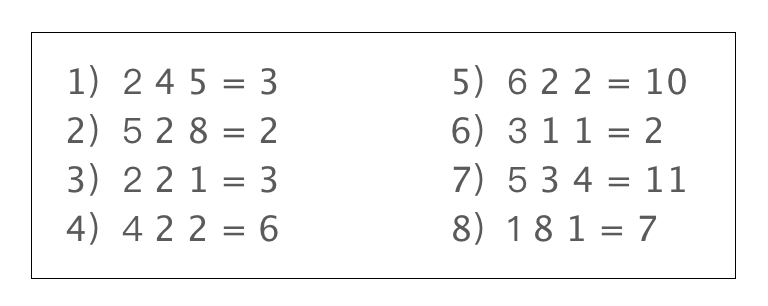
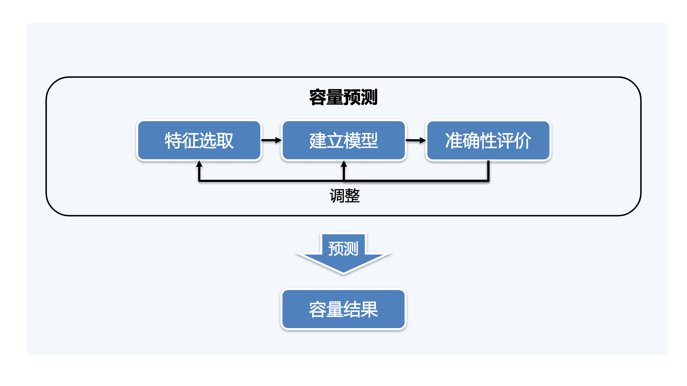
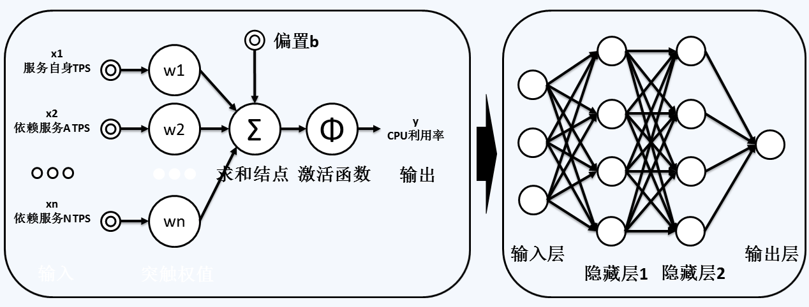
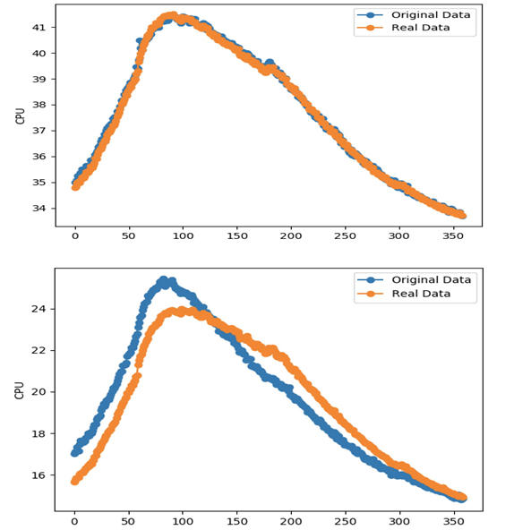
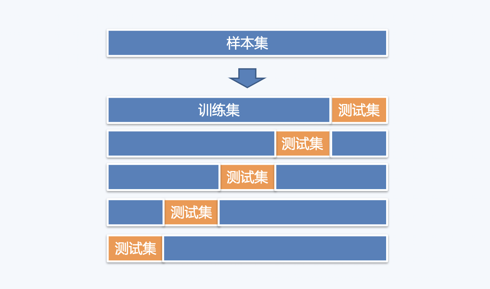
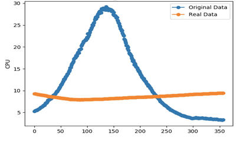

---
date: "2019-06-23"
---  
      
# 08 | 容量预测（上）：第三只眼，通过AI预测服务容量瓶颈
你好，我是吴骏龙。在这一讲和下一讲中，我们来扮演一回预言家，看看容量预测是怎么做的。

我们先来看一个问题，也许在工作中你也会有这样的疑问：

> “双11期间，网站需要举办大促活动，我们目前的服务器能不能承载这些大促活动所产生的访问量？如果不能，用多少服务器可以支撑，又不至于太浪费呢？”

回答这个问题，其实就是容量规划的过程，其中既体现了预测的思想，也体现了对成本的考虑。很显然，**容量预测是容量规划中最重要的环节，没有之一**，容量预测若不准确，容量规划的价值也会大打折扣。

明确了容量预测的重要性，那么该怎么做呢？很不幸的告诉你，在很长一段时间，即便是在阿里本地生活这样体量的公司，技术人员进行容量预测也靠的是“直觉”，不要觉得好笑，你或许也经历过这样的对话：

> A：马上要双11了，服务器撑得住吗？  
> B：要搞大促了，肯定要扩容。  
> A：扩多少？  
> B：依我的经验，扩1000核吧。  
> A：要那么多吗？  
> B：呃…… 那500核吧。

这种将容量预测完全建立在个人经验上的做法，在大部分情况下都是没有什么道理的，在我的容量保障生涯中，就没见过拍脑袋能拍的准的，最后往往都是硬生生的把容量规划变成了一门“玄学”，而容量风险依然存在。

由此可见，我们需要的是一种科学的容量预测方式，它不能依赖于人的经验，而且必须足够准确。坦白说，这是非常困难的，因为影响服务容量的因素实在是太多了，我花了将近1年的时间带领团队做了大量的研究和探索，最终找到了一种通过AI手段进行容量预测的实践方案，并已经在实际工作中落地，现在我就把这项实践的核心技术分享给你，希望能给你带来帮助。

<!-- [[[read_end]]] -->

## 用AI进行容量预测的过程

首先，我们还是来构建一个场景，假设你是某个业务系统的技术负责人，这个业务系统在生产环境每时每刻的流量、CPU利用率等数据你都是知道的，那么你是不是能通过对这些已有的数据进行分析，总结出某种规律，来预测当系统流量达到一个从未有过的量级时，CPU利用率会是多少呢？

如果你暂时没有答案也没关系，我们来做一个小测验，下面有8个等式，请你通过分析这8个等式的规律，解答“8 1 3 = ？”。



如果你的答案是“8x1-3=5”，那么恭喜你，你已经成功完成了对这个问题的解答过程。用AI进行容量预测的本质，和这个问题的解答是类似的，只不过我们将等式前面的3个数字变成了影响容量的特征，而等式后面的1个数字则对应服务容量的结果。通过寻找规律来预测一个新的等式的结果，相当于预测服务在更高流量下的容量表现如何。

了解了原理之后，我们赶紧乘热打铁，看一下基于AI进行容量预测的三大步骤：

**1\. 特征选取：** 选取会对服务容量产生影响的特征作为输入，即预测的条件；再选取一个能表示服务容量结果的特征作为输出，即预测的结果。

**2\. 建立模型：** 也就是寻找某种规律，能够完整地描述已有的输入和输出。

**3\. 准确度评价：** 检查结果是否正确，如果不正确，调整特征或模型，直到结果正确为止（术语叫“收敛”）。

这些步骤的关系可以用下面这张图来表示，建立出最终模型后，我们就可以进行预测工作了，输入特征值（如服务流量），得到容量结果（如CPU利用率）。  
  
下面，我开始具体展开每个步骤的技术细节。

### 1.特征选取

特征选取是容量预测的第一步，甚至可以说是最重要的部分，特征选择得不合适，会极大影响模型的准确性，甚至导致模型失效。

对于互联网服务，我认为，至少有三类特征会影响服务的容量：

1.  **服务的资源配置：** 如CPU核数、内存大小、磁盘大小等。
2.  **服务的业务量：** 如TPS、并发量等。
3.  **服务的上下游依赖情况：** 如依赖服务的TPS等。

我最终选择了将**服务的TPS，以及它所依赖的所有服务的TPS作为输入特征，将CPU利用率作为输出结果**。作出这个选择的原因是，互联网服务的容量风险基本上都是随着流量增长而产生的，而体现流量增长最直观的指标就是TPS；相应的，服务的CPU利用率是服务容量是否充足的一个重要表现，因此我更倾向于将**TPS作为“因”**，将**CPU利用率作为“果”**。

可能你还会有疑问，上面提到的影响服务容量的特征那么多，只考虑TPS会不会太片面？同样的，判断服务容量是否充足的特征也不止是CPU利用率，内存使用率和磁盘使用率都是啊，为什么没有考虑它们呢？

我要提醒你注意的是，特征的选取并不是越多越好的，过多的特征将很容易产生“过拟合”的情况，即通过这些特征能够构建一个自认为完美的模型，但它在解决实际问题时的表现又很差劲。用大白话说就是：“想多了，想得太复杂了”。

因此，尽可能选择对容量影响较大的少量特征才是正道。我们做了很多的调研工作，发现服务的绝大多数业务指标最终都会表现在TPS上，比如并发数上升，TPS一般也会上升；再比如响应时间增加，TPS很可能会降低，等等，因此采用TPS作为特征已经能够比较好的囊括其他特征了。

相应的，我们面对的绝大部分服务都是偏计算型的服务，CPU利用率是评价容量的主要因素，因此考虑CPU利用率作为容量结果特征，也是具有普适性的。

到这里，我主要谈到了特征选取的一些基本方法和思考过程，我们应当**选取尽可能少的，但具有代表性的特征**。其中，我也为你提炼出了TPS和CPU利用率的这两大特征关系，针对绝大多数计算型的互联网服务都是有效的。在下一讲中，我还会就特征选取的方法进行更深入的探讨，提供一些更高级的策略，欢迎继续学习。

### 2.模型建立

选完了特征，下一步就是基于已选取的特征建立合适的模型，这个模型必须具备以下特点：

1.必须是回归模型，即能够建立输入和输出之间的关系，而且输出值必须是连续值，不能是离散值，因为我们需要输出的CPU利用率就是一个连续值。

2.能够支持“多输入-单输出”的映射关系，因为我们需要输入的是服务的TPS和依赖服务的TPS，为多输入；输出的是CPU利用率，为单输出。

3.能够离线计算，生成的模型要能够持久化，不需要每次都重复计算，否则计算量太大。

满足这些条件的常见回归模型有线性回归、多项式回归、神经网络等。我们尝试下来，线性回归和多项式回归在实际应用中表现不佳，原因其实也很容易想明白，TPS和CPU利用率的关系不一定是线性的，也无法用简单的多项式函数表示，这与两者之间的关联度有关，在“容量预测（下）”一讲中，我还会专门探讨下这个问题。

在实际工作中，我们采用了学习能力更强大的神经网络进行建模。如果你不是出身于机器学习相关专业，要深入理解它的原理可能会比较困难（需要有一定的数理基础和高等数学知识），但好在我们身处一个人工智能技术广泛应用的时代，有很多的工具和框架（TensorFlow、PyTorch、Spark MLlib等）已经帮助我们封装了晦涩的底层理论，使神经网络成为一种可以开箱即用的技术，下面我直接从应用角度介绍一下如何使用神经网络进行建模工作。

下图左边部分是一个典型的神经元，我们将服务自身的TPS、依赖服务的各TPS作为输入，引入神经元，每个输入需要乘以一定的权重w后进行求和，再与一个外部的偏置b（可以认为是一个没有输入的权重）相加，得到最终的总和结果，将这个结果投入一个激活函数进行转换（用来保证结果落在规定的区间内），最终得到我们需要的输出，即服务的CPU利用率。

我们将多个这样的神经元组合起来，就得到了下图右边部分的神经网络，包含一层输入层，两层隐藏层和一层输出层。通过不断的样本训练，其实就是在不断地调整各层的权重，最终我们将所有的权重保存下来，就形成了可供预测的模型。



当然，神经网络远远不止上面描述的那样简单，但你暂时不需要了解太多细节，所有的建模过程在TensorFlow等工具中都有现成的方法供调用，比如TensorFlow的[首页例子](https://tensorflow.google.cn/overview/)就是构建了一个简单的神经网络。如果你希望获得一些更偏工程化的例子，可以直接参考这个[代码仓库](https://github.com/adventuresinML/adventures-in-ml-code)，它提供了大量现成可用的代码供参考，而且几乎是傻瓜式的。

那么，训练出的模型效果到底如何呢？我们可以用一条拟合曲线来可视化观测模型的效果，下图中蓝色的曲线由训练样本构成，橙色的曲线代表训练出的模型，可以看到上半张图的曲线是高度贴合的，拟合较好，而下半张图则拟合不佳。这种可视化的方式非常重要，当我们需要调整模型参数或调整特征时，可以通过观察曲线来判断调整的效果。



总结一下，我们选择神经网络作为建模工具，寻找服务TPS及其依赖服务的TPS和CPU利用率之间的关系，最后得到的模型形式是一系列的权重值。整个过程可以基于流行的机器学习框架去编写，最后通过拟合可视化的方式进行优劣评价。

### 3.准确度评价

紧接着上面谈到的内容，拟合可视化给到我们一个直观的视角去评判模型的优劣，但有时候我们也希望能够以更定量的方式去衡量模型的好坏。比如，通过编写自动化脚本来尝试用不同的特征组合进行建模时，需要从中选出准确度最高的特征组合，由于组合的种类非常多，这就很难做到每次都让人来评判模型的准确度，我们需要有一个科学的工具去衡量它。

下面，我介绍一个工程界经常使用的模型准确性评判方法，称为“K折交叉验证”。如下图所示，K折交叉验证的步骤可以分为五步：

1.  将原始数据集（包含输入和输出）划分为相等的K部分（“折”）；
2.  从划分出的K部分中，选取第1部分作为测试集，其余作为训练集；
3.  用训练集训练模型，然后用测试集验证模型输出结果，计算模型的准确度；
4.  每次用不同的部分作为测试集，重复步骤2和3 K次；
5.  将平均准确率作为最终的模型准确度。



K折交叉验证使用了无重复抽样技术，它的特点是每次迭代过程中，每个样本点只有一次被划入训练集或测试集的机会，因此得到的结论是比较稳定的。其中，**对于K的取值，有理论证明K取10的通用效果最好\[1\]。** 因此在实践中你也不妨采用10折交叉验证进行尝试。

K折交叉验证的实现也比较简单，用伪代码可以描述如下：

```
    list[k] = 样本集.split(k); //切分k份
    for(int i = 0; i < k; i++) {
        test[] = list[i]; //第i份为测试集
        train[] = remove(list[k], i); //样本集去除第i份为训练集
        模型 = 训练(train[]); //用训练集建立模型
        结果 = 模型(test[]); //用测试集得到结果
        准确度[].add(比较(结果)); //比较结果的准确度，加入集合
    }
    result = average(准确度[]); //得到准确度的平均值，即所需结论
    

```

通过K折交叉验证的方法，我们可以对模型优劣进行定量分析，提升模型准确度的评判效率。

## Badcase

至此，我们已经完成了基于AI模型的容量预测基础技术工作，但任何事物在开始时都不可能尽善尽美，我们建立的模型也是一样，总会有各种各样的问题，这时一定不能放过每一个“Badcase”，应该将这些Badcase抽象分析，归纳出通用缺陷并修正，这样才能有效提高模型的健壮性。

下面我们来看几个实践中遇到的真实的Badcase，以及问题产生的原因。



上图的拟合情况非常糟糕，几乎是完全不拟合。通过排查，我们发现这个服务所依赖的服务TPS在某天有异常突增，且幅度很大，而当天的数据又恰好被“学习”进了模型，导致模型失效。


上图的拟合情况尚可，但显然不是最优。排查发现，原始的训练数据有很多毛刺点，对模型来说可以认为是噪点，这些噪点影响了模型的拟合程度。


上图的情况很诡异，随着QPS的增加，CPU利用率始终保持在低位。经排查，发现是数据源的问题，CPU利用率数据采集出错。

总结一下会发现，这些Badcase中都有一个共性，就是**数据原因**居多，有数据获取出错，也有数据存在噪点的问题。这就给我们带来了一个启示，要重视输入数据的准确性，及时进行数据清洗和数据去噪（去除无效和错误的数据），否则无论模型多么健壮，结果依然会大打折扣。

## 总结

这一讲，我主要介绍了基于AI模型进行容量预测的详细过程，它与人类学习知识和推理规律的过程高度相似，通过识别特征、建立模型和准确度评价这三项工作，来预测未来的服务容量情况。

其中，特征选取是最重要的环节，尽可能选择具有代表性的少量特征，不仅能减轻建模的复杂度，还能有效规避过拟合的情况。我在探索容量预测工作时，大量的时间都花在了选取合适的特征上，最后发现服务TPS和依赖服务的TPS，是最具有代表性的特征，如果你的服务是计算型的，我极力推荐使用这些特征进行建模。

不过，虽然我一直谈到的是计算型服务，但对于IO密集型或其他类型服务，思路都是类似的，通过找到输入和输出的关系（也就是模型），对未来容量情况进行预测，无非是输入输出的特征变成了内存利用率、磁盘利用率，等等。

神经网络是我们用来建模的工具，它具有强大的学习能力，也满足容量预测对模型的要求。通过使用开源机器学习工具搭建神经网络，能够有效降低技术门槛，使你可以将注意力更多的放在特征选取和模型调优上，拟合可视化是评价模型优劣的一个广泛采用的手段。

K折交叉验证是更为强大的模型准确度评价工具，通过切分数据集，每次取出不重复的一部分作为测试集，从而得到模型准确度的定量结果，这在一些辅助自动化模型评优的工作中会非常有用。

最后，我介绍了一些容量预测中的典型Badcase，并归纳了问题发生最多的地方：数据，提醒你要注重数据清洗和数据去噪，防止对建模造成干扰。

**参考文献**

\[1\] Zhang, Y. and Yang, Y., 2015. Cross-validation for selecting a model selection procedure. Journal of Econometrics, 187\(1\), pp.95-112.

## 课后讨论

留一个作业给你，还记得上面我们提到过的一个Badcase吗？如下图所示，原始的训练数据有很多噪点，影响了模型的拟合程度。请你想一想，用什么方式可以尽可能消除这些噪点？欢迎分享你的思路，或show出你的代码。  
