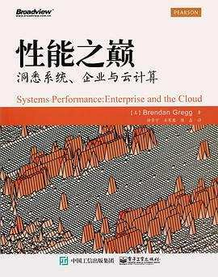
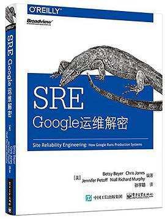
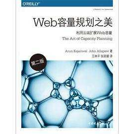
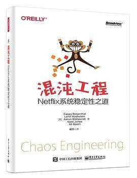

---
date: "2019-06-23"
---  
      
# 加餐 | 学习容量保障的那些经典资料
你好，我是吴骏龙。

从去年6月专栏更新完毕至今，我收到了大量的读者留言，这其中有疑问、有探讨、有建议、有鼓励，这些留言就像一面面镜子，真实反映了很多人的收获和心声，也让我感受到了技术人对知识的渴望和热情。

我们处在一个高速发展的时代，专栏提供了高效获取知识的“捷径”，但学习是永无止尽的，日常积累和阅读等“慢学习”依然不可或缺。我身边有不少读者都希望我能够推荐一些容量保障的经典书籍或相关资料，作为持续学习的素材，那么今天，作为专栏的加餐，我将与你一一分享我觉得值得一读的学习资料，同时也谈一谈我的阅读体会。

我将这些素材分为三类：基础类、综合类，以及研究类。

# **基础类**

容量保障是一门涉猎非常广泛的综合性工作，需要对微服务体系、系统架构、云计算、性能测试和服务性能优化，甚至是组织管理领域都有比较深入的理解。当然，以一名现代化IT从业人员的标准来讲，这些也都是必备的基础知识，只不过容量保障人员所要求的深度更高罢了。

下面，我就来推荐一些与容量保障领域直接相关的基础类学习资料，供你参阅。

## _**《性能之巅：洞悉系统、企业与云计算》**_

这本书是Brendan Gregg的神作，别看它有600多页，但涉及的知识点之广，方法之全面，无可挑剔，几乎所有与性能有关的方法论和实践思路都能在这本书中找到，而且用词精炼（侧面说明了翻译也很用心），看得很爽。

<!-- [[[read_end]]] -->

这是一本非常难得的能够时读时新的书，书中的内容也不落俗套。当然，在如今快节奏的时代背景下，我并不推荐去逐字逐句的精读这本书，你可以先阅读书中陈述的一些重要的方法论，再根据工作中涉及比较多的知识领域去选读某些章节，理论联系实际，能够更快的帮助自己提升。

另外值得一提的是，该书的作者Brendan Gregg始终保持着更新博客的习惯，他的博客质量很高，基本上都是分享以案例和问题驱动的性能分析和调优过程，大概每个月更新两篇（年底频率会降低，甚至不更新，估计休假了），每篇博文不长，建议茶余饭后品读一下：[点此进入](https://www.brendangregg.com/blog)。

## _**《SRE Google运维解密》**_

这又是一本很厚的书，最新版本有400多页，它最初是一本文集，大概有1500多页，经历了大刀阔斧的精简，再通过翻译在国内出版，才形成了我们现在看到的这本书，书中不少内容与容量保障工作是高度贴合的。

SRE是容量保障中一个很重要的角色，根据书中的观点，容量规划、容量治理和相关演练措施，以及应急响应等工作，都是SRE的重要职责范围。因此，无论你是不是SRE，都需要对它的工作职责和内容有所了解。

当然，国内外对于SRE的实践和认知还是有一些差异的，你大可不必过于纠结。领会SRE的工作内容，理解这个角色，在工作中能够随时补位，就可以了。举个例子，我目前在一家中等规模的外企工作，这家公司的SRE只负责线上监控和应急，测试团队负责流程规范制定、线上发布和故障复盘工作，只要各团队的目标一致，一样也能协作的很好。

## _**《大型网站技术架构 核心原理与案例分析》**_

这本书是李智慧老师的佳作，出版时间比较早了，但是通俗易懂，全书特别注重“演进”，讲了很多“过程”而不是“结果”，因此是一本非常**适合入门**的书籍，页数也不多，看得舒服不头疼。特别要讲下，书中对于高性能架构有一个独立的章节，从事容量保障工作的你可以重点阅读。

如果你已经在大厂工作过一段时间，那么这本书也可以作为查遗补漏的复习书，它的缺点和它的优点一样，就是太“通俗易懂”了，描述比较简单不够深入，因此适合入门，不适合深究。

## _**《架构之道：软件构建的设计方法》**_

良好的架构是容量保障的基础和原点，在我的容量保障工作经历中，有大量时间是投入在与研发人员和架构师沟通系统架构设计的合理性上的。我深刻的体会到，要推动系统架构改进，首先你得自己有货才行，否则都很难和别人聊到一快，这本书就可以作为你在软件架构领域的知识储备。

这本书很新，2020年下半年刚刚引入国内，它的作者是获得过微软“软件传奇”（Software Legend）称号的著名架构师Juval Lowy，非常权威。他特别注重方法论的提炼，很多观点都让人有一种相见恨晚的感觉，一些我们通过日常实践所演进出的做法，书中正好能以工程化的方式将其描述出来，因此比较**适合进阶**。

## _**《图解HTTP》**_

计算机网络的相关知识在分析容量问题时经常会被用到，但计算机网络的概念比较抽象，不像架构和代码那么直观，因此较难学精，很多非科班出身的从业人员可能感触更深。

这本书用图片的形式辅助阅读，生动不枯燥，比较适合入门，我接触过不少朋友是看这本书来准备面试的，这也从侧面证明了它的内容确实易懂。不过，在夯实基础后还是要多多实践，对于这类抽象的知识，自己多去抓包分析，比什么都强。

# **综合类**

市面上系统化讲解容量保障相关领域话题的资料不多，这也是我写这个专栏的一大初衷，另外我自己是一个非常极致的效率主义者（或者说我很懒），因此我也不太推荐去阅读很多质量不高的书。所以，在综合类的参考资料这块，我只推荐两本我觉得值得一读的书籍，这两本书都不厚，可以快速看完。

## _**《Web容量规划之美》第二版**_

这本书的作者来头不大，坦白说从撰写的角度来讲，感觉作者的思维也比较跳跃，如果你读惯了平铺直叙的书，可能会觉得有点摸不着头脑。但这本书最大的特点是，它提供的案例特别多，而且特别贴近实际，几乎都可以拿来即用，例如容量预测的案例，展示了涉及到的工具、代码、公式和结果，并做了适度的展开，我把一些思路应用到了我当时的团队工作中，也取得了不错的效果。

我挺喜欢这种实用主义的风格，基于一个个实际的容量规划案例，而不是教条的套用理论模型。你可以把这本书作为一系列实践案例的集合体，与你的工作结合起来。

## _**《混沌工程：Netflix系统稳定性之道》**_

这本书有意思，是我从业以来阅读过的最小巧的一本书，1/32的开本，只有100多页，我花了一天就看完了。书中的内容来源于混沌工程的鼻祖Netflix公司的实践，整理成了一系列方法论和实践案例，很多思想和内容都能对我们的工作起到不小的指导意义。

因此，特别将这本小巧玲珑的书籍推荐给你。

# **研究类**

说到研究类资料，很容易联想到学术研究，其实工程上我们也需要进行不少研究工作，去攻坚一些技术难题。有些难题虽然暂时无法给出最优解，但通过研究、探索能够有些进步，也是很不容易的成就。下面我介绍一些偏工程化的研究类资料，你可以挑选一些钻研。

## _**《计算机系统的性能建模与设计：排队论实战》**_

我在专栏的[第10讲](https://time.geekbang.org/column/article/379908)与你分享了排队论的基础内容，但我观察下来，鲜有企业的技术人员会花费大量时间研究排队论，是排队论没有用吗？显然不是，排队论作为一门基础学科已经成为了不少大学的课程之一。

我想引用本书作者的一段话来回答上面这个问题：“排队论的书对计算机科学家来说并不友好。其中的应用不是面向计算机的，并且所使用的假设对于计算机系统而言通常是不现实的。此外，这些书很深奥，不具备研究生数学水平的人通常都难以理解。”

这段话是很现实的，如果你去网上搜索排队论的资料，你会发现绝大多数资料都是面向制造系统，或是一些排队服务场景，与计算机行业确实存在沟壑。而这本书所面向的是计算机互联网场景，而且是基于CMU（卡内基梅隆大学）的讲义整理，我想这些理由就已经足够我推荐本书了。

## _**云服务商的技术和产品文档**_

各大云服务厂商的技术文档甚至是产品文档，都是不错的研究素材，我在专栏[第11讲](https://time.geekbang.org/column/article/380887)中就总结过AWS的一些产品功能原理。由于云服务厂商需要尽可能提供能帮助用户解决实际问题的功能（这样才能让用户买单赚钱嘛），因此落地性会相对好一些，文档也比较容易理解。此外，这些厂商互相之间有竞争关系，这间接推动了技术的变革，值得学习。

目前，各大云服务商在容量保障领域最主要的关注点是弹性伸缩，下面我列举一些与之相关的技术文档和产品文档地址：

* 技术文档：[AWS弹性伸缩机制](https://aws.amazon.com/cn/blogs/compute/fleet-management-made-easy-with-auto-scaling)
* 技术文档：[AWS提供的预测伸缩功能](https://aws.amazon.com/cn/blogs/aws/new-predictive-scaling-for-ec2-powered-by-machine-learning)
* 产品文档：[阿里云弹性伸缩功能](https://help.aliyun.com/product/25855.html)
* 产品文档：[腾讯云弹性伸缩功能](https://cloud.tencent.com/document/product/377)
* 产品文档：[华为云弹性伸缩功能](https://support.huaweicloud.com/qs-as/zh-cn_topic_0042038053.html)

## **小结**

今天这份加餐，我为你带来了不少容量保障的学习资料。你可以根据自身的实际情况，选读一些基础内容，补齐自己的短板；另外，再精读一些与目前工作直接相关的内容，并带入到实践中去，这样的学习方式是最快的。

如果你是一位团队管理者，恰好团队正在攻坚一些容量保障的具体工作任务，不妨可以选择合适的资料和章节，在团队中组织读书分享会，这种启发式的学习会带来事半功倍的效果。

最后，也欢迎你分享出你所读过的，并且觉得很有收获的容量保障学习资料，我们一起持续学习。