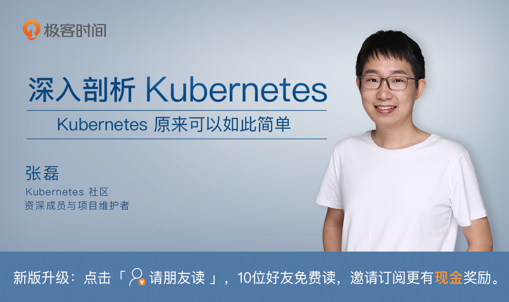

---
date: "2019-06-23"
---  
      
# 结束语 | Kubernetes：赢开发者赢天下
你好，我是张磊。

在本专栏一开始，我用了大量的笔墨和篇幅和你探讨了这样一个话题：Kubernetes 为什么会赢？

而在当时的讨论中，我为你下了这样一个结论：Kubernetes 项目之所以能赢，最重要的原因在于它争取到了云计算生态里的绝大多数开发者。不过，相信在那个时候，你可能会对这个结论有所疑惑：大家不都说 Kubernetes 是一个运维工具么？怎么就和开发者搭上了关系呢？

事实上，Kubernetes 项目发展到今天，已经成为了云计算领域中平台层当仁不让的事实标准。但这样的生态地位，并不是一个运维工具或者 Devops 项目所能达成的。这里的原因也很容易理解：Kubernetes 项目的成功，是成千上万云计算平台上的开发者用脚投票的结果。而在学习完本专栏之后，相信你也应该能够明白，云计算平台上的开发者们所关心的，并不是调度，也不是资源管理，更不是网络或者存储，他们关心的只有一件事，那就是 Kubernetes 的 API。

这也是为什么，在 Kubernetes 这个项目里，只要是跟 API 相关的事情，那就都是大事儿；只要是想要在这个社区构建影响力的人或者组织，就一定会在 API 层面展开角逐。这一层 “API 为王”的思路，早已经深入到了 Kubernetes 里每一个 API 对象的每一个字段的设计过程当中。

<!-- [[[read_end]]] -->

所以说，Kubernetes 项目的本质其实只有一个，那就是“控制器模式”。这个思想，不仅仅是 Kubernetes 项目里每一个组件的“设计模板”，也是Kubernetes 项目能够将开发者们紧紧团结到自己身边的重要原因。作为一个云计算平台的用户，能够用一个 YAML 文件表达我开发的应用的最终运行状态，并且自动地对我的应用进行运维和管理。这种信赖关系，就是连接 Kubernetes 项目和开发者们最重要的纽带。更重要的是，当这个 API 趋向于足够稳定和完善的时候，越来越多的开发者会自动汇集到这个 API 上来，依托它所提供的能力构建出一个全新的生态。

事实上，在云计算发展的历史上，像这样一个围绕一个 API 创建出一个“新世界”的例子，已经出现过了一次，这正是 AWS 和它庞大的开发者生态的故事。而这一次 Kubernetes 项目的巨大成功，其实就是 AWS 故事的另一个版本而已。只不过，相比于 AWS 作为基础设施层提供运维和资源抽象标准的故事，Kubernetes 生态终于把触角触碰到了应用开发者的边界，使得应用的开发者可以有能力去关心自己开发的应用的运行状态和运维方法，实现了经典 PaaS 项目很多年前就已经提出、但却始终没能达成的美好愿景。

这也是为什么我在本专栏里一再强调，Kubernetes 项目里最重要的，是它的“容器设计模式”，是它的 API 对象，是它的 API 编程范式。这些，都是未来云计算时代的每一个开发者需要融会贯通、融化到自己开发基因里的关键所在。也只有这样，作为一个开发者，你才能够开发和构建出符合未来云计算形态的应用。而更重要的是，也只有这样，你才能够借助云计算的力量，让自己的应用真正产生价值。

而通过本专栏的讲解，我希望你能够真正理解 Kubernetes API 背后的设计思想，能够领悟 Kubernetes 项目为了赢得开发者信赖的“煞费苦心”。更重要的是，当你带着这种“觉悟”再去理解和学习 Kubernetes 调度、网络、存储、资源管理、容器运行时的设计和实现方法时，才会真正触碰到这些机制隐藏在文档和代码背后的灵魂所在。

所以说，**当你不太理解为什么要学习 Kubernetes 项目的时候，或者，你在学习 Kubernetes 项目感到困难的时候，不妨想象一下 Kubernetes 就是未来的 Linux 操作系统。**在这个云计算以前所未有的速度迅速普及的世界里，Kubernetes 项目很快就会像操作系统一样，成为每一个技术从业者必备的基础知识。而现在，你不仅牢牢把握住了这个项目的精髓，也就是声明式 API 和控制器模式；掌握了这个 API 独有的编程范式，即 Controller 和 Operator；还以此为基础详细地了解了这个项目每一个核心模块和功能的设计与实现方法。那么，对于这个未来云计算时代的操作系统，你还有什么好担心的呢？

所以说，《深入剖析 Kubernetes 》专栏的结束，其实是你技术生涯全新的开始。我相信你一定能够带着这个“赢开发者赢天下”的启发，在云计算的海洋里继续乘风破浪、一往无前！

