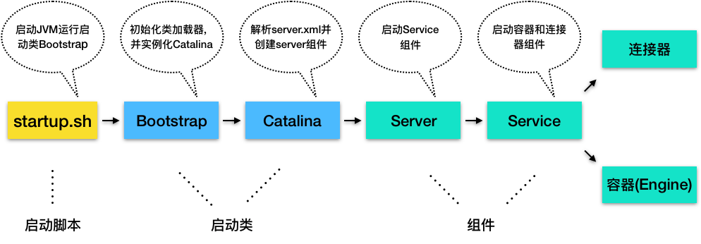

---
date: "2019-06-23"
---  
      
# 08 | Tomcat的“高层们”都负责做什么？
使用过Tomcat的同学都知道，我们可以通过Tomcat的`/bin`目录下的脚本`startup.sh`来启动Tomcat，那你是否知道我们执行了这个脚本后发生了什么呢？你可以通过下面这张流程图来了解一下。



1.Tomcat本质上是一个Java程序，因此`startup.sh`脚本会启动一个JVM来运行Tomcat的启动类Bootstrap。

2.Bootstrap的主要任务是初始化Tomcat的类加载器，并且创建Catalina。关于Tomcat为什么需要自己的类加载器，我会在专栏后面详细介绍。

3.Catalina是一个启动类，它通过解析`server.xml`、创建相应的组件，并调用Server的start方法。

4.Server组件的职责就是管理Service组件，它会负责调用Service的start方法。

5.Service组件的职责就是管理连接器和顶层容器Engine，因此它会调用连接器和Engine的start方法。

这样Tomcat的启动就算完成了。下面我来详细介绍一下上面这个启动过程中提到的几个非常关键的启动类和组件。

你可以把Bootstrap看作是上帝，它初始化了类加载器，也就是创造万物的工具。

<!-- [[[read_end]]] -->

如果我们把Tomcat比作是一家公司，那么Catalina应该是公司创始人，因为Catalina负责组建团队，也就是创建Server以及它的子组件。

Server是公司的CEO，负责管理多个事业群，每个事业群就是一个Service。

Service是事业群总经理，它管理两个职能部门：一个是对外的市场部，也就是连接器组件；另一个是对内的研发部，也就是容器组件。

Engine则是研发部经理，因为Engine是最顶层的容器组件。

你可以看到这些启动类或者组件不处理具体请求，它们的任务主要是“管理”，管理下层组件的生命周期，并且给下层组件分配任务，也就是把请求路由到负责“干活儿”的组件。因此我把它们比作Tomcat的“高层”。

今天我们就来看看这些“高层”的实现细节，目的是让我们逐步理解Tomcat的工作原理。另一方面，软件系统中往往都有一些起管理作用的组件，你可以学习和借鉴Tomcat是如何实现这些组件的。

## Catalina

Catalina的主要任务就是创建Server，它不是直接new一个Server实例就完事了，而是需要解析`server.xml`，把在`server.xml`里配置的各种组件一一创建出来，接着调用Server组件的init方法和start方法，这样整个Tomcat就启动起来了。作为“管理者”，Catalina还需要处理各种“异常”情况，比如当我们通过“Ctrl + C”关闭Tomcat时，Tomcat将如何优雅的停止并且清理资源呢？因此Catalina在JVM中注册一个“关闭钩子”。

```
    public void start() {
        //1. 如果持有的Server实例为空，就解析server.xml创建出来
        if (getServer() == null) {
            load();
        }
        //2. 如果创建失败，报错退出
        if (getServer() == null) {
            log.fatal(sm.getString("catalina.noServer"));
            return;
        }
    
        //3.启动Server
        try {
            getServer().start();
        } catch (LifecycleException e) {
            return;
        }
    
        //创建并注册关闭钩子
        if (useShutdownHook) {
            if (shutdownHook == null) {
                shutdownHook = new CatalinaShutdownHook();
            }
            Runtime.getRuntime().addShutdownHook(shutdownHook);
        }
    
        //用await方法监听停止请求
        if (await) {
            await();
            stop();
        }
    }
    

```

那什么是“关闭钩子”，它又是做什么的呢？如果我们需要在JVM关闭时做一些清理工作，比如将缓存数据刷到磁盘上，或者清理一些临时文件，可以向JVM注册一个“关闭钩子”。“关闭钩子”其实就是一个线程，JVM在停止之前会尝试执行这个线程的run方法。下面我们来看看Tomcat的“关闭钩子”CatalinaShutdownHook做了些什么。

```
    protected class CatalinaShutdownHook extends Thread {
    
        @Override
        public void run() {
            try {
                if (getServer() != null) {
                    Catalina.this.stop();
                }
            } catch (Throwable ex) {
               ...
            }
        }
    }
    

```

从这段代码中你可以看到，Tomcat的“关闭钩子”实际上就执行了Server的stop方法，Server的stop方法会释放和清理所有的资源。

## Server组件

Server组件的具体实现类是StandardServer，我们来看下StandardServer具体实现了哪些功能。Server继承了LifecycleBase，它的生命周期被统一管理，并且它的子组件是Service，因此它还需要管理Service的生命周期，也就是说在启动时调用Service组件的启动方法，在停止时调用它们的停止方法。Server在内部维护了若干Service组件，它是以数组来保存的，那Server是如何添加一个Service到数组中的呢？

```
    @Override
    public void addService(Service service) {
    
        service.setServer(this);
    
        synchronized (servicesLock) {
            //创建一个长度+1的新数组
            Service results[] = new Service[services.length + 1];
            
            //将老的数据复制过去
            System.arraycopy(services, 0, results, 0, services.length);
            results[services.length] = service;
            services = results;
    
            //启动Service组件
            if (getState().isAvailable()) {
                try {
                    service.start();
                } catch (LifecycleException e) {
                    // Ignore
                }
            }
    
            //触发监听事件
            support.firePropertyChange("service", null, service);
        }
    
    }
    

```

从上面的代码你能看到，它并没有一开始就分配一个很长的数组，而是在添加的过程中动态地扩展数组长度，当添加一个新的Service实例时，会创建一个新数组并把原来数组内容复制到新数组，这样做的目的其实是为了节省内存空间。

除此之外，Server组件还有一个重要的任务是启动一个Socket来监听停止端口，这就是为什么你能通过shutdown命令来关闭Tomcat。不知道你留意到没有，上面Catalina的启动方法的最后一行代码就是调用了Server的await方法。

在await方法里会创建一个Socket监听8005端口，并在一个死循环里接收Socket上的连接请求，如果有新的连接到来就建立连接，然后从Socket中读取数据；如果读到的数据是停止命令“SHUTDOWN”，就退出循环，进入stop流程。

## Service组件

Service组件的具体实现类是StandardService，我们先来看看它的定义以及关键的成员变量。

```
    public class StandardService extends LifecycleBase implements Service {
        //名字
        private String name = null;
        
        //Server实例
        private Server server = null;
    
        //连接器数组
        protected Connector connectors[] = new Connector[0];
        private final Object connectorsLock = new Object();
    
        //对应的Engine容器
        private Engine engine = null;
        
        //映射器及其监听器
        protected final Mapper mapper = new Mapper();
        protected final MapperListener mapperListener = new MapperListener(this);
    

```

StandardService继承了LifecycleBase抽象类，此外StandardService中还有一些我们熟悉的组件，比如Server、Connector、Engine和Mapper。

那为什么还有一个MapperListener？这是因为Tomcat支持热部署，当Web应用的部署发生变化时，Mapper中的映射信息也要跟着变化，MapperListener就是一个监听器，它监听容器的变化，并把信息更新到Mapper中，这是典型的观察者模式。

作为“管理”角色的组件，最重要的是维护其他组件的生命周期。此外在启动各种组件时，要注意它们的依赖关系，也就是说，要注意启动的顺序。我们来看看Service启动方法：

```
    protected void startInternal() throws LifecycleException {
    
        //1. 触发启动监听器
        setState(LifecycleState.STARTING);
    
        //2. 先启动Engine，Engine会启动它子容器
        if (engine != null) {
            synchronized (engine) {
                engine.start();
            }
        }
        
        //3. 再启动Mapper监听器
        mapperListener.start();
    
        //4.最后启动连接器，连接器会启动它子组件，比如Endpoint
        synchronized (connectorsLock) {
            for (Connector connector: connectors) {
                if (connector.getState() != LifecycleState.FAILED) {
                    connector.start();
                }
            }
        }
    }
    

```

从启动方法可以看到，Service先启动了Engine组件，再启动Mapper监听器，最后才是启动连接器。这很好理解，因为内层组件启动好了才能对外提供服务，才能启动外层的连接器组件。而Mapper也依赖容器组件，容器组件启动好了才能监听它们的变化，因此Mapper和MapperListener在容器组件之后启动。组件停止的顺序跟启动顺序正好相反的，也是基于它们的依赖关系。

## Engine组件

最后我们再来看看顶层的容器组件Engine具体是如何实现的。Engine本质是一个容器，因此它继承了ContainerBase基类，并且实现了Engine接口。

```
    public class StandardEngine extends ContainerBase implements Engine {
    }
    

```

我们知道，Engine的子容器是Host，所以它持有了一个Host容器的数组，这些功能都被抽象到了ContainerBase中，ContainerBase中有这样一个数据结构：

```
    protected final HashMap<String, Container> children = new HashMap<>();
    

```

ContainerBase用HashMap保存了它的子容器，并且ContainerBase还实现了子容器的“增删改查”，甚至连子组件的启动和停止都提供了默认实现，比如ContainerBase会用专门的线程池来启动子容器。

```
    for (int i = 0; i < children.length; i++) {
       results.add(startStopExecutor.submit(new StartChild(children[i])));
    }
    

```

所以Engine在启动Host子容器时就直接重用了这个方法。

那Engine自己做了什么呢？我们知道容器组件最重要的功能是处理请求，而Engine容器对请求的“处理”，其实就是把请求转发给某一个Host子容器来处理，具体是通过Valve来实现的。

通过专栏前面的学习，我们知道每一个容器组件都有一个Pipeline，而Pipeline中有一个基础阀（Basic Valve），而Engine容器的基础阀定义如下：

```
    final class StandardEngineValve extends ValveBase {
    
        public final void invoke(Request request, Response response)
          throws IOException, ServletException {
      
          //拿到请求中的Host容器
          Host host = request.getHost();
          if (host == null) {
              return;
          }
      
          // 调用Host容器中的Pipeline中的第一个Valve
          host.getPipeline().getFirst().invoke(request, response);
      }
      
    }
    

```

这个基础阀实现非常简单，就是把请求转发到Host容器。你可能好奇，从代码中可以看到，处理请求的Host容器对象是从请求中拿到的，请求对象中怎么会有Host容器呢？这是因为请求到达Engine容器中之前，Mapper组件已经对请求进行了路由处理，Mapper组件通过请求的URL定位了相应的容器，并且把容器对象保存到了请求对象中。

## 本期精华

今天我们学习了Tomcat启动过程，具体是由启动类和“高层”组件来完成的，它们都承担着“管理”的角色，负责将子组件创建出来，并把它们拼装在一起，同时也掌握子组件的“生杀大权”。

所以当我们在设计这样的组件时，需要考虑两个方面：

首先要选用合适的数据结构来保存子组件，比如Server用数组来保存Service组件，并且采取动态扩容的方式，这是因为数组结构简单，占用内存小；再比如ContainerBase用HashMap来保存子容器，虽然Map占用内存会多一点，但是可以通过Map来快速的查找子容器。因此在实际的工作中，我们也需要根据具体的场景和需求来选用合适的数据结构。

其次还需要根据子组件依赖关系来决定它们的启动和停止顺序，以及如何优雅的停止，防止异常情况下的资源泄漏。这正是“管理者”应该考虑的事情。

## 课后思考

Server组件的在启动连接器和容器时，都分别加了锁，这是为什么呢？

不知道今天的内容你消化得如何？如果还有疑问，请大胆的在留言区提问，也欢迎你把你的课后思考和心得记录下来，与我和其他同学一起讨论。如果你觉得今天有所收获，欢迎你把它分享给你的朋友。