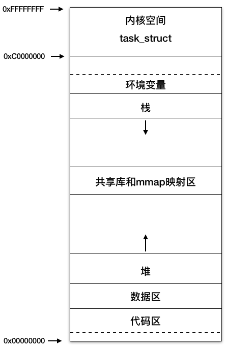
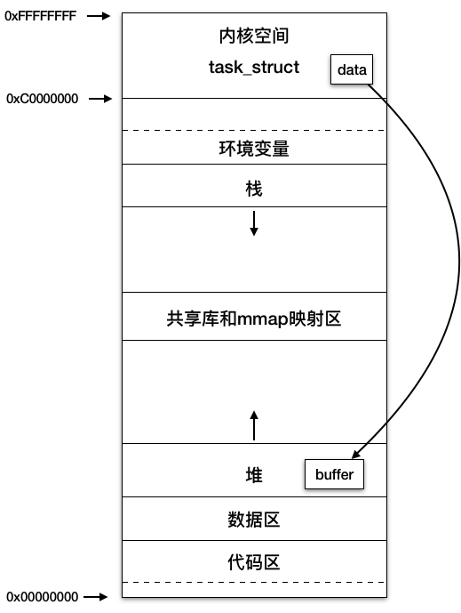

---
date: "2019-06-23"
---  
      
# 22 | 热点问题答疑（2）：内核如何阻塞与唤醒进程？
在专栏的第三个模块，我们学习了Tomcat连接器组件的设计，**其中最重要的是各种I/O模型及其实现**。而I/O模型跟操作系统密切相关，要彻底理解这些原理，我们首先需要弄清楚什么是进程和线程，什么是虚拟内存和物理内存，什么是用户空间和内核空间，线程的阻塞到底意味着什么，内核又是如何唤醒用户线程的等等这些问题。可以说掌握这些底层的知识，对于你学习Tomcat和Jetty的原理，乃至其他各种后端架构都至关重要，这些知识可以说是后端开发的“基石”。

在专栏的留言中我也发现很多同学反馈对这些底层的概念很模糊，那今天作为模块的答疑篇，我就来跟你聊聊这些问题。

## 进程和线程

我们先从Linux的进程谈起，操作系统要运行一个可执行程序，首先要将程序文件加载到内存，然后CPU去读取和执行程序指令，而一个进程就是“一次程序的运行过程”，内核会给每一个进程创建一个名为`task_struct`的数据结构，而内核也是一段程序，系统启动时就被加载到内存中了。

进程在运行过程中要访问内存，而物理内存是有限的，比如16GB，那怎么把有限的内存分给不同的进程使用呢？跟CPU的分时共享一样，内存也是共享的，Linux给每个进程虚拟出一块很大的地址空间，比如32位机器上进程的虚拟内存地址空间是4GB，从0x00000000到0xFFFFFFFF。但这4GB并不是真实的物理内存，而是进程访问到了某个虚拟地址，如果这个地址还没有对应的物理内存页，就会产生缺页中断，分配物理内存，MMU（内存管理单元）会将虚拟地址与物理内存页的映射关系保存在页表中，再次访问这个虚拟地址，就能找到相应的物理内存页。每个进程的这4GB虚拟地址空间分布如下图所示：

<!-- [[[read_end]]] -->



进程的虚拟地址空间总体分为用户空间和内核空间，低地址上的3GB属于用户空间，高地址的1GB是内核空间，这是基于安全上的考虑，用户程序只能访问用户空间，内核程序可以访问整个进程空间，并且只有内核可以直接访问各种硬件资源，比如磁盘和网卡。那用户程序需要访问这些硬件资源该怎么办呢？答案是通过系统调用，系统调用可以理解为内核实现的函数，比如应用程序要通过网卡接收数据，会调用Socket的read函数：

```
    ssize_t read(int fd,void *buf,size_t nbyte)
    

```

CPU在执行系统调用的过程中会从用户态切换到内核态，CPU在用户态下执行用户程序，使用的是用户空间的栈，访问用户空间的内存；当CPU切换到内核态后，执行内核代码，使用的是内核空间上的栈。

从上面这张图我们看到，用户空间从低到高依次是代码区、数据区、堆、共享库与mmap内存映射区、栈、环境变量。其中堆向高地址增长，栈向低地址增长。

请注意用户空间上还有一个共享库和mmap映射区，Linux提供了内存映射函数mmap， 它可将文件内容映射到这个内存区域，用户通过读写这段内存，从而实现对文件的读取和修改，无需通过read/write系统调用来读写文件，省去了用户空间和内核空间之间的数据拷贝，Java的MappedByteBuffer就是通过它来实现的；用户程序用到的系统共享库也是通过mmap映射到了这个区域。

我在开始提到的`task_struct`结构体本身是分配在内核空间，它的`vm_struct`成员变量保存了各内存区域的起始和终止地址，此外`task_struct`中还保存了进程的其他信息，比如进程号、打开的文件、创建的Socket以及CPU运行上下文等。

在Linux中，线程是一个轻量级的进程，轻量级说的是线程只是一个CPU调度单元，因此线程有自己的`task_struct`结构体和运行栈区，但是线程的其他资源都是跟父进程共用的，比如虚拟地址空间、打开的文件和Socket等。

## 阻塞与唤醒

我们知道当用户线程发起一个阻塞式的read调用，数据未就绪时，线程就会阻塞，那阻塞具体是如何实现的呢？

Linux内核将线程当作一个进程进行CPU调度，内核维护了一个可运行的进程队列，所有处于`TASK_RUNNING`状态的进程都会被放入运行队列中，本质是用双向链表将`task_struct`链接起来，排队使用CPU时间片，时间片用完重新调度CPU。所谓调度就是在可运行进程列表中选择一个进程，再从CPU列表中选择一个可用的CPU，将进程的上下文恢复到这个CPU的寄存器中，然后执行进程上下文指定的下一条指令。


而阻塞的本质就是将进程的`task_struct`移出运行队列，添加到等待队列，并且将进程的状态的置为`TASK_UNINTERRUPTIBLE`或者`TASK_INTERRUPTIBLE`，重新触发一次CPU调度让出CPU。

那线程怎么唤醒呢？线程在加入到等待队列的同时向内核注册了一个回调函数，告诉内核我在等待这个Socket上的数据，如果数据到了就唤醒我。这样当网卡接收到数据时，产生硬件中断，内核再通过调用回调函数唤醒进程。唤醒的过程就是将进程的`task_struct`从等待队列移到运行队列，并且将`task_struct`的状态置为`TASK_RUNNING`，这样进程就有机会重新获得CPU时间片。

这个过程中，内核还会将数据从内核空间拷贝到用户空间的堆上。



当read系统调用返回时，CPU又从内核态切换到用户态，继续执行read调用的下一行代码，并且能从用户空间上的Buffer读到数据了。

## 小结

今天我们谈到了一次Socket read系统调用的过程：首先CPU在用户态执行应用程序的代码，访问进程虚拟地址空间的用户空间；read系统调用时CPU从用户态切换到内核态，执行内核代码，内核检测到Socket上的数据未就绪时，将进程的`task_struct`结构体从运行队列中移到等待队列，并触发一次CPU调度，这时进程会让出CPU；当网卡数据到达时，内核将数据从内核空间拷贝到用户空间的Buffer，接着将进程的`task_struct`结构体重新移到运行队列，这样进程就有机会重新获得CPU时间片，系统调用返回，CPU又从内核态切换到用户态，访问用户空间的数据。

不知道今天的内容你消化得如何？如果还有疑问，请大胆的在留言区提问，与我和其他同学一起讨论。如果你觉得今天有所收获，欢迎你把它分享给你的朋友。