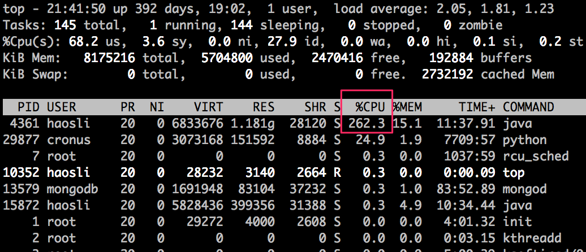
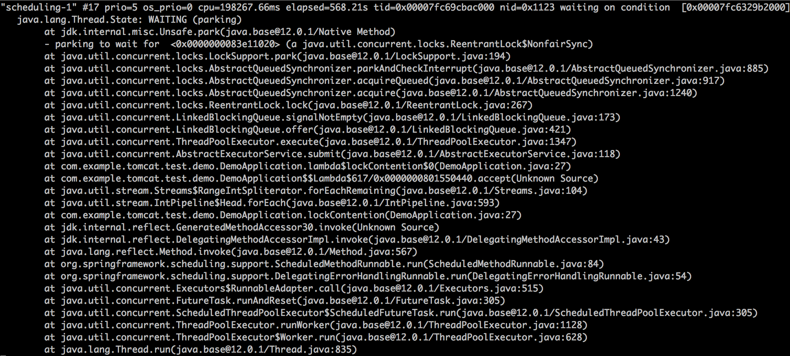
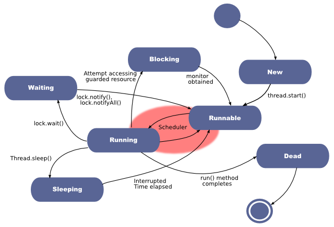
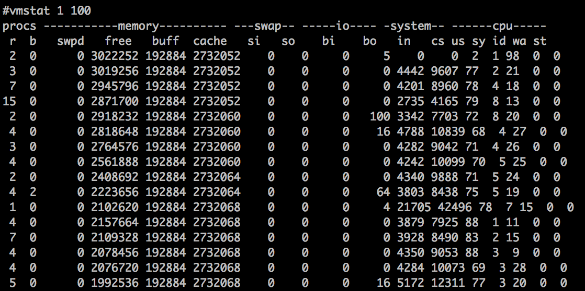
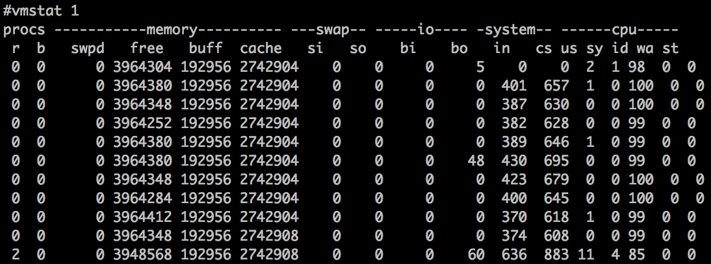

---
date: "2019-06-23"
---  
      
# 39 | Tomcat进程占用CPU过高怎么办？
在性能优化这个主题里，前面我们聊过了Tomcat的内存问题和网络相关的问题，接下来我们看一下CPU的问题。CPU资源经常会成为系统性能的一个瓶颈，这其中的原因是多方面的，可能是内存泄露导致频繁GC，进而引起CPU使用率过高；又可能是代码中的Bug创建了大量的线程，导致CPU上下文切换开销。

今天我们就来聊聊Tomcat进程的CPU使用率过高怎么办，以及怎样一步一步找到问题的根因。

## “Java进程CPU使用率高”的解决思路是什么？

通常我们所说的CPU使用率过高，这里面其实隐含着一个用来比较高与低的基准值，比如JVM在峰值负载下的平均CPU利用率为40％，如果CPU使用率飙到80\%就可以被认为是不正常的。

典型的JVM进程包含多个Java线程，其中一些在等待工作，另一些则正在执行任务。在单个Java程序的情况下，线程数可以非常低，而对于处理大量并发事务的互联网后台来说，线程数可能会比较高。

对于CPU的问题，最重要的是要找到是**哪些线程在消耗CPU**，通过线程栈定位到问题代码；如果没有找到个别线程的CPU使用率特别高，我们要怀疑到是不是线程上下文切换导致了CPU使用率过高。下面我们通过一个实例来学习CPU问题定位的过程。

<!-- [[[read_end]]] -->

## 定位高CPU使用率的线程和代码

1.写一个模拟程序来模拟CPU使用率过高的问题，这个程序会在线程池中创建4096个线程。代码如下：

```
    @SpringBootApplication
    @EnableScheduling
    public class DemoApplication {
    
       //创建线程池，其中有4096个线程。
       private ExecutorService executor = Executors.newFixedThreadPool(4096);
       //全局变量，访问它需要加锁。
       private int count;
       
       //以固定的速率向线程池中加入任务
       @Scheduled(fixedRate = 10)
       public void lockContention() {
          IntStream.range(0, 1000000)
                .forEach(i -> executor.submit(this::incrementSync));
       }
       
       //具体任务，就是将count数加一
       private synchronized void incrementSync() {
          count = (count + 1) % 10000000;
       }
       
       public static void main(String[] args) {
          SpringApplication.run(DemoApplication.class, args);
       }
    
    }
    

```

2.在Linux环境下启动程序：

```
    java -Xss256k -jar demo-0.0.1-SNAPSHOT.jar
    

```

请注意，这里我将线程栈大小指定为256KB。对于测试程序来说，操作系统默认值8192KB过大，因为我们需要创建4096个线程。

3.使用top命令，我们看到Java进程的CPU使用率达到了262.3\%，注意到进程ID是4361。



4.接着我们用更精细化的top命令查看这个Java进程中各线程使用CPU的情况：

```
    #top -H -p 4361
    

```


从图上我们可以看到，有个叫“scheduling-1”的线程占用了较多的CPU，达到了42.5\%。因此下一步我们要找出这个线程在做什么事情。

5.为了找出线程在做什么事情，我们需要用jstack命令生成线程快照，具体方法是：

```
    jstack 4361
    

```

jstack的输出比较大，你可以将输出写入文件：

```
    jstack 4361 > 4361.log
    

```

然后我们打开4361.log，定位到第4步中找到的名为“scheduling-1”的线程，发现它的线程栈如下：



从线程栈中我们看到了`AbstractExecutorService.submit`这个函数调用，说明它是Spring Boot启动的周期性任务线程，向线程池中提交任务，这个线程消耗了大量CPU。

## 进一步分析上下文切换开销

一般来说，通过上面的过程，我们就能定位到大量消耗CPU的线程以及有问题的代码，比如死循环。但是对于这个实例的问题，你是否发现这样一个情况：Java进程占用的CPU是262.3\%， 而“scheduling-1”线程只占用了42.5\%的CPU，那还有将近220\%的CPU被谁占用了呢？

不知道你注意到没有，我们在第4步用`top \-H \-p 4361`命令看到的线程列表中还有许多名为“pool-1-thread-x”的线程，它们单个的CPU使用率不高，但是似乎数量比较多。你可能已经猜到，这些就是线程池中干活的线程。那剩下的220\%的CPU是不是被这些线程消耗了呢？

要弄清楚这个问题，我们还需要看jstack的输出结果，主要是看这些线程池中的线程是不是真的在干活，还是在“休息”呢？


通过上面的图我们发现这些“pool-1-thread-x”线程基本都处于WAITING的状态，那什么是WAITING状态呢？或者说Java线程都有哪些状态呢？你可以通过下面的图来理解一下：



从图上我们看到“Blocking”和“Waiting”是两个不同的状态，我们要注意它们的区别：

* Blocking指的是一个线程因为等待临界区的锁（Lock或者synchronized关键字）而被阻塞的状态，请你注意的是处于这个状态的线程**还没有拿到锁。**
* Waiting指的是一个线程拿到了锁，但是需要等待其他线程执行某些操作。比如调用了Object.wait、Thread.join或者LockSupport.park方法时，进入Waiting状态。**前提是这个线程已经拿到锁了**，并且在进入Waiting状态前，操作系统层面会自动释放锁，当等待条件满足，外部调用了Object.notify或者LockSupport.unpark方法，线程会重新竞争锁，成功获得锁后才能进入到Runnable状态继续执行。

回到我们的“pool-1-thread-x”线程，这些线程都处在“Waiting”状态，从线程栈我们看到，这些线程“等待”在getTask方法调用上，线程尝试从线程池的队列中取任务，但是队列为空，所以通过LockSupport.park调用进到了“Waiting”状态。那“pool-1-thread-x”线程有多少个呢？通过下面这个命令来统计一下，结果是4096，正好跟线程池中的线程数相等。


你可能好奇了，那剩下的220\%的CPU到底被谁消耗了呢？分析到这里，我们应该怀疑CPU的上下文切换开销了，因为我们看到Java进程中的线程数比较多。下面我们通过vmstat命令来查看一下操作系统层面的线程上下文切换活动：



如果你还不太熟悉vmstat，可以在[这里](https://linux.die.net/man/8/vmstat)学习如何使用vmstat和查看结果。其中cs那一栏表示线程上下文切换次数，in表示CPU中断次数，我们发现这两个数字非常高，基本证实了我们的猜测，线程上下文切切换消耗了大量CPU。那么问题来了，具体是哪个进程导致的呢？

我们停止Spring Boot测试程序，再次运行vmstat命令，会看到in和cs都大幅下降了，这样就证实了引起线程上下文切换开销的Java进程正是4361。



## 本期精华

当我们遇到CPU过高的问题时，首先要定位是哪个进程的导致的，之后可以通过`top \-H \-p pid`命令定位到具体的线程。其次还要通jstack查看线程的状态，看看线程的个数或者线程的状态，如果线程数过多，可以怀疑是线程上下文切换的开销，我们可以通过vmstat和pidstat这两个工具进行确认。

## 课后思考

哪些情况可能导致程序中的线程数失控，产生大量线程呢？

不知道今天的内容你消化得如何？如果还有疑问，请大胆的在留言区提问，也欢迎你把你的课后思考和心得记录下来，与我和其他同学一起讨论。如果你觉得今天有所收获，欢迎你把它分享给你的朋友。