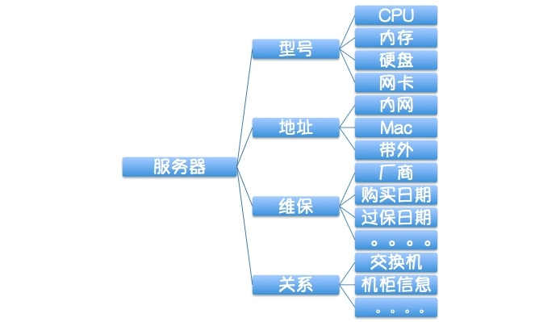

---
date: "2019-06-23"
---  
      
# 03 | 标准化体系建设（上）：如何建立应用标准化体系和模型？
今天我专门来讲讲标准化这个工作。可以说这项工作是运维过程中最基础、最重要的，但也是最容易被忽视的一个环节。

我做过多次公开演讲，每次讲到这个环节，通常会有单独的一页PPT，就放四个字，字号加大加粗，重复三遍，这四个字就是“**标准先行**”，然后演讲过程中会大声说出“**标准先行，标准先行，标准先行**”，重要的事情说三遍，目的就是想反复强调这件事情的重要程度，一定不要忽视。

**我们运维工作的开展常常不知从何下手，或者上来就冲着工具和自动化去了，却始终不得章法，工具做了一堆，效率却并没有提升。其实绝大多数情况下，问题和原因就是标准化这个基础工作没做扎实。**

首先，让我们来看看为什么标准化这个事情如此重要。

## 为什么要做标准化？

**标准化的过程实际上就是对运维对象的识别和建模过程**。形成统一的对象模型后，各方在统一的认识下展开有效协作，然后针对不同的运维对象，再抽取出它们所对应的运维场景，接下来才是运维场景的自动化实现。

这有点像我们学的面向对象编程的思想，其实我们就是需要遵循这样一个思路，我们面对的就是一个个实体和逻辑运维对象。

在标准化的过程中，先识别出各个运维对象，然后我们日常做的所有运维工作，都应该是针对这些对象的运维。如果运维操作脱离了对象，那就没有任何意义。同样，没有理清楚对象，运维自然不得章法。

比如我们说扩容，那就要先确定这里到底是服务器的扩容，还是应用的扩容，还是其它对象的扩容。你会发现，对象不同，扩容这个场景所实施的动作是完全不一样的。

如果把服务器的扩容套用到应用的扩容上去，必然会导致流程错乱。同时对于对象理解上的不一致，也会徒增无谓的沟通成本，造成效率低下。自然地，这种情况下的运维自动化不但不能提升效率，还会越自动越混乱。

这就是为什么我每次都会连续强调三遍“标准先行”的原因。虽然这个事情比较枯燥和繁琐，但是**于纷繁复杂中抽象出标准规范的东西，是我们后续一系列自动化和稳定性保障的基础**。万丈高楼平地起，所以请你一定不要忽略这个工作。

好，总结一下标准化的套路：

<!-- [[[read_end]]] -->

* 第一步，**识别对象**；
* 第二步，**识别对象属性**；
* 第三步，**识别对象关系**；
* 第四步，**识别对象场景**。

接下来我们就按照上面这个思路，一起来分析从基础设施层面和应用层面应该识别出哪些运维对象。

## 基础设施层面的标准化

基础设施层面的运维对象应该不难识别，因为都是一个个物理存在的实体，我们可以进行如下分析。

* 第一步，识别实体对象，主要有服务器、网络、IDC、机柜、存储、配件等。
* 第二步，识别对象的属性，比如服务器就会有SN序列号、IP地址、厂商、硬件配置（如CPU、内存、硬盘、网卡、PCIE、BIOS）、维保信息等；网络设备如交换机也会有厂商、型号、带宽等信息。
* 第三步，识别对象之间的关联关系，比如服务器所在的机柜，虚拟机所在的宿主机、机柜所在IDC等简单关系；复杂一点就会有核心交换机、汇聚交换机、接入交换机以及机柜和服务器之间的级联关系等，这些相对复杂一些，也就是我们常说的**网络拓扑关系**。

把以上信息梳理清楚，通过ER建模工具进行数据建模，再将以上的信息固化到DB中，一个资源层面的信息管理平台就基本成型了。

以服务器为例简单展示一下，我们的视角就是下面这样的：

但是，信息固化不是目的，也没有价值，只有信息动态流转起来才有价值。接下来我们需要做的事情，就是识别出针对运维对象所实施的日常运维操作有哪些，也就是**识别出运维场景是什么**。

* 第四步，还是以服务器为例，我们针对服务器的日常操作有采购、入库、安装、配置、上线、下线、维修等等。另外，可能还会有可视化和查询的场景，如拓扑关系的可视化和动态展示，交换机与服务器之间的级联关系、状态（正常or故障）的展示等，这样可以很直观地关注到资源节点的状态。

完成了这些工作，接下来才是对上述运维场景的自动化开发。所以你看，在真正执行去做工具和自动化平台之前，其实是需要先做好大量的基础准备工作的。我要再次强调这一点，一定不能忽视。

## 应用层面的标准化

下面我们再一起看一个逻辑上的对象，就是我们前面经常提到的运维的核心：**应用**。对这个逻辑对象的建模会相对复杂一些，不过我们依然可以按照上面的套路来。

* 第一步，识别对象。

我们前面讲过，这个识别过程是在做微服务架构设计或拆分的时候就确定下来的。所以严格地讲，它不应该是运维阶段才被识别出来的，而是在之前设计阶段就被识别和确认下来，然后延伸到运维这里才对。

* 第二步，识别对象属性。

一个应用是业务的抽象逻辑，所以会有业务和运维两个维度的属性。业务属性在业务架构时确定，这主要是需要业务架构师去识别的，但是它的运维属性就应该由运维来识别了。

下面我们一起来看一下，一个应用应该具备哪些基本的运维属性。

\***应用的元数据属性**，也就是简单直接地描述一个应用的信息，如应用名、应用Owner、所属业务、是否核心链路应用以及应用功能说明等，这里的关键是应用名；

\***应用代码属性**，主要是编程语言及版本（决定了后续的构建方式），GitLab地址；

\***应用部署模式**，涉及到基础软件包，如语言包Java、C加加、Go等；容器如Tomcat、JBoss等；

\***应用目录信息**，如运维脚本目录、日志目录、应用包目录、临时目录等；

\***应用运行脚本**，如启停脚本、健康监测脚本；

\***应用运行时的参数配置**，如运行端口、Java的JVM参数GC方式、新生代、老生代、永生代的堆内存大小配置等。

从应用属性的视角，应该是下面这样一个视图（简单示例，不完整）：

* 第三步，识别对象关系。

也就是应用与外部的关系，概括起来有三大类：

**第一类是应用与基础设施的关系**，包括应用与资源、应用与VIP、应用与DNS等等的关系；

**第二类是平行层面的应用与应用之间的关系**，这里再细分下去就是应用服务或API与其它应用服务和API的依赖关系。如果你有相关的经验，应该会联想到全链路这样的工具平台了，没错，这样的平台就是用来处理应用间关系管理的。

**第三类是应用与各类基础组件之间的关系**，比如应用与缓存，应用与消息、应用与DB等等之间的关系。

* 第四步，识别应用的运维场景。

这个就会比较多了，比如应用创建、持续集成、持续发布、扩容、缩容、监控等；再复杂点的比如容量评估、压测、限流降级等。

好，这里我们先收一下，聚焦到标准化的层面，通过基础设施和应用层面标准化的示例，我想你应该可以掌握基本的建模思路了，这样的思路可以应用到其它的运维对象上 。

同时，通过上面这些内容，你应该可以比较清晰地看到，我们的每一个运维操作都是针对某个运维对象的，这一点在规划运维体系时非常重要。

**而在这些对象中，应用又是重中之重，是微服务架构下的核心运维对象**。

从应用标准化的过程中我们也可以看到，针对应用的识别和建模，明显复杂很多。所以，后面我还会从理论和实践的角度来继续强化和分析这个概念。

最后，给你留两个小问题。

1.标准化部分我们提到，在规划和设计一个运维技术方案时，一定要找到对象主体，那请你思考以下问题：我们现在经常听到一些高大上的词汇，如水平扩展、弹性伸缩和自动化扩缩容等，你能否说一说这些技术手段的主体是谁，也就是是谁的水平扩展？弹性伸缩的是什么？同时，这些名词之间又有什么关系？

2.在对象属性识别过程中，我们进行了一些关键项的举例，但是如果换一个对象，有没有好的方法论来指导我们进行准确和全面的识别，而不至于遗漏？从我们今天的内容中，你有没有发现一些规律呢？

如果今天的内容对你有帮助，也请你分享给身边的朋友。

欢迎你留言与我一起讨论。