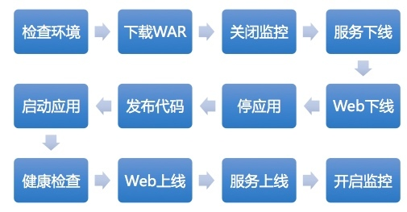
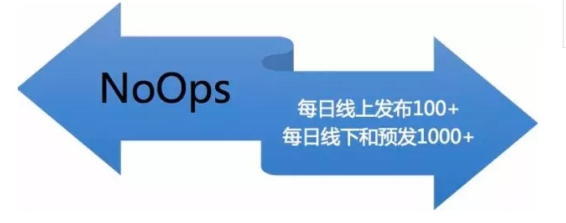

---
date: "2019-06-23"
---  
      
# 20 | 做持续交付概念重要还是场景重要？看“笨办法”如何找到最佳方案
上期文章中我们讲到，在经过严格的依赖规则校验和安全审计之后，构建出的软件包才可以部署发布。

在开发环境、项目环境、集成测试环境以及预发环境下，我们还要进行各类的功能和非功能性测试，最后才能发布到正式的生产环境之上。

通常状况下，做一次软件版本发布，必须经过以下几个环境（如下图所示）。需要明确的是，项目环境和“小蘑菇”（内部叫法）环境，只有特殊版本才会配备，这里我们不做强制。

上述这些环境我们在之前都介绍过。而历经如此多的环境，高效的自动化持续部署和发布就变得尤为重要。

特别是最后的线上发布环节，还需要确保业务连续稳定、无间断，所以，在复杂的微服务架构环境下，我们对软件的发布策略选择、自动化程度和稳定性要求就更高了。

今天，我们一起看看整个流水线软件部署和发布的细节。

## 软件的持续部署发布

这里，我们直接以生产环境的发布过程来讲解。软件的部署发布，简单来说就是：

**将构建完成和验证通过的应用软件包，发布到该应用对应环境下的IP主机上的指定目录下，并通过应用优雅上下线，来实现软件最新版本对外提供服务的过程。**

这个过程会包含的环节，我以图示整理如下：

我们可以看到，软件部署发布，听上去就是把软件部署一下，然后启动起来。这样的操作方式对于单体架构软件没有问题，但是在微服务架构下就满足不了要求了。

单体架构软件启动起来就可以提供服务，但是对于微服务应用，无论停止还是启动，都需要考虑到对周边其它依赖和被依赖应用的影响才可以，考虑的点也就相对较多。

我们针对单机发布，分环节来看一下：

1.从CMDB中，拿到线上生产环境下的应用主机IP列表去对应关系，目的是要将软件包发布到应用对应的IP主机上。

2.检查每台机器上的服务是否正常运行，如果是正常服务的，说明可以发布，但是服务本身异常，就要记录或跳过。

3.下载war包到指定目录。这里要依赖前期我们介绍的应用配置管理，在这一步要获取到该应用的源代码目录。

4.关闭该应用在这台主机上的监控，以免服务下线和应用终止产生线上错误告警。

5.优雅下线。RPC服务从软负载下线，如果该应用还提供了http的Web调用，就需要从Nginx这样的七层负载下线，下线动作均通过API接口调用方式实现。

6.下线后经过短暂静默，重启应用。对于Java应用来说，重启时可以自动解压，启停命令等还是之前从应用配置管理中获取响应路径和命令脚本名称。

7.优雅上线，进行健康监测，检查进程和应用状态是否正常，如果全部监测通过，则开始上线服务，开启监控。

上述是一个应用的单机发布过程，过程比较长，但是可以看出，每个环节并不复杂。这里我们需要注意两个关键点：

* **针对场景，进行细分，这样就可以化整为零，把一个乍看上去很复杂的过程，分解成一个个可执行的步骤。**
* 与服务化的软负载和注册中心进行交互，确保应用是可以优雅上下线的，而不是简单粗暴地启动和停止。

<!-- [[[read_end]]] -->

## 发布策略

上述过程是针对单机的操作步骤。但是，如果我们有上百台主机，甚至一些大的集群有上千台主机，这时应该怎么发布呢？这里就涉及到发布策略问题。

业界常见的几种模式，如蓝绿发布、灰度发布（金丝雀发布）、滚动发布等等，这几种模式网上资料丰富，在这里我们就不逐一展开详细介绍了。

这里，我们主要以**灰度发布和滚动发布的组合方式**为例，详细分析一下这种发布模式。

前面介绍的线上Beta环境，选择的就是金丝雀发布模式，我们内部称之为灰度发布或Beta发布。后来国外Netflix持续交付经验传播比较广，所以我们经常可以听到金丝雀发布这种方式，而其本质上还是灰度发布模式。

Beta环境下，我们会保留1-2台应用主机，引入较少的线上真实用户流量。发布到这个环境上时，对于核心应用和大规模的集群，我们会静默较长时间，以观察应用的新版本运行状态。

如果没有严重的报错或崩溃，静默期过后，我们认为软件质量和稳定性是没有问题的，接下来就会发布到正式的生产环境上。

因为生产环境上大的集群可能会有上百台甚至上千台主机，如果每台主机逐一单独发布，这样会导致发布效率过低；但是一次性发布数量太多，又会对线上应用容量大幅度缩减，极有可能会导致服务雪崩或业务中断。

所以我们选择的方式就是滚动发布，或者可以理解为分批次发布：即每批次发布10台或20台，升级完成后，再启动下一批次发布。这样每次发布的机器数量可以自行设定，但是必须低于50\%。

至此，一个应用的滚动发布流程就结束了。根据我们实践的具体情况，这种灰度加滚动的发布模式，相对平稳和可控。相比于蓝绿发布，不需要额外再独立一个环境出来，且不需要每次发布都要做一次整体的流量切换，避免产生较大的操作风险。

对于回滚，我们会根据上个版本的war包名称记录，在发布过程中或发布后出现严重情况时，直接快速回滚。因为这个操作是在紧急和极端的情况下才执行，所以提供一键操作，过程跟上述的发布过程相似，在此也不再赘述。

## 持续交付体系的收益

持续交付体系运作起来后，整个流水线过程完全自助发布，运维无需介入，达到了DevOps，或者说是NoOps的效果。如下图所示：

## 总结

至此，我们整个持续交付体系的内容就全部介绍完了。对于整个过程的总结，你可以参考本专栏“持续交付”主题的第一篇文章[《持续交付知易行难，想做成这事你要理解这几个关键点》](https://time.geekbang.org/column/article/2631)，我在文中对整个持续交付体系进行了比较完整的梳理。

细心的你应该可以发现，到本期文章为止，我并没有提到太多DevOps相关的内容，而这个恰恰是当前业界非常火热的概念。在写作过程中，我也没有特别强调持续交付是什么，持续集成是什么，而这些又是当前DevOps里面特别强调的部分。

我之所以这样做是因为，概念都是一个个名词或者Buzzword（时髦名词），它们所表达的意思也都非常泛，每个人，每个团队或每个组织对它们的理解以及解读都是不一样的。

就拿DevOps举例，有谁能说清楚它到底是什么，到底代表什么意思？估计一千个人会有一千种理解，不同的团队对它的实践模式也不一样。

所以，如果直接从概念出发，反而容易让我们迷失方向，忘记想要解决的问题，让我们脱离所处的实际场景，把精力都放在了各种所谓的工具和技术上。这一点也恰恰与我所一直强调的，要从实际问题和业务场景出发来考虑解决方案相违背。

在我们“持续交付”主题的分享中，你可以看到，有很多的解决方案并没有标准化的模式，也没有哪一个工具或技术能够直接解决这些问题。

我们所采取的手段，其实都是些笨办法：即找到问题，分析问题，调研解决方案，讨论碰撞，然后慢慢摸索和实践，找出最合适我们的方式。

希望我的分享能够给你带来启发，就像我们开篇词提到的：思路上的转变远比技术上的提升更为重要。

欢迎你留言与我讨论。

如果今天的内容对你有帮助，也欢迎你分享给身边的朋友，我们下期见！