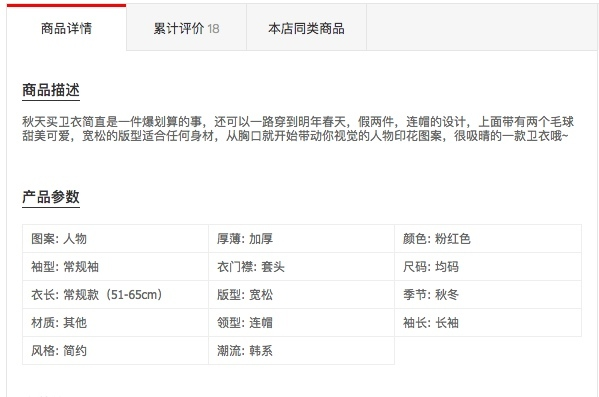
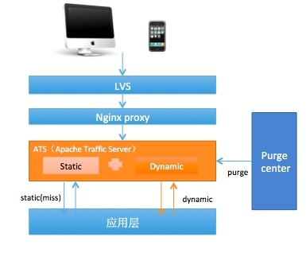
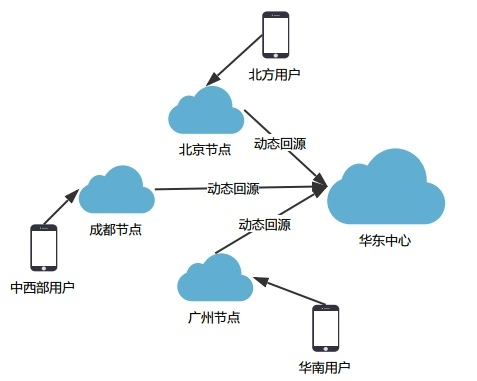

---
date: "2019-06-23"
---  
      
# 36 | 量体裁衣方得最优解：聊聊页面静态化架构和二级CDN建设
上期文章中我们介绍了CDN和云存储的实践，以及云生态的崛起之路，今天，我们继续聊一聊CDN。

我们通常意义上讲的CDN，更多的是针对静态资源类的内容分发网络，最典型的就是电商的各类图片，还有JS和CSS这样的样式文件。通过CDN能够让用户就近访问，提升用户体验。

但是这类文件只是以单纯的资源存在，与业务逻辑没有强关联。所以我们在技术上，可以使用业界通用的CDN和云存储解决方案。

需要注意的是，本文中我们讲到的实践内容，同样是遵从**静态内容，就近访问**这个原则的。

但是，因为其中包含了大量的业务逻辑，这就要求我们在面对不同的场景时，要有跟业务逻辑相关的定制化的解决方案。

下面，我们就一起来看看页面静态化架构和二级CDN建设。

## 静态化架构建设的业务场景

我们仍然回到电商的业务场景中来。对于电商，访问量最大的无疑是商品的详情页，绝大多数用户都要通过浏览商品详情，来决定是否下单。所以单就这一类页面，就占到全站30\%+的流量。

那么，商品详情一般由哪些部分组成呢？我们看下面两个截图：

  
  
  
  
以上两张图就是某个商品详情页的主要组成部分。我们可以看到，商品详情大致包括了商品名称、商品描述、产品参数描述、价格、SKU、库存、评价、优惠活动、优惠规则以及同款推荐等等信息。

这里我们仔细观察可以发现，其实对于商品描述类的信息，比如商品名称、商品描述、产品参数描述等等，一般在商品发布之后，就很少再变动，属于静态化的内容。

而优惠活动、优惠规则、价格等等则是可以灵活调整的，库存和评价这类信息也是随时变化，处于不断的更新中。

说到这里，我们会想到，如果能够把静态化的内容提取出来单独存放，业务请求时直接返回，而不用再通过调用应用层接口的方式，去访问缓存或者查询数据库，那访问效率一定是会大幅提升的。

所以，我们在参考和调研了业界的解决方案之后，引入了页面静态化架构。

<!-- [[[read_end]]] -->

## 页面静态化架构

静态架构中，我们采用的技术方案是ATS，也就是Apache Traffic Server。

ATS是一个开源产品，本质上跟Nginx、Squid以及Varnish这样的HTTP反向代理是一样的。但是它能对动静态分离的场景提供很好的支持，所以在最初，我们直接引入了这样的开源解决方案。

ATS的架构示意图如下：

  
  
关键技术点：

* **动静态分离**。将页面上相对固定的静态信息和随时在变化的动态信息区分出来，静态信息直接在ATS集群获取，动态信息则回源到应用层。通过HTTP请求调用获取，最终通过ATS组装后返回给调用方，从而实现了动静态资源的分离。
* **动态数据获取**。直接采用ATS的ESI标签模式，用来标记那些动态的被请求的数据。
* **失效机制**。分为主动失效、被动失效和定时失效。对于静态信息来说，我们也允许它变化，但因为静态信息自身的特性，决定了它不会频繁变化。所以，我们会有一个失效中心，即Purge Center。失效消息通过HTTP的Purge方法发送给ATS，而失效中心则会通过订阅消息系统中特定的Topic，或者MySql中特定的binlong变更，执行失效。

以上就是静态化建设的框架性的解决方案，这个方案在电商大促时往往能够发挥更加突出的作用。下面我就简单说明下。

## 静态化架构在大促场景中的应用

我们还是以业务场景作为切入点来看。以“双11”为例，参与大促的商家和商品，一般会在11月初完成全部报名。届时所有的商品信息都将确认完毕，且直到“双11活动"结束，基本不会再发生大的变化。

它跟平时的不同之处在于，商品在大促期间是相对固定的，所以就可以将商品的静态化信息提前预热到ATS集群中，大大提升静态化的命中率。

同时，价格、优惠、库存这些动态信息在日常是会经常变化的，但是在大促阶段是必须固定的。即使有变化，也只能体现在最终的订购阶段，而在用户浏览阶段尽量保持不变。

所以，这时可做静态化处理的内容就会更多。换言之，静态化架构对于后端的访问请求就会进一步减少，特别是价格、优惠和库存这样的查询计算类请求。

同时，我们静态化页面的范围可以更广，不仅仅是详情页，还可以包括各类大促活动的页面、秒杀页面、会场页面，甚至是首页。

因为这些页面都是提前配置好再发布的，所以我们完全可以通过静态化解决方案，来分担更大的流量。

以详情页为例。在静态化方案全面铺开推广后，静态化内容在大促阶段的命中率为95\%，RT时延从原来完全动态获取的200ms，降低到50ms。这大大提升了用户体验，同时也大幅提升了整体系统容量。

静态化方案和应用场景我们就介绍到这里。你可能会问：既然是静态化的内容，那是不是仍然可以借鉴CDN的思路，让用户就近访问呢？

我们下面就介绍一下页面静态化与公有云相结合的方案：二级CDN建设。

## 二级CDN建设

上面我们提到的静态化方案，仅仅是我们自己中心机房的建设方案，也就是说，所有的用户请求还是都要回到中心机房中。

静态化方案提升的是后端的访问体验，但是用户到机房的这段距离的体验并没有改善。

从静态化的角度，这些内容我们完全可以分散到更多的地域节点上，让它们离用户更近，从而真正解决从用户起点到机房终点的距离问题。

所以，我们接下来的方案就是：选择公有云节点，进行静态化与公有云相结合的方案，也就是我们的二级CDN方案。简单示意如下：

  
  
引入了这样的二级CDN架构后，下面几个技术点需要我们多加关注。

* **回源线路，公网回源转变为专线回源**。之前我们的中心机房还是托管IDC模式时，动态回源部分都是通过公网回源，同时，静态化配置的推送也是通过公网推送到公有云节点，这对成功率和访问质量上都会有一些影响。但是我们上云之后，做的第一件事情就是将公网访问模式调整成了内网调用模式，也就是动态回源直接改为专线的动态回源。这样大大提升了访问质量，且进一步节省了部分带宽费用。
* **弹性伸缩**。利用了公有云节点之后，在大促时就可以很方便地进行动态扩缩容，以便真正地按需使用。而且自动化的扩缩容，以及日常的静态化配置推送都需要完善。
* **高可用保障**。为了保障多节点的高可用，在单个节点故障时，要能够快速切换。当前我们的策略仍然是，当某个节点遭遇故障，直接全部切换回中心节点。这里为了能够达到快速切换的目的，需要通过HttpDNS这样切换IP的方式实现。因为DNS缓存生效周期较长，如果是通过域名切换，则造成的影响周期会比较长。

## 总结

今天分享的页面静态化架构方案和二级CDN方案，是我在实际工作中较早跟公有云方案相结合的实践之一，并且在我们的日常和大促活动中，起到了非常好的效果。

同时也可以看到，我们的业务一旦与公有云相结合，云生态的各种优势就会马上体现出来。但是无论选择哪种方案，都要结合具体的业务场景，才能作出最优的方案选择。

公有云也好，云计算也好，都不能为我们提供完美的定制解决方案。正所谓具体问题具体分析，找出问题，优化解决路径，量体裁衣，才能得到最适合我们的“定制方案”。

正如我之前提到的：只有挖掘出对业务有价值的东西，我们的技术才会有创新，才会有生命力。

如果你在这方面有好的实践经验和想法，欢迎你留言与我讨论。

如果今天的内容对你有帮助，也欢迎你分享给身边的朋友，我们下期见！