---
date: "2019-06-23"
---  
      
# 划重点：赵成的运维体系管理课精华（三）
今天我们来梳理专栏的另外两部分，“云计算时代的运维实践”和“个人成长”。我从每一篇文章里选出一句最想告诉你的话，制作成知识卡，帮助你回顾文章内容，点击就可以**一键直达原文**。

我们专栏的四大模块分别是：

* 应用运维体系建设
* 效率和稳定性最佳实践
* 云计算时代的运维实践
* 个人成长

**愿你已拥有不一样的运维思考！**

## 云计算时代的运维实践

[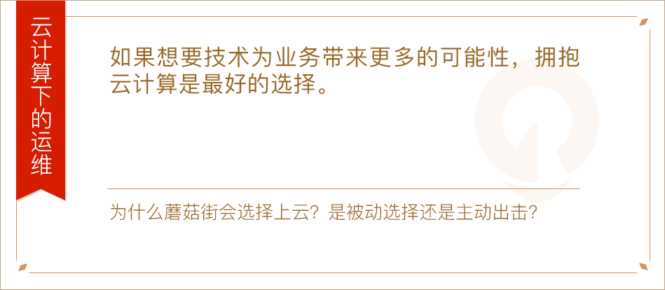](https://time.geekbang.org/column/article/3633)

[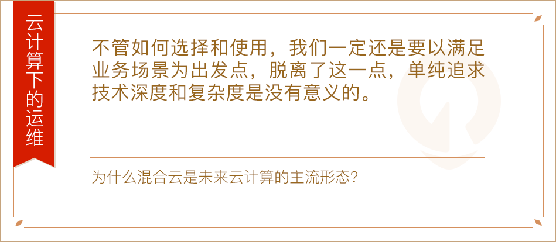](https://time.geekbang.org/column/article/3655)

[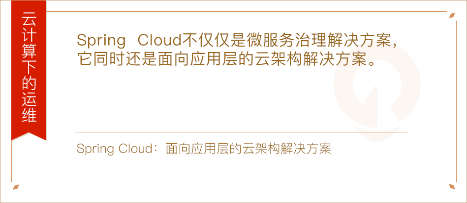](https://time.geekbang.org/column/article/3673)

[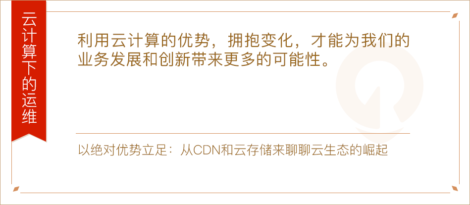](https://time.geekbang.org/column/article/3716)

<!-- [[[read_end]]] -->

[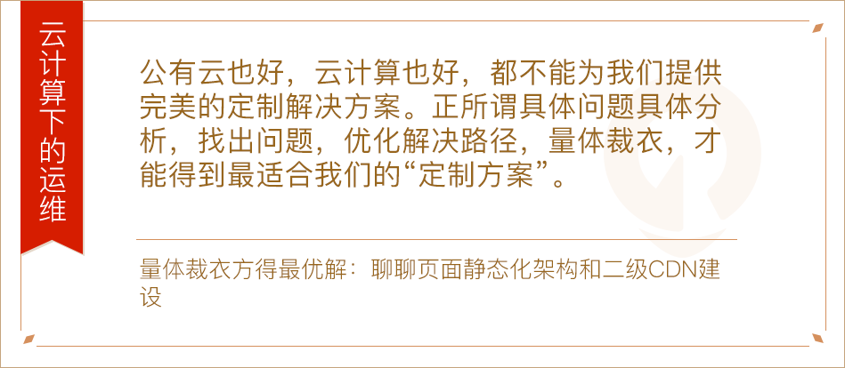](https://time.geekbang.org/column/article/3842)

[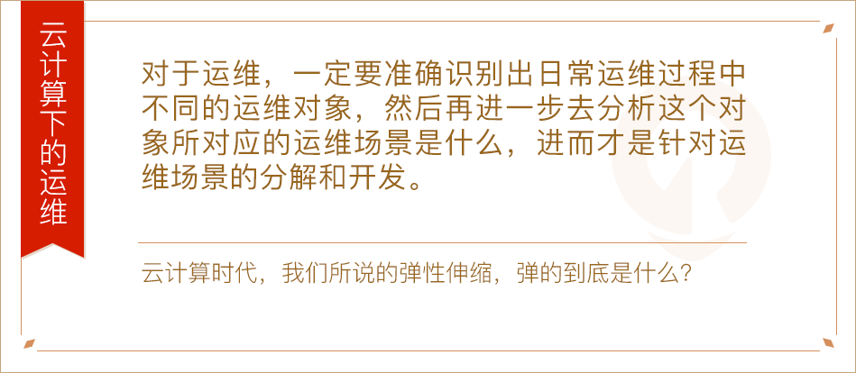](https://time.geekbang.org/column/article/4074)

## 个人成长

[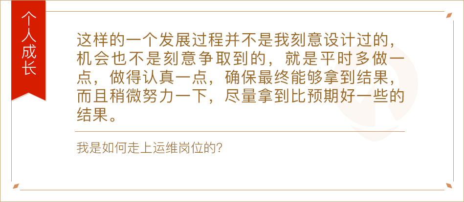](https://time.geekbang.org/column/article/1956)

[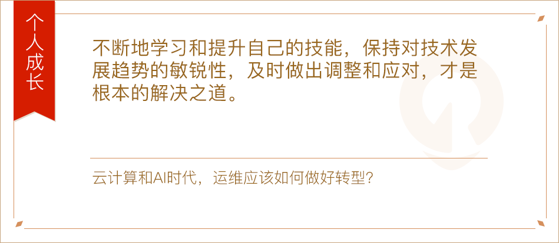](https://time.geekbang.org/column/article/2397)

[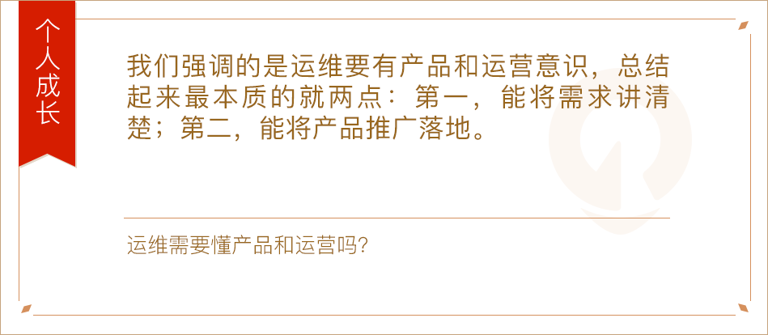](https://time.geekbang.org/column/article/2400)

[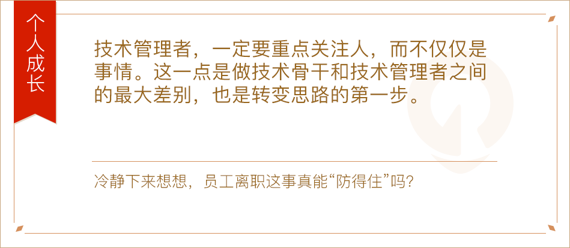](https://time.geekbang.org/column/article/2401)

[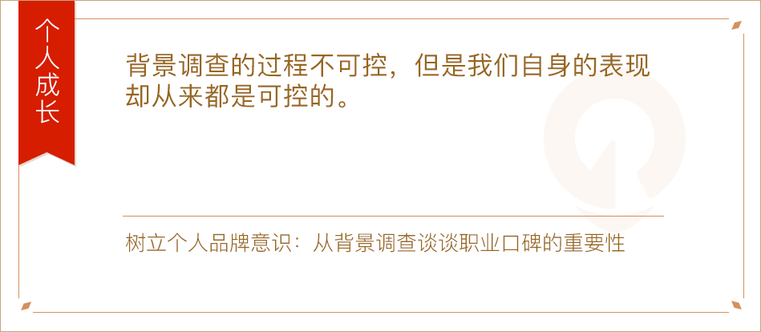](https://time.geekbang.org/column/article/3775)